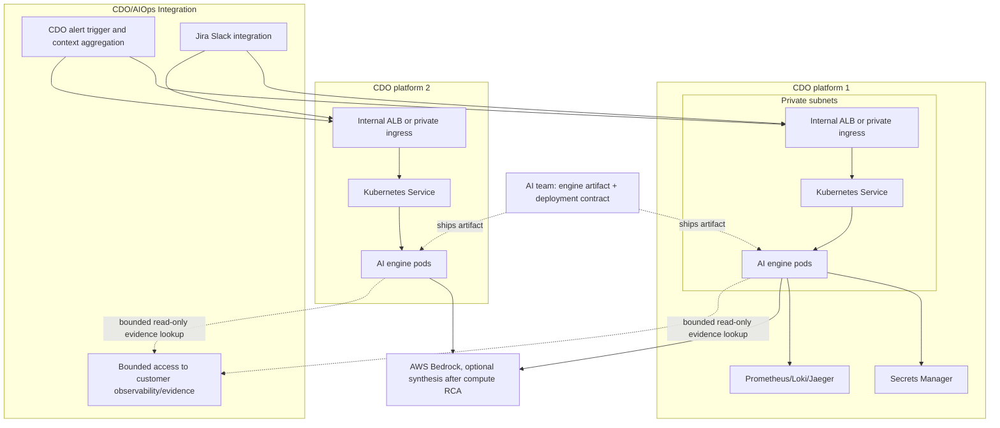

# Deployment Contract - TF1 Triage Hub

Owner: AI team TF1
Status: Final candidate for W11 CDO sign-off
Freeze target: 2026-06-25
Reviewers: AI Lead, CDO Leads, reviewer panel

## Purpose

Define how the TF1 AIOps triage engine artifact is packaged, deployed, connected, observed, and rolled back. Platform/deployment owners use this contract to deploy the engine on their own platform while preserving one stable AI API and telemetry boundary.

The AI team ships the engine as a container/code artifact plus this deployment specification. Each CDO team in TF1 can deploy the same engine instance on its own platform while preserving the API contract and tenant isolation. The W11 App Runner endpoint is a temporary bootstrap/demo endpoint for early integration and smoke tests.

The AI engine is an event-driven triage compute service. Customer applications emit telemetry into the customer's observability stack; Platform/DevOps provides alert detection and bounded access to that metrics/logs/traces evidence. CDO/platform calls the AI Ops endpoint when an alert/anomaly/incident needs triage. The AIOps app performs validation, normalization, bounded context enrichment, RCA scoring, and optional synthesis after invocation.

## Runtime Boundary

| Aspect | Decision |
|---|---|
| Service type | Dockerized HTTP API |
| API surface | `GET /healthz`, `POST /v1/triage` |
| Invocation pattern | Event-driven after CDO/platform alert detection, not AI polling or continuous telemetry streaming into triage |
| AI pattern | Compute-first RCA, optional Bedrock synthesis |
| Port | `8080` |
| Tenant isolation | `X-Tenant-Id` header must match body `tenant_id` |
| Correlation | `X-Correlation-Id` header must match body `correlation_id` |
| Remediation boundary | AI never executes remediation; it only returns human-reviewed recommendations |
| Evidence retrieval | AI may pull bounded evidence after an alert exists; CDO/platform owns evidence storage/API, AI Ops owns cleaning/curation before triage |

## Ownership Boundary

| Area | Owner | Requirement |
|---|---|---|
| AI engine code and container artifact | AI team | Provide the triage engine implementation, image/artifact reference, runtime behavior, config documentation, and smoke-test support. |
| API behavior | AI team | Preserve `/healthz` and `/v1/triage` schema, response semantics, guardrails, and fallback behavior. |
| Deployment infrastructure | CDO/platform | Deploy and operate the AI engine on the CDO platform. Own cluster/service runtime, ingress/load balancer, network, auth, secrets, scaling, observability plumbing, and rollout/rollback. |
| Slack/Jira execution | CDO/platform | Render Slack, create Jira issues from `ticket_payload`, manage credentials/retries, and require human confirmation for personal assignment. |
| Evidence hosting | CDO/platform | Host or expose bounded evidence bundles/sources and preserve tenant/service/environment/time-window isolation. |

## Compute

| Aspect | Configuration |
|---|---|
| Target | EKS `Deployment` behind an internal Kubernetes `Service` and private ingress/internal ALB |
| Region | `us-east-1` for capstone scope |
| Cluster | CDO-owned EKS cluster, namespace `tf1-aiops` unless the CDO platform provides an equivalent namespace |
| Service name | `tf1-ai-triage-engine` or CDO platform equivalent |
| Image source | AI-provided ECR image URI plus immutable image tag/digest per release |
| CPU request/limit per pod | 500m request / 1000m limit for skeleton; 1000m request / 2000m limit if LLM calls are enabled |
| Memory request/limit per pod | 1 GiB request / 2 GiB limit for skeleton; 2 GiB request / 4 GiB limit if LLM calls are enabled |

## Scaling

| Aspect | Value |
|---|---|
| Replicas | min 2, max 6 |
| Autoscale trigger 1 | HPA target CPU 70% |
| Autoscale trigger 2 | Request rate target 100 requests/minute/pod when ingress or custom metrics are available |
| Scale-up cooldown | 60 seconds |
| Scale-down cooldown | 300 seconds |
| Load test input | W11 skeleton target: 30 triage requests/minute, p99 < 2 seconds |

## Configuration And Secrets

| Name | Type | Source | Notes |
|---|---|---|---|
| `APP_ENV` | env var | Kubernetes Deployment or ConfigMap | `sandbox`, `staging`, or `prod` |
| `AIOPS_LOG_LEVEL` | env var | Kubernetes Deployment or ConfigMap | Default `INFO` |
| `AIOPS_INVESTIGATION_MODE` | env var | Kubernetes Deployment or ConfigMap | `auto`, `deterministic_only`, `agent_assisted`, or `agent_platform`; default `auto` |
| `AIOPS_ASSISTED_COMPLEXITY_THRESHOLD` | env var | Kubernetes Deployment or ConfigMap | Default `3` |
| `AIOPS_AGENT_COMPLEXITY_THRESHOLD` | env var | Kubernetes Deployment or ConfigMap | Default `6` |
| `AIOPS_AGENT_MAX_ITERATIONS` | env var | Kubernetes Deployment or ConfigMap | Default `2` |
| `AIOPS_AGENT_MAX_TOOL_CALLS` | env var | Kubernetes Deployment or ConfigMap | Default `5` |
| `AIOPS_TRIAGE_DEADLINE_SECONDS` | env var | Kubernetes Deployment or ConfigMap | Default `30` |
| `AWS_REGION` | env var | Kubernetes Deployment or ConfigMap | `us-east-1` |
| `AGENTCORE_RUNTIME_ARN` | env var | Kubernetes Deployment or ConfigMap | Required only when AgentCore modes are enabled |
| `ENABLE_AGENTCORE_LLM` | env var | Kubernetes Deployment or ConfigMap | Enables AgentCore summary/action/platform calls |
| `ENABLE_AGENTCORE_LLM_TOOLS` | env var | Kubernetes Deployment or ConfigMap | Enables assisted AgentCore tool proposals |
| `BEDROCK_MODEL_ID` / `BEDROCK_MODEL_IDS` | env var | Kubernetes Deployment or ConfigMap | Optional model override for AgentCore/Bedrock calls |
| `SERVICE_AUTH_TOKEN` | secret | AWS Secrets Manager `tf1/ai-engine/service-auth-token` | Capstone fallback if IAM/JWT is not ready |
| `PROMETHEUS_URL` | env var | Kubernetes Deployment or ConfigMap | Optional bounded metrics backend for context tools |
| `LOKI_URL` | env var | Kubernetes Deployment or ConfigMap | Optional bounded logs backend for context tools |
| `JAEGER_URL` | env var | Kubernetes Deployment or ConfigMap | Optional bounded traces backend for context tools |
| `DEPLOY_METADATA_PATH` | env var | Kubernetes Deployment or ConfigMap | Optional deploy metadata JSON path |
| `OWNERSHIP_PATH` | env var | Kubernetes Deployment or ConfigMap | Optional ownership/runbook JSON path |
| `EVIDENCE_BUNDLE_BASE_PATH` | env var | Kubernetes Deployment or ConfigMap | Optional local evidence bundle base path |
| `JIRA_HISTORY_PATH` | env var | Kubernetes Deployment or ConfigMap | Optional read-only Jira history/accountId mapping |

No long-lived AWS access keys are stored in the service. Production AWS access uses IRSA with a scoped Kubernetes `ServiceAccount` and IAM role.

## Networking

| Aspect | Configuration |
|---|---|
| Subnet type | Private subnets |
| Load balancer | Internal ALB or private ingress controller only |
| Kubernetes service | ClusterIP service `tf1-ai-triage-engine` on port `8080` |
| Security group | `tf1-ai-engine-sg` or CDO EKS equivalent security group policy |
| Ingress | Allow only approved CDO/platform incident integration or context services on port `8080` or ingress listener port |
| Egress | AWS service endpoints required for CloudWatch or Loki, Secrets Manager, Bedrock if enabled, and bounded evidence APIs |
| DNS | Private hosted zone record such as `https://ai-engine.tf1.internal` |

Kubernetes runtime requirements:

- Namespace: `tf1-aiops`.
- ServiceAccount: `tf1-ai-triage-engine` annotated for IRSA when AWS APIs are needed.
- RBAC: no permission to mutate customer workloads, namespaces, deployments, pods, configmaps, or secrets. The AI engine is not a Kubernetes remediation controller.
- NetworkPolicy: allow ingress only from approved CDO integration/context services; allow egress only to approved AWS endpoints, observability backends, Bedrock when enabled, and bounded evidence APIs.

## Observability Stack Dependency

| Responsibility | Owner | Notes |
|---|---|---|
| Deploy metrics/logs/traces backend | Platform/DevOps | Prometheus, Grafana, Loki, Jaeger, and OpenTelemetry in the CDO EKS observability stack. |
| Preserve required metadata | Platform/DevOps + app emitters | `tenant_id`, `service`, `environment`, `timestamp`, labels. |
| Provide bounded query/export path | Platform/DevOps | Query by tenant/service/env/time window. |
| Detect alerts/incidents | Platform/DevOps | Monitoring, alert rules, incident event generation, and initial push to AI Ops. |
| Expose bounded evidence | Platform/DevOps | Customer observability is the source of truth; CDO/platform owns the bounded access path, auth, query limits, and tenant isolation exposed to AI Ops. |
| Normalize/clean/enrich incident context | AIOps app | Validate pushed incident context, request bounded extra evidence if needed, clean/normalize/curate evidence before triage. |
| RCA/confidence/LLM synthesis | AIOps triage engine | Compute-first RCA; Bedrock optional. |

## Per-CDO Deployment

Each CDO team deploys the same AI engine artifact behind its own private endpoint. The CDO-hosted instance must preserve the API paths, request/response schema, tenant isolation, auth boundary, health check, and rollback behavior defined in this contract.

| Platform | Endpoint URL | Auth draft | Notes |
|---|---|---|---|
| CDO platform 1 | `https://ai-engine.cdo-1.tf1.internal` or equivalent | IAM SigV4 preferred; bearer token fallback | CDO-owned deployment endpoint. |
| CDO platform 2 | `https://ai-engine.cdo-2.tf1.internal` or equivalent | IAM SigV4 preferred; bearer token fallback | CDO-owned deployment endpoint. |
| Bootstrap/demo | `https://snpmtcwpys.us-east-1.awsapprunner.com` | Scoped bearer token fallback | Temporary W11 endpoint for early integration and mentor smoke tests only. |

## Health Check

| Field | Value |
|---|---|
| Path | `/healthz` |
| Expected response | `200` with `{"status":"ok"}` |
| Interval | 30 seconds |
| Healthy threshold | 2 consecutive 200 responses |
| Unhealthy threshold | 3 consecutive non-200 responses |

## Rollout Strategy

Use canary rollout once the CDO/platform incident integration has a working endpoint integration.

| Step | Traffic | Interval |
|---|---:|---|
| 1 | 10% | 5 minutes |
| 2 | 50% | 5 minutes |
| 3 | 100% | Until next release |

Abort and roll back if any of these occur during canary:

- 5xx error rate > 1%.
- P99 latency > 2 seconds for 5 consecutive minutes.
- Tenant mismatch or schema validation failures caused by the new release.
- Missing `audit_id` in any successful triage response.

## Rollback

| Aspect | Value |
|---|---|
| Primary method | `kubectl rollout undo deployment/tf1-ai-triage-engine` or revert Helm/Kustomize image tag to previous immutable digest |
| Secondary method | Roll back deployment pipeline release |
| Target RTO | < 60 seconds for capstone rollback when only the image tag/digest changes |
| Data migration | None for skeleton/demo; current report artifacts are JSON files |

## Observability

| Aspect | Configuration |
|---|---|
| Logs | Structured JSON logs to Loki or CloudWatch Logs, 14-day capstone retention |
| Metrics | Prometheus metrics for request count, 2xx/4xx/5xx, latency p50/p95/p99, validation failures, and rate limiting |
| Traces | Accept and propagate `X-Correlation-Id`; export OpenTelemetry traces to the CDO Jaeger/OTel stack when enabled |
| Audit | Every successful triage response includes `audit_id`; local report JSON can store demo audit artifacts |

## Failure Modes And Response

| Failure | Detection | Response |
|---|---|---|
| Pod crash | Kubernetes liveness/readiness probes | Restart pod and route traffic only to ready pods |
| AI unavailable | Ingress/service 5xx or 503 | CDO/platform integration queues retry or creates fallback ticket |
| Bedrock throttling | App metric after optional LLM synthesis is enabled | Fall back to compute-only response |
| Alert storm or request burst | Rate-limit metrics, backlog age, or platform retry depth | Apply bounded retry/backpressure and preserve idempotency by `correlation_id`. |
| Tenant mismatch | API validation | Return `400`; caller must fix request |
| Missing context | AI validation | Return successful triage response with `INSUFFICIENT_CONTEXT` |

## W11 Implementation Scope

| Item | Contract requirement |
|---|---|
| Demo auth | Use private networking or protected gateway. Scoped bearer token is allowed as a capstone fallback; IAM SigV4 or service-to-service JWT is preferred when CDO infra supports it. |
| Load target | 30 triage requests/minute for W11 skeleton validation, p99 < 2 seconds on bounded payloads. |
| Audit storage | Local JSON/report store is accepted for W11 skeleton/demo. |
| Bootstrap endpoint evidence | The W11 App Runner endpoint is recorded in the readiness checklist only after `/healthz` and one `/v1/triage` smoke test pass. |
| Alert delivery model | CDO/platform pushes alerts/incidents to the AI endpoint. AI Ops must not depend on continuous polling to discover incidents. |
| Evidence cleaning layer | CDO/platform owns production storage, retention, auth, and bounded evidence access; AI Ops owns cleaning, normalization, curation criteria, and RCA consumption behavior. |

## W11 Sign-Off

This contract is the AI-owned draft for CDO review and onsite sign-off on 2026-06-25.

| Role | Name | Signature | Date | Status | Notes |
|---|---|---|---|---|---|
| AI lead | Đinh Danh Nam |  |  | Ready for signature | Owns engine image, runtime behavior, health checks, and release notes. |
| CDO tech lead 1 | Nguyễn Đức Tiến |  |  | Ready for signature | Confirms hosting/network/secrets approach for one CDO platform. |
| CDO tech lead 2 | Nguyễn Đỗ Khánh Hưng |  |  | Ready for signature | Confirms hosting/network/secrets approach for the second CDO platform. |
| Mentor witness | TBD |  |  | Pending onsite | Witnesses contract freeze. |

Signature may be handwritten on the printed contract or added as an approved electronic signature.

After sign-off, changes to endpoint hosting, network boundary, auth mechanism, or rollout/rollback behavior require a formal ADR or curveball response.
