# Solution Design - TF1 Triage Hub

Owner: AI team TF1
Status: Final candidate for W11 CDO sign-off
Last updated: 2026-06-24

## 1. High-Level Architecture

TF1 uses an event-driven triage design. Production-grade ownership is split between customer observability, CDO/platform integration, and AIOps reasoning. Customer applications emit telemetry into the customer's observability layer. CDO/platform makes that telemetry safely reachable through bounded access, owns alert detection/integration, and pushes incidents to AI Ops. AI Ops validates the incident context, gathers bounded evidence only when needed through allowlisted tools, cleans/normalizes/curates that evidence, then performs RCA and optional LLM synthesis.

```mermaid
graph LR
    A[Services or simulator emit metrics logs traces deploy events] --> B[Platform observability stack: OTel Prometheus Loki Jaeger Grafana CloudWatch]
    B --> C[CDO alert detection and bounded evidence access]
    C -->|push incident seed/context| F[AIOps context validation]
    F -->|bounded pull if needed| C
    F --> K[Clean normalize curate evidence]
    K -->|POST /v1/triage| G[Compute-first RCA and confidence gate]
    G -->|Optional grounded synthesis| H[Bedrock LLM]
    G --> I[Report JSON audit artifact]
    I --> J[Raw response fields Jira payload React report UI]
    J --> L[CDO Slack Block Kit renderer]
    H --> I
```

The triage engine is not a direct Bedrock wrapper. It is a Dockerized compute service that receives bounded context, performs schema validation, feature extraction, deterministic RCA scoring, confidence gating, safety checks, and optional LLM synthesis.

## 2. Component Breakdown

| Component | Owner | Responsibility | Tech choice | Reason |
|---|---|---|---|---|
| Observability stack | Platform/DevOps | Collect, store, retain, secure, and expose metrics/logs/traces/deploy events. | OpenTelemetry, Prometheus/Grafana, Loki, CloudWatch, or capstone simulator | Platform ensures data is observable and accessible safely. |
| Alert detection | Platform/DevOps | Detect alert/anomaly/incident candidates and push incident seed/context to AI Ops. | Alertmanager/EventBridge/webhook/API integration or CDO platform equivalent | Keeps monitoring responsibility with the platform and avoids AI polling delay. |
| Bounded evidence access | Platform/DevOps | Store or expose incident-scoped logs/traces/metrics/deploy/ownership data with tenant/service/environment/time bounds. | S3/MinIO/Postgres/DynamoDB or read-only evidence proxy | Gives AI bounded evidence without raw backend credentials. |
| AIOps context enrichment | AIOps app | Validate pushed incident context, request bounded extra evidence if insufficient, clean/redact/normalize/curate evidence, normalize schema. | Python/FastAPI worker or service | Product logic consumes platform evidence but does not own production storage. |
| AI triage engine | AIOps app | Validate request, extract features, run RCA scoring, confidence gate, and produce response payloads. | Dockerized FastAPI service on ECS/Fargate | Gives the team full control of diagnosis behavior and API contract. |
| Optional LLM synthesis | AIOps app | Turn grounded RCA evidence into concise diagnosis, Jira description, assignee suggestion rationale, and runbook-aware recommendations. | Bedrock via AI engine | LLM is used after bounded evidence exists, not as the first decision-maker or a raw query engine. |
| Ticket/notification integration | CDO integration layer with AI output | Create Jira issue from `ticket_payload`, render Slack Block Kit from raw AI response fields, and handle human-confirmed assignment. | Jira/Slack APIs or mocks | Required for E2E demo flow. |
| Audit/report store | AIOps app | Persist traceable AI decisions and link them to ticket/notification artifacts. | JSON files for local demo; DynamoDB/S3/CloudWatch later | Required for confidence behavior and demo evidence. |
| Report UI | AIOps app | Render incident list, RCA candidates, evidence, topology, causal hints, Slack/Jira previews, and audit metadata. | React/Vite local demo UI | Keeps Slack concise while preserving a complete investigation surface. |
| Telemetry simulator | AIOps app for demo/eval | Replay sanitized RCAEval-style cases into observability as metrics, logs, and traces. | Python, Prometheus client, Loki push API, OTLP traces | Lets the capstone demonstrate production-like data flow without committing the full RCAEval dataset. |
| Local observability stack | Platform-like demo fixture | Collect and expose metrics/logs/traces for bounded worker queries. | Docker Compose, OpenTelemetry Collector, Prometheus, Loki, Jaeger, Grafana | Keeps DevOps/CDO ownership boundaries visible in local evaluation. |

## 3. Data Flow

1. Services continuously emit telemetry: metrics, logs, traces, deploy events, and alert-source events.
2. Platform observability stack collects/stores telemetry and exposes bounded query/export paths by tenant, service, environment, and time window.
3. CDO/platform detection evaluates alert rules, SLOs, anomaly signals, or monitoring events and pushes an incident seed/context to AI Ops.
4. If the initial context is insufficient, AI Ops requests bounded extra evidence from the customer's observability/evidence layer through a CDO/platform-approved bundle, bounded evidence store, or read-only evidence proxy.
5. AI Ops cleans, redacts if needed, normalizes, and curates the evidence into the `telemetry-contract.md` request shape.
6. The integration/context layer invokes the triage engine through `POST /v1/triage`, with normalized alert metadata, metrics, AI-curated logs, traces, recent deploys, ownership, and runbook/docs context.
7. The AI engine validates tenant/correlation headers, validates schema, extracts features, and runs compute-first RCA rules/scoring with topology-aware candidates, bounded anomaly evidence, experimental lag-correlation causal hints, and deterministic investigator summaries.
8. The AI engine applies confidence gates:
   - high enough signal: `DIAGNOSED`
   - weak or conflicting signal: `INVESTIGATE`
   - missing supporting context: `INSUFFICIENT_CONTEXT`
9. If enabled, the AI engine calls Bedrock only to synthesize grounded diagnosis, recommendations, Jira description, and assignee suggestion rationale from cleaned evidence.
10. The CDO integration layer renders Slack Block Kit from raw AI response fields, creates or updates Jira from `ticket_payload`, and requires human confirmation before assigning a Jira user.
11. Engineer feedback such as RCA confirmed, RCA corrected, owner accepted, or owner rejected is recorded as audit metadata when available. Retrain trigger is design-only until reviewed feedback volume is sufficient.
12. Grafana remains the raw observability dashboard. The React report UI is the AI RCA explanation and audit surface.

For the local demo, `engine-skeleton/app/simulator.py` replays sanitized scenario files into the Compose observability stack, and `engine-skeleton/app/aiops_worker.py` queries Prometheus/Loki/Jaeger before building the `telemetry-contract.md` request. The triage service receives bounded normalized context, enriches the response with optional RCA/report fields, and exposes local report APIs for the React viewer.

For the W11 handoff, the primary scenario datapacks are RCAEval-derived evidence bundles under `engine-skeleton/datapack/external/evidence-bundles/`. These bundles give CDO a concrete artifact to host and expose while preserving the production boundary: CDO owns evidence storage/access, and AIOps owns RCA interpretation. Synthetic scenario fixtures remain useful for smoke tests and dashboard demos, but they are not the primary evaluation source.

## 4. Key Design Decisions

### 4.1 Alert Push vs AI Polling

- Option A: AI Ops continuously polls CDO/customer telemetry to discover incidents.
  - Pros: AI controls retrieval cadence.
  - Cons: adds polling delay, duplicates monitoring responsibility, requires broad data-platform permissions, and is harder to scale securely.
- Option B: CDO/platform detects alerts and pushes incident seed/context to AI Ops; AI pulls bounded evidence only after alert delivery.
  - Pros: immediate alert handling, clear platform/AI boundary, safer credentials, and better production fit.
  - Cons: requires CDO to expose a reliable incident trigger and evidence access path.

Chosen: Option B. Alert delivery is push-based; evidence retrieval can be bounded pull-based after an alert exists.

### 4.2 Continuous Triage vs Event-Driven Triage

- Option A: Run full AI triage continuously on all telemetry.
  - Pros: could detect subtle patterns earlier.
  - Cons: expensive, noisy, difficult to scale, and overuses LLM/compute for non-incidents.
- Option B: Invoke AI triage only on platform incident candidates.
  - Pros: lower cost, clearer platform/triage boundary, easier to test and defend.
  - Cons: depends on CDO detection quality and context aggregation.

Chosen: Option B. CDO/platform detects incidents, then invokes AI triage event-by-event.

### 4.3 LLM-First vs Compute-First RCA

- Option A: Send raw incident context directly to Bedrock and ask for diagnosis.
  - Pros: faster to prototype.
  - Cons: weaker evidence control, harder confidence calibration, higher hallucination risk.
- Option B: Run deterministic RCA/scoring first, then optionally call Bedrock for synthesis.
  - Pros: more explainable, safer, cheaper, and easier to evaluate.
  - Cons: requires more explicit scenario logic.

Chosen: Option B. Bedrock is optional synthesis after grounded compute evidence.

### 4.4 Triage Pulls Raw Telemetry vs Curated Evidence Access

- Option A: The triage/RCA function pulls directly from every raw telemetry store at request time.
  - Pros: triage has direct retrieval control.
  - Cons: tighter coupling, higher latency, broader runtime permissions, and harder testing.
- Option B: Platform observability exposes bounded evidence, then AIOps context logic cleans/curates it and builds a normalized context bundle before triage.
  - Pros: clearer platform/AIOps separation, cheaper triage calls, easier replay/eval, and safer LLM prompting.
  - Cons: observability data contract must preserve enough evidence for RCA.

Chosen: Option B. Customer observability remains the telemetry source of truth. Platform/CDO owns alert detection plus the bounded access path to that evidence. AIOps owns context validation, evidence cleaning/curation, enrichment, and incident-level RCA.

## 5. Risk And Mitigation

| Risk | Likelihood | Impact | Mitigation |
|---|---|---|---|
| Context bundle misses important telemetry | Medium | High | Return `INSUFFICIENT_CONTEXT`, document missing fields, and add datapack mapping checks. |
| Detection layer sends noisy incident candidates | Medium | Medium | Confidence gate returns `INVESTIGATE` for weak/conflicting signals; CDO can tune alert rules and AI Ops can tune evidence cleaning/curation. |
| LLM hallucinates root cause | Medium | High | Compute-first evidence, schema validation, grounding checks, and no direct auto-remediation. |
| Bedrock throttling or outage | Medium | Medium | Keep rule-based path available; fallback to deterministic response without LLM. |
| Tenant data leak | Low | High | Enforce header/body tenant match and avoid cross-request context persistence. |
| Team conflates AI polling with production alert delivery | Medium | Medium | Document hybrid model: CDO pushes alert, AI pulls bounded evidence only when needed. |

## 6. W11 Decisions And Deferred Items

| Item | W11 decision |
|---|---|
| Auth | Private network or protected gateway with scoped bearer token fallback for capstone. IAM SigV4 or service-to-service JWT remains production-preferred. |
| Persistent audit store | JSON/report store is accepted for W11 skeleton/demo; object storage or database-backed metadata is the production target. |
| Local demo path | Simulator/evidence bundles -> bounded observability/context -> `/v1/triage` -> report JSON/API -> React report UI. Slack text in local dry-run is a demo convenience, not the signed API response contract. |
| Production telemetry mix | Any CDO-approved Prometheus/Loki/Jaeger/CloudWatch/OpenTelemetry mix is acceptable if it satisfies the supporting `observability-data-contract.md`. |
| Alert delivery model | CDO/platform pushes incident seed/context to AI Ops. AI Ops does not continuously poll CDO/customer systems for alert discovery. |
| Evidence cleaning layer | Optional but recommended. CDO owns production storage/access/query bounds; AI Ops owns cleaning, curation criteria, schemas, sample processors, and RCA consumption. |
| Real-time infra monitoring | Out of AI Ops scope. CDO/platform owns continuous metric collection, platform health dashboards, and alert rules; AI Ops consumes incident-scoped evidence for RCA. |
| Dataset schema | RCAEval telemetry is primary. Supplemental deploy/ownership/runbook records are used where RCAEval lacks operational fields; logs/traces are supplemental only for selected cases that do not provide them. |
| Feedback/retrain | Human feedback is audit metadata only for W11. Retrain trigger is a future design hook and must not auto-update production behavior. |
| Deferred | Final AWS endpoint URL and live CDO observability backend are recorded after deployment smoke tests pass. |

## Related Documents

- [`03_ai_engine_spec.md`](03_ai_engine_spec.md) - AI engine architecture detail, governance, and security.
- [`../contracts/observability-data-contract.md`](../contracts/observability-data-contract.md) - supporting platform observability/evidence handoff; not one of the 3 signed W11 contracts.
- [`../contracts/telemetry-contract.md`](../contracts/telemetry-contract.md) - normalized context bundle contract.
- [`../contracts/ai-api-contract.md`](../contracts/ai-api-contract.md) - API consumed by the CDO/platform incident integration layer.
- [`../contracts/deployment-contract.md`](../contracts/deployment-contract.md) - deployment topology.
- [`05_adrs.md`](05_adrs.md) - architecture decision records.
