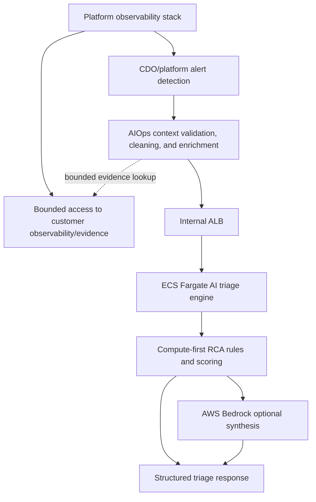

# AI Engine Spec - TF1 Triage Hub

Owner: AI team TF1
Status: Final candidate for W11 CDO sign-off
Last updated: 2026-06-24

## 1. Model Architecture

TF1 uses a **hybrid compute-first triage architecture**:

```text
normalized incident context
  -> schema and tenant validation
  -> bounded evidence gathering through allowlisted tools when needed
  -> cleaning, redaction, normalization, and curation
  -> feature extraction
  -> deterministic anomaly/RCA scoring
  -> confidence gate and safety checks
  -> optional Bedrock synthesis
  -> structured diagnosis + Jira ticket fields + Slack-renderable raw fields
```

The LLM is not the primary detector and does not receive direct observability backend credentials. Platform/DevOps provides observability data, alert detection, and bounded secure evidence access. AIOps performs context validation, bounded evidence query through allowlisted tools, cleaning/normalization/curation, evidence sufficiency checks, and incident-level RCA after an alert is pushed to AI Ops. Bedrock is optional and used only after the engine has grounded evidence.

### 1.1 Responsibilities

| Layer | Responsibility |
|---|---|
| Customer observability layer | Source of truth for metrics/logs/traces/deploy events emitted by customer applications. |
| CDO/platform access layer | Expose customer observability evidence to AI Ops through bounded query/export, auth, tenant isolation, and query limits. |
| Platform alert detection layer | Detect alert/anomaly/incident candidates and push incident seed/context to AI Ops. |
| Bounded evidence layer | Expose incident-scoped logs/events/traces/metrics/deploys/ownership from the customer's observability/evidence sources through safe bounded access owned by CDO/platform. |
| AIOps context aggregation | Validate pushed incident context, request bounded extra evidence when context is insufficient through allowlisted tools, and clean/normalize/curate it before RCA. |
| AI compute service | Validate, extract features, correlate metrics/logs/deploys, score RCA candidates, and apply confidence gates. |
| Optional Bedrock synthesis | Convert grounded evidence into clear diagnosis, Jira description, assignee suggestion rationale, and runbook-aware recommendations. |

### 1.2 Why Compute-First

- RCA must be explainable and auditable.
- Confidence must correlate with evidence quality.
- Low-signal cases should return `INVESTIGATE` or `INSUFFICIENT_CONTEXT`, not a confident guess.
- Bedrock cost and latency should be paid only when an incident candidate needs human-readable synthesis.
- No auto-remediation is allowed, so every action remains advisory.

## 2. Model And Runtime Selection

| Field | Value |
|---|---|
| Runtime | Dockerized FastAPI compute service |
| Deployment target | ECS Fargate behind internal ALB |
| Primary logic | Rules, thresholds, scenario classifiers, deploy/log/metric correlation |
| LLM provider | AWS Bedrock, optional after skeleton |
| LLM role | Grounded synthesis of diagnosis, recommendations, Jira text, and assignee suggestion rationale |
| Region | `us-east-1` for capstone scope |
| Fallback | Deterministic rule-based response without Bedrock |

The skeleton uses `AI_MODE=rules`. A later release may enable `AI_MODE=hybrid`, but the compute-first RCA path remains mandatory.

## 3. Invocation Pattern

The triage engine is **event-driven**, while platform telemetry collection and platform alert detection are continuous.

```text
continuous telemetry
  -> platform observability stack
  -> platform alert detection
  -> alert/anomaly/incident candidate
  -> push incident seed/context to AI Ops
  -> AIOps context validation, bounded evidence lookup through allowlisted tools, cleaning, and curation
  -> POST /v1/triage
```

Platform/DevOps may operate CloudWatch, Prometheus, Grafana, Loki, OpenTelemetry, or related data plumbing. CDO/platform owns alert detection and production evidence storage/access. AIOps consumes bounded incident evidence and owns interpretation/RCA logic. The triage function receives normalized bounded context so RCA logic remains replayable and testable.

## 4. Input And Feature Extraction

Triage input is defined in `../contracts/telemetry-contract.md`. Upstream observability access is defined in the supporting handoff `../contracts/observability-data-contract.md`.

Feature extraction should produce at least:

| Feature group | Examples |
|---|---|
| Alert features | severity, service, title tokens, start time, labels |
| Metric features | latency spike, error-rate spike, request-rate drop, saturation increase |
| Log features | timeout terms, dependency errors, health-check failures, repeated warnings |
| Deploy features | recent deploy within alert window, change summary, rollback ref |
| Ownership features | owner team, Slack channel, Jira project, runbook availability |
| Context sufficiency | whether metrics/logs/deploys/runbooks are present enough to diagnose |

## 5. RCA And Confidence Logic

The initial deterministic scenario logic maps to:

| Scenario | Output status | Classification | Confidence behavior |
|---|---|---|---|
| Critical service down | `DIAGNOSED` | `critical_service_down` | High when availability/log/deploy context supports impact. |
| Latency degradation | `DIAGNOSED` | `latency_degradation` | High when latency metrics, timeout logs, or deploy correlation exist. |
| Noisy or ambiguous alert | `INVESTIGATE` | `noisy_or_ambiguous_alert` | Low/medium when severity is low or signals conflict. |
| Missing context | `INSUFFICIENT_CONTEXT` | `insufficient_context` | Low when only alert metadata is available. |

Future RCA scoring can add weighted evidence:

```text
score = metric_signal + log_signal + deploy_correlation + runbook_match - ambiguity_penalty
```

The score is converted into confidence and status. The engine must never turn low-confidence evidence into a strong root-cause claim.

## 6. Optional Bedrock Synthesis

Bedrock may be called only after the compute service has:

- validated tenant and correlation IDs,
- validated the schema,
- extracted structured evidence,
- selected status/classification,
- applied confidence gates,
- removed or redacted unsafe/PII content.

The LLM prompt should receive grounded evidence, not raw unbounded telemetry dumps. The LLM output must be schema validated before returning to the integration layer.

Allowed LLM outputs:

- concise diagnosis wording,
- evidence summary,
- Jira description text,
- assignee suggestion rationale when Jira history/accountId evidence exists,
- runbook-aware next-step phrasing.

Disallowed LLM outputs:

- executable auto-remediation,
- destructive production commands,
- root-cause claims unsupported by compute evidence,
- arbitrary PromQL/LogQL/backend queries outside the approved tool schema,
- rendered Slack Block Kit or pre-rendered Slack text in the API response,
- cross-tenant references.

## 7. Multi-Tenant Routing

| Control | Implementation |
|---|---|
| Tenant identification | `X-Tenant-Id` header and body `tenant_id`. |
| Correlation | `X-Correlation-Id` header and body `correlation_id`. |
| Validation | Header values must match body values or return `400`. |
| Context isolation | Per-request stateless processing; no cross-tenant memory. |
| Audit | Every successful response includes `audit_id`. |

## 8. Governance Controls

| Control | Requirement | Evidence |
|---|---|---|
| Explainability | Response includes evidence and root-cause summary. | Sample response fixtures. |
| Auditability | Response includes deterministic `audit_id`; persistent store is design target. | Eval report and future audit store logs. |
| Confidence gating | Low confidence maps to `INVESTIGATE` or `INSUFFICIENT_CONTEXT`. | Skeleton fixtures and eval report. |
| Human feedback | Engineer confirmation/correction is audit metadata only; retrain trigger is design-only. | Future feedback endpoint or Jira/Slack callback export. |
| No auto-remediation | Response actions are advisory only. | API contract action allowlist. |
| Reproducibility | Same input produces same skeleton output. | Response fixtures. |
| Cost control | Bedrock is optional and invoked only after detection/triage need exists. | Architecture docs and deployment config. |

### 8.1 Human Feedback And Retrain Design Note

Human feedback is a future design target, not a W11 API contract requirement. CDO may collect whether an engineer confirmed or corrected the RCA in Slack/Jira and store that as audit metadata, but the W11 `/v1/triage` contract does not require a feedback endpoint.

Future feedback values should remain non-executable audit metadata, for example `RCA_CONFIRMED`, `RCA_CORRECTED`, `OWNER_ACCEPTED`, and `OWNER_REJECTED`. Retrain triggering must remain offline until enough reviewed feedback exists, and a single feedback event must not automatically change production model behavior during W11/W12 demos.

## 9. AI Security

| Risk | Mitigation |
|---|---|
| Prompt injection through logs or alert text | Treat telemetry as data, delimit prompt inputs, and sanitize before LLM. |
| Hallucinated RCA | Compute-first evidence and schema validation. |
| PII leakage | The observability/context layer avoids PII in snippets; AI redacts before LLM when enabled. |
| Cross-tenant leakage | Header/body tenant enforcement and stateless processing. |
| Bedrock throttling | Fall back to deterministic rule-based response. |
| Unsafe action suggestion | Allowed action types are advisory only and schema constrained. |

## 10. Evaluation Methodology

Skeleton evaluation validates contract behavior. Final evaluation should include:

- at least 3 E2E scenarios: critical service down, latency degradation, noisy alert,
- 5-10 additional test cases from the RCAEval subset or approved mentor datapack,
- precision, recall, F1,
- P50/P99 latency,
- cost per call,
- confidence calibration checks,
- missing-context behavior checks.

For W11, RCAEval-derived evidence bundles under `../engine-skeleton/datapack/external/evidence-bundles/` are the primary handoff/evaluation data. Synthetic fixtures remain smoke-test scaffolding only.

## 11. Cost Model

The main cost control is event-driven invocation:

- observability collection stays in the platform layer,
- alert detection remains in the CDO/platform layer,
- AI compute runs only for incident candidates,
- Bedrock runs only when synthesis is enabled and grounded evidence exists.

Initial skeleton cost is ECS/Fargate or local runtime only. LLM token costs are added later when `AI_MODE=hybrid` is enabled.

## 12. Deployment Topology



Deployment details are defined in `../contracts/deployment-contract.md`.

## Related Documents

- [`02_solution_design.md`](02_solution_design.md)
- [`04_eval_report.md`](04_eval_report.md)
- [`05_adrs.md`](05_adrs.md)
- [`../contracts/ai-api-contract.md`](../contracts/ai-api-contract.md)
- [`../contracts/observability-data-contract.md`](../contracts/observability-data-contract.md) - supporting evidence handoff, not one of the 3 signed W11 contracts
- [`../contracts/telemetry-contract.md`](../contracts/telemetry-contract.md)
- [`../contracts/deployment-contract.md`](../contracts/deployment-contract.md)
