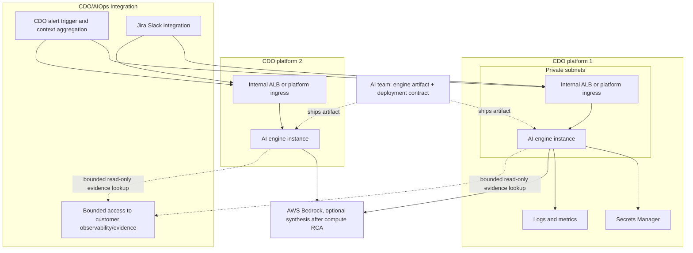

# Deployment Contract - TF1 Triage Hub

Owner: AI team TF1
Status: Final candidate for W11 CDO sign-off
Freeze target: 2026-06-25
Reviewers: AI Lead, CDO Leads, reviewer panel

## Purpose

Define how the TF1 AIOps triage engine artifact is packaged, deployed, connected, observed, and rolled back. Platform/deployment owners use this contract to deploy the engine on their own platform while preserving one stable AI API and telemetry boundary.

The AI team ships the engine as a container/code artifact plus this deployment specification. Each CDO team in TF1 deploys its own engine instance on its own platform, with tenant isolation enforced by the API contract. The W11 App Runner endpoint is a temporary bootstrap/demo endpoint only; it is not the final W12 hosting target.

The AI engine is an event-driven triage compute service. Customer applications emit telemetry into the customer's observability stack; Platform/DevOps provides alert detection and bounded access to that metrics/logs/traces evidence. CDO/platform calls the AI Ops endpoint when an alert/anomaly/incident needs triage. The AIOps app performs validation, normalization, bounded context enrichment, RCA scoring, and optional synthesis after invocation.

## Runtime Boundary

| Aspect | Decision |
|---|---|
| Service type | Dockerized HTTP API |
| API surface | `GET /healthz`, `POST /v1/triage` |
| Invocation pattern | Event-driven after CDO/platform alert detection, not AI polling or continuous telemetry streaming into triage |
| AI pattern | Compute-first RCA, optional Bedrock synthesis |
| Port | `8080` |
| Tenant isolation | `X-Tenant-Id` header must match body `tenant_id` |
| Correlation | `X-Correlation-Id` header must match body `correlation_id` |
| Remediation boundary | AI never executes remediation; it only returns human-reviewed recommendations |
| Evidence retrieval | AI may pull bounded evidence after an alert exists; CDO/platform owns evidence storage/API, AI Ops owns cleaning/curation before triage |

## Compute

| Aspect | Configuration |
|---|---|
| Target | ECS Fargate service behind an internal ALB, or equivalent CDO platform runtime |
| Region | `us-east-1` for capstone scope |
| Cluster | `tf-1-aiops-cluster` or CDO platform equivalent |
| Service name | `tf1-ai-triage-engine` or CDO platform equivalent |
| Image source | AI-provided ECR image URI plus immutable image tag/digest per release |
| CPU per task | 512 CPU units for skeleton, 1024 CPU units if LLM calls are enabled |
| Memory per task | 1024 MB for skeleton, 2048 MB if LLM calls are enabled |

## Scaling

| Aspect | Value |
|---|---|
| Replicas | min 2, max 6 |
| Autoscale trigger 1 | Target CPU 70% |
| Autoscale trigger 2 | Target request count 100 per task |
| Scale-up cooldown | 60 seconds |
| Scale-down cooldown | 300 seconds |
| Load test input | W11 skeleton target: 30 triage requests/minute, p99 < 2 seconds |

## Configuration And Secrets

| Name | Type | Source | Notes |
|---|---|---|---|
| `APP_ENV` | env var | ECS task definition | `sandbox`, `staging`, or `prod` |
| `LOG_LEVEL` | env var | ECS task definition | Default `INFO` |
| `AI_MODE` | env var | ECS task definition | `rules` for skeleton; `hybrid` when optional Bedrock synthesis is enabled |
| `BEDROCK_MODEL_ID` | env var | ECS task definition | Required only when `AI_MODE=hybrid` |
| `AWS_REGION` | env var | ECS task definition | `us-east-1` |
| `TENANT_AUTH_TOKENS` | secret | AWS Secrets Manager `tf1/ai-engine/tenant-{tenant_id}/auth-token` | Capstone Demo: Scoped bearer token per tenant. Token format: `<tenant_id>.<random_secret>`. |
| `SLACK_SIGNING_SECRET` | secret | AWS Secrets Manager or CDO platform secret store | Required only if W12 Slack two-way endpoints are enabled |
| `EVIDENCE_API_BASE_URL` | env var | CDO platform config | Required only if AI follow-up evidence lookup is enabled. Points to a CDO/platform-approved bounded access endpoint for the customer's observability/evidence layer, not directly to customer applications. |
| `EVIDENCE_API_AUTH_SECRET` | secret | AWS Secrets Manager or CDO platform secret store | Required only if `EVIDENCE_API_BASE_URL` is set. |
| `EVIDENCE_API_TIMEOUT_SECONDS` | env var | ECS task definition | Optional; default target 2-5 seconds for bounded incident windows. |
| `EVIDENCE_API_MAX_WINDOW_MINUTES` | env var | ECS task definition | Optional; default max 60 minutes unless approved. |

No long-lived AWS access keys are stored in the service. Production AWS access uses task roles and scoped IAM policies.

## Networking

| Aspect | Configuration |
|---|---|
| Subnet type | Private subnets |
| Load balancer | Internal ALB only |
| Security group | `tf1-ai-engine-sg` |
| Ingress | Allow only approved CDO/platform incident integration or context services on port `8080` or ALB listener port |
| Egress | AWS service endpoints required for CloudWatch, Secrets Manager, and Bedrock if enabled |
| DNS | Private hosted zone record such as `https://ai-engine.tf1.internal` |

## Observability Stack Dependency

| Responsibility | Owner | Notes |
|---|---|---|
| Deploy metrics/logs/traces backend | Platform/DevOps | Prometheus/Grafana/Loki/CloudWatch/OpenTelemetry mix to be finalized. |
| Preserve required metadata | Platform/DevOps + app emitters | `tenant_id`, `service`, `environment`, `timestamp`, labels. |
| Provide bounded query/export path | Platform/DevOps | Query by tenant/service/env/time window. |
| Detect alerts/incidents | Platform/DevOps | Monitoring, alert rules, incident event generation, and initial push to AI Ops. |
| Expose bounded evidence | Platform/DevOps | Customer observability is the source of truth; CDO/platform owns the bounded access path, auth, query limits, and tenant isolation exposed to AI Ops. |
| Normalize/clean/enrich incident context | AIOps app | Validate pushed incident context, request bounded extra evidence if needed, clean/normalize/curate evidence before triage. |
| RCA/confidence/LLM synthesis | AIOps triage engine | Compute-first RCA; Bedrock optional. |

## Per-CDO Deployment

Each CDO team deploys the same AI engine artifact behind its own private endpoint. The CDO-hosted instance must preserve the API paths, request/response schema, tenant isolation, auth boundary, health check, and rollback behavior defined in this contract.

| Platform | Endpoint URL | Auth mechanism | Notes |
|---|---|---|---|
| CDO platform 1 | `https://ai-engine.cdo-1.tf1.internal` or equivalent | Scoped Bearer Token for demo; JWT/SigV4 for prod | Final W12 hosting target for one CDO team. |
| CDO platform 2 | `https://ai-engine.cdo-2.tf1.internal` or equivalent | Scoped Bearer Token for demo; JWT/SigV4 for prod | Final W12 hosting target for the second CDO team. |
| Bootstrap/demo | `https://snpmtcwpys.us-east-1.awsapprunner.com` | Scoped Bearer Token | Temporary W11 endpoint for early integration and mentor smoke tests only. |

## Health Check

| Field | Value |
|---|---|
| Path | `/healthz` |
| Expected response | `200` with `{"status":"ok"}` |
| Interval | 30 seconds |
| Healthy threshold | 2 consecutive 200 responses |
| Unhealthy threshold | 3 consecutive non-200 responses |

## Rollout Strategy

Use canary rollout once the CDO/platform incident integration has a working endpoint integration.

| Step | Traffic | Interval |
|---|---:|---|
| 1 | 10% | 5 minutes |
| 2 | 50% | 5 minutes |
| 3 | 100% | Until next release |

Abort and roll back if any of these occur during canary:

- 5xx error rate > 1%.
- P99 latency > 2 seconds for 5 consecutive minutes.
- Tenant mismatch or schema validation failures caused by the new release.
- Missing `audit_id` in any triage response (both successful and failed 4xx/5xx responses).

## Rollback

| Aspect | Value |
|---|---|
| Primary method | Revert ECS service to previous immutable image tag |
| Secondary method | Roll back deployment pipeline release |
| Target RTO | < 5 minutes for capstone |
| Data migration | None for skeleton; future persistent audit schema changes need ADR before freeze |

## Observability

| Aspect | Configuration |
|---|---|
| Logs | Structured JSON logs to CloudWatch Logs, 14-day capstone retention |
| Metrics | Request count, 2xx/4xx/5xx, latency p50/p95/p99, validation failures |
| Traces | Accept and propagate `X-Correlation-Id`; OpenTelemetry recommended for the AIOps platform |
| Audit | Every triage response (successful or failed 4xx/5xx) includes a unique `audit_id` generated at the request start. Failure audits include error details. |

## Failure Modes And Response

| Failure | Detection | Response |
|---|---|---|
| Task crash | ECS health check | Auto-restart task |
| AI unavailable | ALB/ECS 5xx or 503 | CDO/platform integration queues retry or creates fallback ticket |
| Bedrock throttling | App metric after optional LLM synthesis is enabled | Fall back to compute-only response |
| Alert storm or request burst | Rate-limit metrics, backlog age, or platform retry depth | Apply bounded retry/backpressure and preserve idempotency by `incident_id`. |
| Invalid Token / Auth fail | API validation | Return `401 Unauthorized`; logs generated with error `audit_id`. |
| Tenant mismatch (Scope) | API validation | Return `403 Forbidden` (token tenant scope doesn't match `X-Tenant-Id`); logs generated with error `audit_id`. |
| Tenant mismatch (Body) | API validation | Return `400 Bad Request` (body `tenant_id` doesn't match `X-Tenant-Id`); logs generated with error `audit_id`. |
| Missing context | AI validation | Return successful triage response with `INSUFFICIENT_CONTEXT` |

## W11 Decisions And Deferred Items

| Item | W11 decision |
|---|---|
| Demo auth | Finalized for capstone demo: Scoped Bearer Token authentication via the `Authorization: Bearer <tenant_id>.<random_secret>` header. Token value is parsed to extract `tenant_id`, and validated against the secret stored at `tf1/ai-engine/tenant-{tenant_id}/auth-token` in Secrets Manager. |
| Load target | 30 triage requests/minute for skeleton validation, p99 < 2 seconds on bounded payloads. |
| Audit storage | Every transaction (including 400/401/403/429/500/503 errors) must generate an `audit_id` and write to the audit logs. Local JSON/report store is accepted for W11. |
| Bootstrap endpoint evidence | The W11 App Runner endpoint is recorded in the readiness checklist only after `/healthz` and one `/v1/triage` smoke test pass. |
| Final hosting target | W12 requires each CDO team to deploy the AI engine artifact on its own platform according to this contract; switching from bootstrap endpoint to CDO-owned endpoint must not change the API schema. |
| Production auth finalization | Before W12 integration, AI and CDO must transition from bearer token to service-to-service JWT or IAM SigV4 for the CDO-hosted engine. |
| W12 burst behavior | The deployment must support bounded retries, rate limiting, and idempotent replay by `incident_id` for alert storms. Platform-specific buffering is allowed but must stay behind the same API contract. |
| Alert delivery model | CDO/platform pushes alerts/incidents to the AI endpoint. AI Ops must not depend on continuous polling to discover incidents. |
| Evidence cleaning layer | Optional but recommended. CDO/platform owns production storage, retention, auth, and query API; AI Ops owns cleaning, normalization, curation criteria, and RCA consumption behavior. |
| Follow-up evidence API | Optional W12 integration. If enabled, CDO exposes bounded read-only evidence endpoints and sets `EVIDENCE_API_BASE_URL`; otherwise CDO sends evidence inline or via precomputed bundle. |

## W11 Sign-Off

This contract is the AI-owned draft for CDO review and onsite sign-off on 2026-06-25.

| Role | Name | Signature | Date | Status | Notes |
|---|---|---|---|---|---|
| AI lead | Đinh Danh Nam |  |  | Ready for signature | Owns engine image, runtime behavior, health checks, and release notes. |
| CDO tech lead 1 | Nguyễn Đức Tiến |  |  | Ready for signature | Confirms hosting/network/secrets approach for one CDO platform. |
| CDO tech lead 2 | Nguyễn Đỗ Khánh Hưng |  |  | Ready for signature | Confirms hosting/network/secrets approach for the second CDO platform. |
| Mentor witness | TBD |  |  | Pending onsite | Witnesses contract freeze. |

Signature may be handwritten on the printed contract or added as an approved electronic signature.

After sign-off, changes to endpoint hosting, network boundary, auth mechanism, or rollout/rollback behavior require a formal ADR or curveball response.
