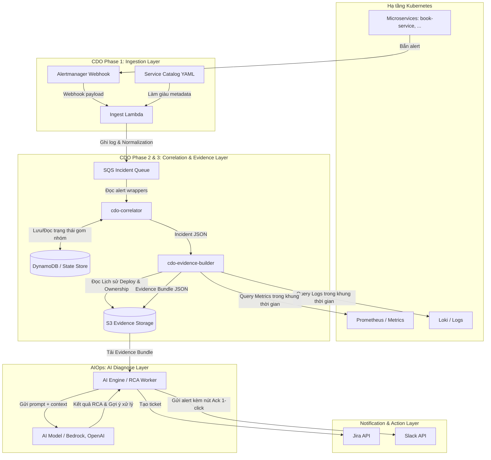

# Tài liệu Luồng Xử lý Sự cố Triage Hub (End-to-End Pipeline Flow)

Tài liệu này đặc tả toàn bộ quy trình xử lý dữ liệu cảnh báo từ khi sự cố xảy ra ở hạ tầng cho đến khi AI chẩn đoán, tạo ticket Jira và gửi thông báo qua Slack.

---

## 1. Sơ đồ luồng (Workflow Diagram)

Dưới đây là sơ đồ luồng dữ liệu end-to-end được thiết kế theo mô hình K8s-native / event-driven worker:

---

## 2. Chi tiết các bước trong luồng xử lý

### Bước 1: Cảnh báo kích hoạt (Alert Trigger)
Khi có sự cố xảy ra trên workload (ví dụ: RAM chạm hạn mức ở Scenario 2, hoặc code mới bị lỗi HTTP 500 ở Scenario 3):
1.  **Prometheus/Alertmanager** phát hiện chỉ số bất thường và bắn webhook alert thô (Raw alert) sang **Ingest Lambda**.

### Bước 2: Ingest & Normalize (CDO Phase 1)
1.  **Ingest Lambda** nhận raw alert.
2.  Kiểm tra tính hợp lệ (bắt buộc phải có các nhãn định danh: `tenant_id`, `environment`, `cluster`, `namespace`).
3.  Truy vấn **Service Catalog** để tự động điền các nhãn thông tin sở hữu còn thiếu (`owner_team`, `slack_channel`, `jira_project`).
4.  Lưu alert đã chuẩn hóa (Alert Wrapper) vào hàng đợi **SQS**.

### Bước 3: Gom nhóm & Correlate (CDO Phase 2)
1.  **cdo-correlator** kéo các alert từ queue.
2.  Gom các alert có cùng phạm vi (`tenant_id` + `service` + `environment` + `cluster` + `namespace`) xảy ra trong cùng một khung thời gian **10 phút** thành một **Incident** duy nhất.
3.  Cập nhật trạng thái vào State Store (tránh sinh lặp incident và hỗ trợ cơ chế giảm thiểu bão cảnh báo).

### Bước 4: Thu thập bằng chứng (CDO Phase 3 - Evidence Builder)
1.  Từ Incident được tạo, **cdo-evidence-builder** tự động mở rộng thời gian trước sự cố 15 phút và sau sự cố 5 phút (ví dụ: Alert bắt đầu lúc 10:00, Evidence window sẽ là 09:45 đến 10:10).
2.  Tiến hành truy vấn và lọc dữ liệu từ các kho lưu trữ:
    *   **Metrics**: Tải biểu đồ CPU/RAM, request rates.
    *   **Logs**: Tải log của container lỗi (nhận dạng các lỗi Thread, Exception).
    *   **K8s Events**: Gom các sự kiện Pod (`OOMKilled`, `Killing`, `CrashLoopBackOff`).
    *   **Deploys**: Truy xuất lịch sử triển khai gần nhất để kiểm tra có đợt cập nhật code nào trước sự cố hay không.
3.  Đóng gói toàn bộ thành một file **Evidence Bundle JSON** lưu trữ bất biến trên S3.

### Bước 5: Chẩn đoán AI (AI RCA Engine)
1.  **AI Engine** nhận thông báo về Evidence Bundle mới trên S3.
2.  Đọc file bundle, trích xuất dữ liệu thô và dựng prompt gửi đến LLM (như AWS Bedrock hoặc OpenAI).
3.  AI thực hiện phân tích:
    *   *Nguyên nhân*: Do đâu (ví dụ: OOMKilled do rò rỉ bộ nhớ, hoặc HTTP 500 do NullPointerException ở dòng 42 của deploy v1.4.3).
    *   *Mức độ tin cậy (Confidence)*.
    *   *Đề xuất hành động xử lý*.

### Bước 6: Tạo Ticket & Gửi thông báo (Notification & Human-in-the-loop)
1.  Hệ thống gọi API tạo ticket lỗi trên **Jira** (gắn tag team sở hữu, mức độ nghiêm trọng).
2.  Gửi thông điệp Slack đến kênh của đội on-call (`slack_channel`) chứa:
    *   Tóm tắt nguyên nhân lỗi từ AI.
    *   Đường link tới bằng chứng (Evidence Bundle) và ticket Jira.
    *   Nút bấm **1-Click Acknowledge** để kỹ sư on-call xác nhận xử lý, đảm bảo con người kiểm soát quy trình quyết định cuối cùng (*Human-in-the-loop*).
