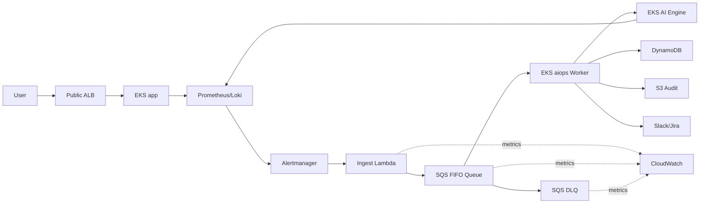
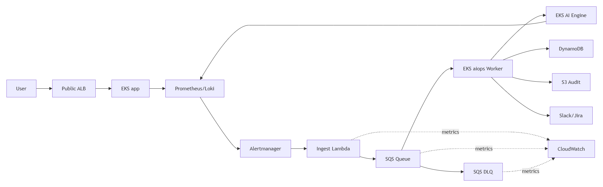

# Security Design - TF1 Triage Hub · CDO-05

**Owner:** CDO-05  
**Team liên quan:** AIO-01  
**Status:** Draft Pack #1, refined toward Pack #2  
**Scope:** DevOps/infrastructure security: network, IAM/IRSA, secrets, encryption, audit, tenant isolation, alert reliability.  
**Out of scope:** Full enterprise security audit, SIEM implementation, app-level authorization chi tiết, auto-remediation security.

---

## 1. Security summary

TF1 Triage Hub nhận alert từ observability stack, chuẩn hóa alert, đưa qua SQS FIFO/DLQ, gom thành incident, gọi AI Engine để RCA/summarize, rồi tạo payload cho Slack/Jira. Rủi ro chính:

- tenant A đọc nhầm dữ liệu tenant B;
- alert critical bị mất hoặc retry tạo duplicate Jira/Slack;
- AI Engine nhận quá nhiều raw logs/metrics hoặc nhận secret trong context;
- Jira/Slack/Bedrock tokens bị lộ trong Git, image, logs hoặc screenshot;
- public endpoint hoặc alert storm tạo cost spike;
- EKS workload có quyền quá rộng.

Security stance của CDO-05:

```text
private-by-default
+ least privilege IAM/IRSA
+ bounded observability access
+ tenant-scoped state/evidence
+ SQS/DLQ reliability
+ DynamoDB idempotency
+ S3 audit trail
+ no auto-remediation by AI
```

CDO owns platform, networking, IAM, Kubernetes guardrails, state/audit stores, and integration plumbing. AIO-01 owns RCA logic, prompt/model behavior, confidence scoring, and generated Slack/Jira payload content.

---

## 2. Network security

### 2.1 Network model





Caption: public traffic chỉ tới Demo App/Public API qua ALB. AI Engine không public. Metrics/logs nằm ở Prometheus/Loki/CloudWatch, không dump raw vào SQS. TF1 client brief yêu cầu single-region `us-east-1`; nếu CDO-05 demo chạy `ap-southeast-1` theo infra/cost draft hiện tại thì phải ghi rõ là capstone demo deviation và xin mentor/client approve.

### 2.2 Network controls

| Area | Control |
|---|---|
| Public edge | ALB dùng HTTPS/TLS 1.2+, security group chỉ mở 443; nếu public thật thì bật WAF rate-based rule và ALB access logs. |
| EKS placement | EKS nodes chạy trong private subnets; public subnet chỉ dành cho ALB/NAT nếu cần. |
| EKS API | Prod nên dùng private endpoint hoặc public endpoint giới hạn CIDR/VPN/bastion; tránh mở admin access `0.0.0.0/0`. |
| AI Engine | Internal service only; không route public ingress tới `ai-engine`. |
| AWS service access | Ưu tiên VPC endpoints cho S3, DynamoDB, SQS, CloudWatch Logs, ECR, Secrets Manager, STS, Bedrock nếu bật. |
| NAT Gateway | Không bật mặc định cho mọi egress; chỉ dùng khi worker/pod cần gọi public Slack/Jira trực tiếp. |
| Observability UI | Prometheus, Loki, Grafana, Alertmanager không public unauthenticated; dùng SSO/RBAC/VPN/internal access. |

Kubernetes NetworkPolicy baseline:

- default deny ingress theo namespace nếu CNI hỗ trợ;
- allow `app -> observability` cho metrics/traces/log shipping;
- allow `aiops -> ai-engine` cho internal RCA request;
- allow `ai-engine -> observability` theo bounded query;
- deny public ingress tới `ai-engine`;
- allow `aiops -> AWS endpoints` qua HTTPS cho SQS/DynamoDB/S3/Secrets.

Nếu dùng AWS VPC CNI, team cần xác nhận NetworkPolicy enforcement đã bật hoặc dùng Calico/Cilium. Nếu chưa enforce được, phải ghi rõ là gap trong `07_test_eval_report.md`.

---

## 3. IAM and access control

### 3.1 AWS IAM roles

| Role | Used by | Allow | Avoid |
|---|---|---|---|
| `tf1-ingest-lambda-role` | Ingest Lambda | `sqs:SendMessage` vào incident FIFO queue, CloudWatch Logs write, read webhook signing secret | `sqs:*`, DynamoDB write, Jira/Slack secret access |
| `tf1-correlator-worker-irsa-role` | K8s SA `aiops/correlator-worker` | SQS receive/delete/change visibility, DynamoDB read/write table cụ thể, S3 put/get audit bucket, read scoped secrets | `AdministratorAccess`, broad `s3:*`, broad `dynamodb:*`, observability admin |
| `tf1-ai-engine-irsa-role` | K8s SA `ai-engine/ai-engine-api` | Read bounded evidence, optional `bedrock:InvokeModel`, read service auth secret | Jira/Slack tokens nếu không cần, cluster-admin, direct broad log access |
| `tf1-observability-irsa-role` | Observability add-ons | Permission riêng cho log/metric backend nếu cần | Incident state mutation |
| `tf1-deploy-role` | CI/CD/GitOps | ECR push, EKS deploy, Helm/Argo sync, Terraform apply scoped resources | Long-lived static keys, broad IAM admin |
| `tf1-readonly-review-role` | Mentor/reviewer | Read-only EKS/CloudWatch/S3 evidence | Mutating actions |

### 3.2 IRSA and Kubernetes RBAC

Pods không dùng static AWS credentials và không dựa vào node role cho app permissions. Workload nào cần gọi AWS service phải dùng IRSA/EKS Pod Identity theo service account riêng.

RBAC rules:

- ưu tiên `RoleBinding` theo namespace, hạn chế `ClusterRoleBinding`;
- không cấp `cluster-admin`, wildcard `*`, hoặc `system:masters` cho user thường ngày;
- không cấp `get/list/watch secrets` nếu không bắt buộc;
- hạn chế `pods/exec`, `pods/portforward`, `nodes/proxy`, `escalate`, `bind`, `impersonate`;
- tách namespace theo trust boundary: `app`, `aiops`, `ai-engine`, `observability`;
- break-glass admin phải có owner, expiry, MFA và audit log.

Pod Security baseline cho `app`, `aiops`, `ai-engine`: run as non-root, no privilege escalation, read-only root filesystem nếu app hỗ trợ, drop Linux capabilities, `seccompProfile: RuntimeDefault`. Prod nên có `ResourceQuota`, `LimitRange`, HPA/KEDA và PodDisruptionBudget.

---

## 4. Secrets management

### 4.1 Secrets inventory

| Secret | Storage | Accessed by | Rotation |
|---|---|---|---|
| `WEBHOOK_SIGNING_KEY` | AWS Secrets Manager | Ingest Lambda / Alertmanager adapter | Manual cho capstone |
| `SERVICE_AUTH_TOKEN` | Secrets Manager -> External Secrets -> K8s Secret | CDO Worker + AI Engine | Manual cho capstone |
| `JIRA_API_TOKEN` | Secrets Manager | Worker/integration layer | Rotate sau demo nếu dùng token thật |
| `SLACK_WEBHOOK_URL` | Secrets Manager | Worker/integration layer | Rotate sau demo nếu dùng webhook thật |
| `GRAFANA_ADMIN_PASSWORD` | Secrets Manager / K8s Secret | Observability admin | Manual |
| `BEDROCK_MODEL_ID` | ConfigMap/env var | AI Engine | Không phải secret |

### 4.2 Inject pattern

Preferred pattern:

```text
AWS Secrets Manager
-> External Secrets Operator
-> Kubernetes Secret trong target namespace
-> Pod env var hoặc mounted file
```

Fallback cho Lambda: Lambda đọc secret bằng IAM role scoped ARN. Không hardcode secret trong Terraform state nếu tránh được.

Anti-leak controls: không commit `.env`/token/webhook/kubeconfig; không bake secret vào image; không lưu secret plaintext; redact sensitive headers/tokens; chạy secret scan trước Evidence Pack #2.

---

## 5. Data protection and storage boundary

| Data | Store | Security rule |
|---|---|---|
| Metrics | Prometheus / managed metric backend | Retention bounded; label `tenant_id`, `service`, `env`; không chứa secret. |
| Logs | Loki / CloudWatch Logs | Redaction, retention 7-14 ngày cho demo; không log token/header nhạy cảm. |
| Alert event | SQS FIFO Incident Queue | Chỉ giữ normalized alert event, không chứa raw log blob; `MessageGroupId` theo tenant/service/correlation key và `MessageDeduplicationId` theo idempotency key. |
| Failed alert | SQS DLQ | DLQ alarm > 0; restricted read; manual redrive. |
| Incident state | DynamoDB | Workflow state/idempotency; conditional writes; TTL; PITR. |
| Audit evidence | S3 | Alert payload, context snapshot, AI request/response, Jira/Slack payload; prefix theo tenant/service/incident. |
| Secrets | Secrets Manager | Scoped IAM access; no Git/image/log exposure. |

DynamoDB key model đề xuất:

```text
PK = tenant_id#incident_id
GSI1PK = idempotency_key
idempotency_key = tenant_id#service#alert_name#alert_fingerprint#window_start
```

S3 audit prefix mẫu:

```text
s3://tf1-audit/{tenant_id}/{service}/{incident_id}/...
```

Encryption baseline:

- SQS FIFO: SSE-SQS hoặc KMS CMK nếu alert payload nhạy cảm.
- DynamoDB: encryption at rest, PITR, TTL.
- S3: Block Public Access, SSE-KMS baseline cho audit evidence; Object Lock 90 ngày là design target vì requirement cần immutable audit trail. Nếu Pack #2 chưa bật được Object Lock thì ghi rõ gap trong `07_test_eval_report.md`.
- CloudWatch Logs: retention ngắn, KMS cho log group nhạy cảm nếu cần.
- ECR: scan on push, immutable tags, lifecycle policy.

Bedrock/AI data rule: AI chỉ nhận bounded context package, không nhận unlimited raw logs. Model response chỉ là recommendation/payload; AI không có quyền trực tiếp scale, restart, close incident, hoặc create Jira/Slack bằng quyền riêng.

---

## 6. Tenant isolation

CDO-05 dùng pooled EKS platform với tenant-aware metadata, không tạo cluster riêng cho từng tenant trong MVP.

Minimum tenant context:

```json
{
  "tenant_id": "tenant-a",
  "service": "checkout",
  "env": "prod",
  "alert_fingerprint": "abc123",
  "window": "5m"
}
```

| Layer | Isolation control |
|---|---|
| Request / alert event | `X-Tenant-Id` phải match body `tenant_id`; reject mismatch. |
| Kubernetes metadata | Workload/log/metric phải có `tenant_id`, `service`, `env`, `version`. |
| Namespace | Demo chia theo function; production có thể nâng lên namespace theo tenant/env hoặc tenant service group. |
| Observability query | Bắt buộc có `tenant_id + service + env + time_window`; prod nên enforce bằng query gateway. |
| Worker | Reject nếu thiếu tenant context; AI call gating theo tenant/quota. |
| DynamoDB | Key có tenant scope; conditional writes chống duplicate side effects. |
| S3 | Prefix bắt đầu bằng `{tenant_id}/{service}/{incident_id}`; bucket policy deny public/non-TLS. |
| Rate limit | Per-tenant alert quota, worker concurrency limit, AI/Bedrock call cap. |

Quan trọng: label `tenant_id` đủ cho MVP query convention, nhưng chưa đủ làm hard boundary cho production. Prod nên có query gateway hoặc observability backend multi-tenant để enforce scope trước khi query Prometheus/Loki.

---

## 7. Audit trail and monitoring

### 7.1 What to log

| Event | Required fields |
|---|---|
| Ingest Lambda received alert | `tenant_id`, `service`, `env`, `alert_fingerprint`, validation status |
| SQS enqueue/dequeue | queue name, message id, receive count, message age |
| Worker idempotency check | `tenant_id`, `incident_id`, `idempotency_key`, decision |
| Worker -> AI Engine call | `tenant_id`, `correlation_id`, `incident_id`, gating_reason, latency, status |
| AI bounded query | `tenant_id`, `service`, `env`, `window`, query source, result count |
| DynamoDB state update | incident id, old/new status, retry count |
| Jira/Slack side effect | idempotency key, target, result id, retry count |
| Security rejection | missing auth, invalid signature, tenant mismatch, oversized payload |

### 7.2 Pipeline monitor

CloudWatch alarms/dashboard cần cover: Lambda errors/throttles/duration; SQS queue depth, in-flight messages, oldest message age; DLQ visible messages > 0; worker errors/latency/AI call count; AI Engine timeout/error rate/latency; DynamoDB throttles/errors; S3 errors; Jira/Slack integration failures; suspicious IAM/secret access qua CloudTrail nếu bật.

Retention: logs 7-14 ngày cho demo; S3 evidence và DynamoDB incident state 30-90 ngày; security test outputs giữ tới final defense.

---

## 8. Security tests for evidence

| Test | How | Expected |
|---|---|---|
| Tenant mismatch | Header tenant A, body tenant B | Request bị reject 400/403 |
| Cross-tenant query | Query tenant A window | Không trả data tenant B |
| Webhook signing | Gửi alert thiếu/sai HMAC | Lambda reject, không enqueue SQS |
| SQS retry/DLQ | Worker fail nhiều lần | Message retry rồi vào DLQ, alarm visible |
| Idempotency | Retry cùng alert sau khi Jira đã tạo | Reuse existing ticket id, không duplicate |
| Secret leak scan | Scan repo/log/evidence | Không có raw token/webhook |
| Network isolation | Gọi public trực tiếp AI Engine | Không reachable |
| S3 public access | Check bucket public access block | Public access disabled |

Evidence commands cho Pack #2:

```bash
kubectl get networkpolicy -A
kubectl auth can-i get secrets --as <reviewer>
aws sqs get-queue-attributes --queue-url <queue-url> --attribute-names All
aws s3api get-public-access-block --bucket <audit-bucket>
```

---

## 9. Compliance touchpoints

Capstone không phải compliance audit đầy đủ. Mục này chỉ map control ở mức platform để mentor/client thấy security thinking đúng hướng.

| Area | Control touched |
|---|---|
| SOC2 logical access | IAM least privilege, IRSA, RBAC, no default cluster-admin. |
| SOC2 monitoring | CloudWatch alarms, SQS/DLQ visibility, EKS/CloudTrail audit logs. |
| SOC2 change management | Terraform, GitOps/CI-CD, immutable images, approval gate for prod. |
| GDPR-style tenant data protection | Tenant-scoped metadata/query/state/prefix, retention/TTL, deletion path. |
| Data retention | Short log retention, S3 lifecycle, DynamoDB TTL. |

---

## 10. Open questions

| ID | Question | Owner | Deadline |
|---|---|---|---|
| SQ-01 | Public ALB có cần internet thật không, hay demo internal/VPN là đủ? | CDO-05 | Before infra final |
| SQ-02 | NetworkPolicy sẽ enforce bằng AWS VPC CNI native policy, Calico hay Cilium? | CDO-05 | Before security evidence |
| SQ-03 | Jira/Slack là live integration hay chỉ payload/mock trong demo? | CDO-05 + AIO-01 | Before E2E demo |
| SQ-04 | Bedrock có bật thật không? Nếu bật, model/cost cap là gì? | AIO-01 + CDO-05 | Before cost final |
| SQ-05 | Audit evidence có cần Object Lock/KMS CMK không, hay SSE-S3 đủ cho capstone? | CDO-05 | Before final docs |
| SQ-06 | Namespace model cuối cùng là by function hay by tenant/env? | CDO-05 | Before multi-tenant test |
| SQ-07 | Region cuối cùng theo client brief `us-east-1` hay demo deviation `ap-southeast-1`? | CDO-05 | Before infra final |

---

## 11. Related documents

- [`02_infra_design.md`](02_infra_design.md) - architecture, component choices, scaling/failure modes.
- [`07_test_eval_report.md`](07_test_eval_report.md) - nơi ghi evidence thật cho tenant isolation, auth, DLQ, idempotency và secret scan.
- [`08_adrs.md`](08_adrs.md) - ADR cho EKS, SQS/DLQ, DynamoDB idempotency, S3 audit.
