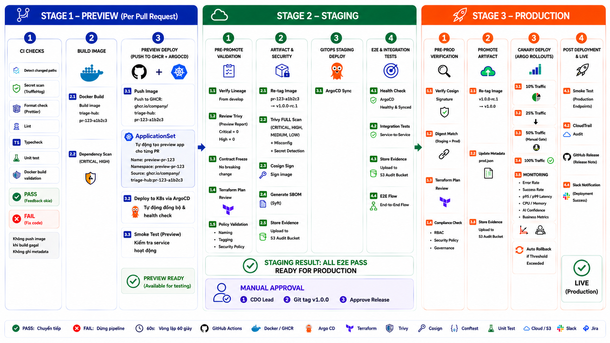

# Deployment & CI/CD Design - Task force 1 · CDO 05

<!-- Doc owner: CDO 05
     Status: Draft (W11 T4) → Final (W11 T6 Pack #1) → Working (W12 T4 Pack #2)
     Word target: 1200-2000 từ -->

## 1. IaC strategy

### 1.1 Tool choice

- **IaC tool**: Terraform v1.9+ (HCL) - justify: Declarative, mature AWS provider, có state drift detection mạnh, plan-before-apply workflow phù hợp cho capstone approval gate. Dễ review hơn so với CDK hay CloudFormation.
- **State backend**: S3 bucket (`tf1-cdo05-tfstate`) + DynamoDB lock (`tf1-cdo05-tflock`) tại `ap-southeast-1`.
- **Modular structure**: shared modules (networking, eks, data-store...) + environment-specific roots (`environments/dev`, `environments/prod`).

### 1.2 Module structure

```text
infra/
├── modules/
│   ├── networking/        # VPC, 3-AZ subnets, NAT, SG, VPC Endpoints
│   ├── compute/           # EKS cluster, managed node group, IRSA, OIDC
│   ├── data/              # DynamoDB tables (tenant config, audit index)
│   ├── tenant-provision/  # per-tenant resources (Namespace, Role, DB key)
│   └── observability/     # CloudWatch Log Groups, Metric Alarms, SNS topics
├── environments/
│   ├── dev/               # Gọi modules/ với dev-specific vars
│   └── prod/              # Gọi modules/ với prod-specific vars
└── README.md
```

### 1.3 State management

- Remote state per environment: `dev/terraform.tfstate`, `prod/terraform.tfstate`.
- State lock via DynamoDB (`tf1-cdo05-tflock`, hash key = `LockID`) với Consistent Read.
- Plan-on-PR + apply-on-merge gate: 
  - `terraform plan` tự động chạy và comment trên PR.
  - Tự động apply trên dev khi merge, cần manual approve cho prod.

## 2. CI/CD pipeline

### 2.1 Pipeline stages



```text
PR opened ──► Build ──► Test ──► Scan ──► Plan ──► Review ──► Merge ──► Apply ──► Smoke test
```

| Stage | Tool | What it does | Quality gate |
|---|---|---|---|
| Build | GitHub Actions | Compile + container build (Build once, promote everywhere) | Build success |
| Test | pytest / Jest | Unit + integration tests, Contract schema validation | Coverage ≥ 70%, Pass 100% |
| Scan | Trivy + Gitleaks | Image vuln + dependency CVE + secret scan | No CRITICAL/HIGH, 0 secrets |
| Plan | Terraform plan | Preview infra change | Plan review success |
| Apply | ArgoCD / Terraform | Deploy K8s manifests / deploy infra | Healthy & Synced / Apply success |
| Smoke | Custom script | K8s Job health check post-deploy / policy validation | All endpoints 200, valid response |

### 2.2 Branch strategy

- `main` = production-ready (Deploy to Prod namespace, manual approval required).
- `develop` = integration (Deploy to Dev namespace, auto-sync).
- `feature/*` = feature branches (Chỉ chạy CI check và Preview env, không deploy cố định).
- PR required for merge to `main` + approval, strict status checks (Trivy scan, test coverage).

## 3. GitOps

### 3.1 Tool

- **ArgoCD** (preferred). Cung cấp UI dashboard trực quan phục vụ demo và native integration với Argo Rollouts.
- **Repo structure**: separate "app" repo (source code) and "config" repo (GitOps manifests dùng App of Apps pattern và Kustomize overlays).

### 3.2 Sync waves

| Wave | Components |
|---|---|
| 0 | Namespaces, RBAC, ExternalSecrets, ConfigMaps |
| 1 | Platform Service (Deployment, Service, HPA) |
| 2 | AI Engine (Argo Rollout Canary, Secrets, NetworkPolicy) |
| 3 | Worker (AIOps Worker - Cần AI Engine URL sẵn sàng) |
| 4 | Observability (Prometheus, Grafana, CloudWatch Agent) |

### 3.3 Drift detection

- ArgoCD auto-sync with prune enabled cho môi trường dev. Disabled cho prod để tránh xoá nhầm resource.
- Poll Git repo mỗi 3 phút, phát hiện drift và self-heal về Git state (ghi đè thay đổi thủ công từ `kubectl`).
- Daily drift report cho Terraform và manual approval cho destructive change qua `terraform plan`.

## 4. Deployment strategy

### 4.1 Strategy

- **Canary** (preferred cho AI Engine): 10% → 50% → 100% qua các bước pause và check metric tự động (AnalysisRun).
- **Rolling Update** (cho Platform Service): Đơn giản hoá vận hành với `maxUnavailable: 0` và `maxSurge: 1`.
- **Abort criteria**:
  - Error rate > 0.5% (5xx errors)
  - P99 latency > 1000ms
  - AI confidence avg < 0.5
- **Auto-rollback** on abort: Argo Rollouts tự động scale down canary pods nếu vi phạm criteria.

### 4.2 Rollback method

- **Primary**: Argo Rollouts auto-abort / ArgoCD rollback to previous Git SHA.
- **Secondary**: Terraform state rollback bằng `terraform state pull` version cũ (nếu infra change lỗi).
- **Target RTO**: < 60s cho application rollback (shift traffic về pods bản cũ).

## 5. Environment separation

| Env | Purpose | Account / Namespace | Auto-deploy |
|---|---|---|---|
| Dev | Dev experimentation & Staging | `triage-hub-dev` | On merge to `develop` |
| Prod | Real tenant traffic (Demo capstone) | `triage-hub-prod` | On merge to `main` + manual approval |

*(Ghi chú: Thu gọn xuống 2 môi trường do giới hạn budget capstone $100-150 / 2 tuần).*

## 6. Secrets in pipeline

- CI accesses secrets via OIDC + IAM assume-role (Không dùng static AWS keys, TTL 15m).
- Runtime secrets được quản lý bởi AWS Secrets Manager và inject vào cluster qua External Secrets Operator (ESO).
- Secret scanning trên PR bằng Gitleaks / TruffleHog.
- Block merge if secret detected.

## 7. Tenant onboarding deployment

```text
1. POST /platform/v1/tenants → trigger Step Function
2. SF invokes Terraform module `tenant-provision`
3. Module creates: IAM role (IRSA) + DB partition key + K8s namespace + NetworkPolicy
4. Smoke test runs
5. Callback to API: tenant ready
```

Total time target: < 30 min.

## 8. Observability stack

| Component | Tool |
|---|---|
| Metrics | Prometheus (in-cluster) / CloudWatch |
| Logs | Fluent Bit → CloudWatch Logs / S3 cho cold storage |
| Traces | OpenTelemetry → AWS X-Ray |
| Dashboards | Grafana (SLO, cost tracking, AI health) |
| Alerts | Prometheus Alertmanager → SNS → Slack |

## 9. Open questions

- [ ] Q1: AI team dùng ECR repo nào? CDO-05 cần cross-account ECR pull permission?
- [ ] Q2: Jira API token do CDO quản lý hay AI quản lý?
- [ ] Q3: Bedrock throttling fallback: CDO handle retry hay AI handle?
- [ ] Q4: ArgoCD deploy trên EKS cluster chung hay cluster riêng?

## Related documents

- [`01_requirements_analysis.md`](01_requirements_analysis.md) - NFR targets (SLO, scale, cost) driving deployment design
- [`02_infra_design.md`](02_infra_design.md) - Infra design này deploy theo strategy §1-§5 doc này
- [`03_security_design.md`](03_security_design.md) - Secret scanning + OIDC + IAM (this doc covers CI/CD security)
- [`05_cost_analysis.md`](05_cost_analysis.md) - Cost implications of 2-env strategy
- [`08_adrs.md`](08_adrs.md) - Quyết định chọn Terraform, ArgoCD, Canary
