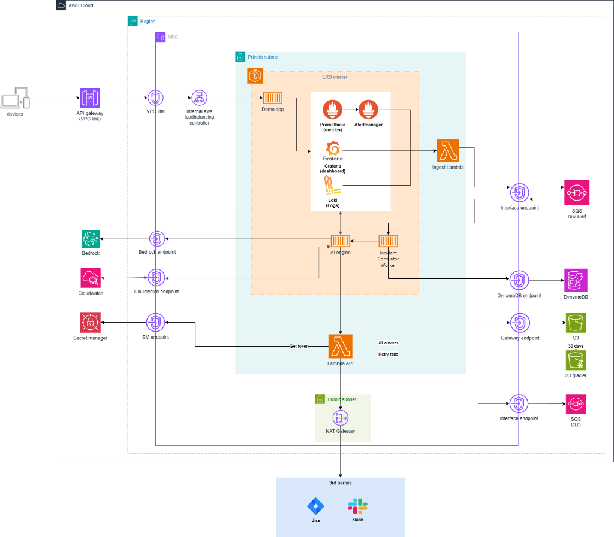

# Infrastructure Design - Task Force 1 · CDO 5

## 1. Architecture diagram



**Caption:**  
This architecture uses Amazon EKS as the main runtime platform for the demo application, CDO Incident Correlator Worker, and Kubernetes-native observability stack. User traffic enters through an Application Load Balancer and reaches demo workloads running inside EKS.

The application emits metrics and logs. Metrics are stored in Prometheus, logs are stored in Loki, and Grafana is used for dashboard and investigation. PrometheusRule evaluates metrics and fires alerts when abnormal conditions are detected.

Alertmanager acts as the first noise-control layer. It groups, inhibits, silences, and controls repeat intervals before alerts enter the incident pipeline. Ingest Lambda receives the Alertmanager webhook, validates required metadata, normalizes the alert payload, and sends the alert event to SQS.

SQS is used only for alert events. It provides durable buffering, retry, DLQ, and backlog visibility. Metrics and logs do not go through SQS.

The CDO Incident Correlator Worker polls SQS, deduplicates repeated alerts, groups related alerts into incident-level triggers, and stores workflow state in DynamoDB. The worker does not perform RCA. It only decides whether the AI Engine should be called and sends a bounded incident trigger when needed.

The AI Engine is owned by the AIOps/AI team. It receives the incident trigger, queries Prometheus and Loki through bounded read access, builds the context, performs RCA, and returns structured output such as root cause, confidence, evidence, missing context, and suggested actions.

CDO stores incident state in DynamoDB, stores audit/evidence in S3, and creates or updates Jira/Slack if CDO owns the integration layer.

---

## 1.1 Data ownership boundary

The system has two different data flows.

### Normal observability flow

```text
App on EKS
→ Prometheus metrics
→ Loki logs
→ Grafana dashboards
→ SRE / AI Engine query by tenant/service/env/time window
```

This flow is used for normal monitoring, SRE investigation, and RCA context retrieval.

CDO provides two possible access patterns:

```text
Pull model:
AI Engine or SRE tool queries Prometheus/Loki/CloudWatch directly
through bounded read access.

Push model:
CDO may send windowed summaries to AI Engine, for example every 1 minute.
This is a batched summary flow, not realtime raw metric/log streaming.
```

Important boundary:

```text
Metrics/logs do not go through SQS.
Metrics stay in Prometheus.
Kubernetes application logs stay in Loki.
AWS-side service logs/metrics stay in CloudWatch.
```

### Alert incident flow

```text
PrometheusRule
→ Alertmanager
→ Ingest Lambda
→ SQS
→ CDO Incident Correlator Worker
→ DynamoDB
→ AI Engine
→ Jira/Slack
→ S3 audit
```

This flow is used only when an alert event is fired and the incident triage workflow needs to start.

Key distinction:

```text
Metric/log raw = analysis data
Alert event = incident workflow trigger
```

---

## 1.2 Responsibility boundary: CDO vs AIOps/AI Engine

CDO does not own RCA logic and does not build the final metric/log context package for the AI Engine.

CDO owns:

```text
- runtime platform on EKS
- Prometheus, Grafana, Alertmanager, Loki
- consistent observability metadata
- bounded read access to Prometheus/Loki/CloudWatch
- network policy, IAM, RBAC, and secret access boundary
- alert ingestion from Alertmanager
- SQS alert buffering
- alert deduplication and correlation
- incident state and idempotency in DynamoDB
- Jira/Slack integration reliability if CDO owns that layer
- S3 audit/evidence store
- CloudWatch monitoring for AWS-side services
```

AIOps/AI Engine owns:

```text
- receive incident trigger from CDO
- query Prometheus metrics by tenant/service/env/window
- query Loki logs by tenant/service/env/window
- normalize and aggregate metrics/logs
- build time-window context
- calculate baseline/trend/anomaly
- perform RCA
- return confidence, evidence, missing context, and suggested actions
```

Final boundary:

```text
CDO owns the platform and alert reliability.
AI owns observability interpretation and RCA.
```

---

# 2. Component table

|Component|AWS Service / Tool|Reason|Cost note|
|---|---|---|---|
|Compute|Amazon EKS|Main runtime for demo app, CDO Correlator Worker, and observability stack. Chosen because Kubernetes gives consistent workload metadata, namespace, labels, service discovery, NetworkPolicy, and GitOps-friendly deployment context.|Higher fixed cost than ECS/Lambda because of EKS control plane and worker nodes. Accepted for Kubernetes-native design.|
|API entry|ALB + AWS Load Balancer Controller|Public entry point for user/load generator traffic into demo app on EKS. Managed through Kubernetes Ingress.|ALB has hourly and traffic-based cost. Keep one shared ALB for MVP.|
|Alert ingestion|Ingest Lambda|Receives Alertmanager webhook, validates required fields, normalizes alert payload, and sends message to SQS quickly.|Low cost for MVP because alert volume is small.|
|Event queue|SQS Raw Alert Queue + DLQ|Durable alert buffer, retry, visibility timeout, backlog visibility, DLQ for failed alerts. Decouples monitoring from downstream processing.|Low for capstone traffic. Must monitor backlog and DLQ.|
|Incident state|DynamoDB|Stores incident_state, alert_fingerprint, correlation_key, workflow progress, retry_count, Jira ticket ID, Slack thread ID, and last_error. Enables idempotency.|Low for MVP. On-demand mode is simpler for unpredictable demo traffic.|
|Audit storage|S3|Stores original alert payload, AI request/response, Jira/Slack payload, workflow evidence, and replay/debug material.|Low cost. Can use lifecycle policy to move older evidence to cheaper tier.|
|Metrics|Prometheus|Stores application and Kubernetes metrics, evaluates PrometheusRule, and provides query source for SRE/AIOps.|Runs inside EKS, consumes node CPU/memory/storage. Retention should be limited for MVP.|
|Logs|Loki|Stores Kubernetes workload logs and supports label-based log query by namespace, pod, service, tenant_id, env, and time window.|Runs inside EKS. Cost depends on log volume and retention.|
|Dashboard|Grafana|Dashboard and investigation UI for metrics, logs, and alert status.|Runs inside EKS. Low MVP footprint.|
|Alert noise control|Alertmanager|First-layer alert noise control: grouping, inhibition, silence, group_wait, repeat_interval.|Runs as part of monitoring stack.|
|AWS-side monitoring|CloudWatch|Monitors Lambda logs, SQS backlog, DLQ count, DynamoDB errors/throttles, and AWS integration logs.|Cost depends on log volume and retention. Set retention policy.|
|Secret management|Secrets Manager / SSM|Stores Jira token, Slack token/webhook, AI Engine API key, and runtime secrets.|Low if secret count is small.|
|Pod AWS access|IAM + IRSA / EKS Pod Identity|Allows EKS pods to access SQS, DynamoDB, S3, Secrets Manager with least privilege.|No major direct cost, but important for security.|
|External integration|Jira + Slack|Human-in-the-loop output. One incident should map to one Jira ticket and one Slack thread.|External service cost depends on account/license, not core AWS infra.|

---

## 2.1 Component responsibility

|Component|Does|Does not do|
|---|---|---|
|ALB|Routes public traffic to demo app/API service on EKS.|Does not call AI Engine directly.|
|EKS|Runs app workloads, Correlator Worker, and observability stack.|Does not store durable incident state by itself.|
|Demo App|Generates traffic, metrics, logs, and failure scenarios.|Does not perform RCA or create Jira/Slack.|
|Prometheus|Scrapes metrics, stores time-series, evaluates rules.|Does not store application logs.|
|Loki|Stores Kubernetes application/workload logs.|Does not monitor AWS managed services.|
|Grafana|Provides dashboard and investigation UI.|Does not own incident workflow state.|
|Alertmanager|Groups/inhibits/silences alerts before ingestion.|Does not perform deep multi-service incident correlation.|
|Ingest Lambda|Validates and normalizes alert webhook, pushes alert to SQS.|Does not do RCA, does not query metric/log, does not call AI Engine.|
|SQS|Stores alert event durably and supports retry/DLQ.|Does not store metric/log raw and does not guarantee exactly-once processing.|
|SQS DLQ|Stores messages that fail too many times.|Does not fix failed messages automatically.|
|CDO Correlator Worker|Polls SQS, deduplicates alerts, correlates related alerts, updates DynamoDB, decides whether to call AI Engine.|Does not perform RCA, baseline calculation, anomaly interpretation, or deep log analysis.|
|DynamoDB|Stores incident state, idempotency keys, workflow progress, Jira/Slack IDs.|Does not store raw logs, full metric windows, or large AI evidence.|
|S3 Audit Store|Stores audit evidence, AI request/response, payload snapshots, replay/debug material.|Does not serve realtime query traffic.|
|AI Engine|Queries observability data, builds RCA context, performs reasoning, returns RCA/confidence/suggested actions.|Does not own alert durability, SQS retry, or pipeline state.|
|Jira/Slack|Human-facing incident tracking and notification.|Does not act as source of truth for workflow state.|
|CloudWatch|Monitors AWS-side pipeline components.|Does not replace Loki for Kubernetes application logs.|

---


---

# 4. Multi-tenant approach

## 4.1 Tenant model

In the MVP, multi-tenancy is handled mainly through metadata, not a full SaaS tenant lifecycle.

Required metadata:

```text
tenant_id
service
env
namespace
workload
timestamp
alertname
severity
```

Example tenant IDs for demo:

```text
tenant-a
tenant-b
```

Production can use UUID v4, but the MVP does not claim full production tenant onboarding.

---

## 4.2 Isolation pattern

**Data isolation:** pooled model by metadata.

```text
Prometheus labels include tenant_id, service, env.
Loki labels include tenant_id, service, env, namespace, pod.
DynamoDB keys include tenant_id and correlation_key.
S3 audit prefix includes tenant_id/service/incident_id.
```

**Compute isolation:** shared EKS cluster.

```text
Demo app workloads can be separated by namespace.
CDO pipeline components run in platform/ops namespace.
AIOps/AI Engine can run in its own namespace or external runtime.
```

**Why this pattern:**  
Pooled metadata + shared EKS is suitable for capstone scope because the target is to prove reliable alert handling and incident correlation, not to implement full SaaS tenant isolation with per-tenant accounts or clusters.

---

## 4.3 Bounded access for AI Engine

CDO must not give the AI Engine unrestricted access to the entire monitoring stack.

Access should be bounded by:

```text
tenant_id
env
service or service_group
time window
read-only permission
internal network path
```

Possible enforcement mechanisms:

```text
- internal query gateway/API
- read-only service account or token
- namespace and NetworkPolicy boundary
- IAM/RBAC boundary if AWS-side access is needed
- query convention requiring tenant_id/service/env/window
- audit logging of AI queries
```

Important note:

```text
Prometheus/Loki labels alone are not strong tenant isolation.
For MVP, they are acceptable as metadata-based scoping.
For production, a query gateway or stronger access-control layer should be added.
```

---

## 4.4 Tenant onboarding flow

MVP onboarding:

```text
1. Create tenant_id or service label in config.
2. Attach tenant_id/service/env to metrics, logs, and alert labels.
3. Create namespace if workload separation is needed.
4. Configure Alertmanager grouping by tenant/env/service/severity.
5. Verify alert payload has required metadata.
6. Verify AI Engine can query bounded data by tenant/service/env/window.
```

Future production onboarding:

```text
POST /platform/v1/tenants
→ Terraform/Step Function provisions namespace/config/IAM
→ create tenant-scoped observability labels
→ create secret and access policy
→ smoke test
→ tenant ready callback
```

Do not claim this full lifecycle is implemented in the MVP unless it is actually built.

---

## 4.5 Noisy neighbor mitigation

MVP controls:

```text
- ResourceQuota and LimitRange per namespace if multiple tenants are simulated
- Alertmanager grouping to reduce alert spam before Lambda/SQS
- SQS backlog visibility to detect high alert volume
- Correlator gating to avoid repeated AI calls
- bounded observability queries by tenant/service/env/time window
```

Avoid claiming exact quota numbers unless tested.

---

# 5. Key design decisions / alternatives considered

## 5.1 Why Amazon EKS?

### Alternatives

```text
Option A: Lambda + API Gateway
Option B: ECS Fargate + ALB
Option C: Amazon EKS
```

### Why not Lambda as the main compute?

Lambda is good for short-lived event handling, but TF1 is not only an API or simple event processor. The platform needs to run demo workloads, worker processes, observability stack, Alertmanager, Grafana, Loki, Prometheus, and Kubernetes-style metadata around workloads.

Lambda is still used, but only as a lightweight alert ingestion adapter.

### Why not ECS Fargate?

ECS can run containers well and is often simpler and cheaper than EKS. However, this project benefits from Kubernetes-native concepts:

```text
- namespace
- labels
- annotations
- service discovery
- NetworkPolicy
- GitOps
- rollout metadata
- pod/deployment identity
- observability close to workload
```

### Why EKS?

EKS gives one consistent metadata model around:

```text
tenant_id
service
env
namespace
pod
deployment
version
```

This metadata can be used across runtime, metrics, logs, alerts, deployment history, and bounded query access for AIOps.

Decision:

```text
Choose EKS because TF1 is an AIOps-ready incident triage platform,
not only a cheap container hosting problem.
```

---

## 5.2 Why AWS Load Balancer Controller + ALB?

### Alternatives

```text
Option A: NodePort
Option B: NGINX Ingress only
Option C: API Gateway
Option D: AWS Load Balancer Controller + ALB
```

### Why ALB Controller?

The demo app and possible API entrypoints run inside EKS. AWS Load Balancer Controller allows Kubernetes Ingress to manage ALB automatically.

Benefits:

```text
- Kubernetes-native ingress management
- no manual ALB/target group management
- works naturally with EKS service discovery
- supports path-based and host-based routing
- fits GitOps workflow because ingress config lives in Kubernetes manifests
```

### Why not API Gateway as main entry?

API Gateway is useful for managed API auth/throttling, but this MVP mainly exposes containerized workloads inside EKS. ALB is simpler and more natural for HTTP ingress into Kubernetes workloads.

Decision:

```text
Use ALB + AWS Load Balancer Controller for public app/API entry into EKS.
```

---

## 5.3 Why Ingest Lambda before SQS?

### Alternatives

```text
Option A: Alertmanager sends directly to SQS
Option B: Alertmanager sends directly to Worker/API
Option C: Alertmanager sends to Ingest Lambda, then Lambda sends to SQS
```

### Why Lambda?

Alertmanager webhook payload may need validation and normalization before becoming an internal alert event.

Ingest Lambda performs:

```text
- receive webhook
- validate required fields
- normalize payload
- attach tenant/service/env/window metadata
- generate idempotency key or correlation fields if needed
- send message to SQS
```

It is intentionally lightweight.

It does not:

```text
- perform RCA
- query metrics/logs
- correlate deeply
- call AI Engine
- create Jira/Slack
```

Decision:

```text
Use Ingest Lambda as a thin adapter between Alertmanager webhook and SQS.
```

---

## 5.4 Why SQS + DLQ?

### Alternatives

```text
Option A: Direct webhook to AI Engine
Option B: Lambda retry only
Option C: SQS + DLQ
```

### Why SQS?

Alert event is a critical incident trigger. If the alert is lost, the triage workflow may never start.

SQS provides:

```text
- durable alert buffer
- retry through visibility timeout
- DLQ for poison messages
- backlog visibility
- decoupling between monitoring and downstream processing
- replay/debug capability
```

Lambda retry only protects function execution in some cases. SQS protects the incident event lifecycle more explicitly.

Decision:

```text
Use SQS for alert events only.
Do not use SQS for metric/log raw data.
```

---

## 5.5 Why DynamoDB for incident_state?

### Alternatives

```text
Option A: No database
Option B: RDS/Aurora
Option C: DynamoDB
```

### Why state is needed?

SQS is at-least-once delivery. The same message can be processed more than once.

Example:

```text
Worker receives alert
→ creates Jira successfully
→ crashes before sending Slack
→ message becomes visible again
→ worker retries same alert
```

Without state, the worker may create duplicate Jira tickets or Slack messages.

DynamoDB stores:

```text
- incident_id
- correlation_key
- alert_fingerprint
- status
- current_step
- retry_count
- last_error
- jira_ticket_id
- slack_thread_id
- created_at
- updated_at
```

Decision:

```text
Use DynamoDB as incident state store, idempotency store, and workflow progress store.
```

---

## 5.6 Why S3 Audit Store?

### Alternatives

```text
Option A: Store everything in DynamoDB
Option B: Store audit evidence in S3
```

### Why S3?

DynamoDB should store current state, not large evidence objects.

S3 can store:

```text
- original alert payload
- grouped alert payload
- incident trigger sent to AI
- AI request
- AI response
- Jira payload
- Slack payload
- replay/debug material
```

This helps answer:

```text
What did the AI receive?
What evidence did it use?
Can we replay/debug this incident?
What exactly was sent to Jira/Slack?
```

Decision:

```text
Use DynamoDB for current state.
Use S3 for detailed audit evidence and replay material.
```

---

## 5.7 Why Prometheus/Loki + CloudWatch split?

### Why not only CloudWatch?

CloudWatch is strong for AWS managed services, but Kubernetes workload metrics/logs are easier to work with through Kubernetes-native labels.

Prometheus/Loki fit EKS workloads because they can use labels such as:

```text
namespace
pod
container
service
tenant_id
env
```

### Why keep CloudWatch?

CloudWatch is still needed for AWS-side services:

```text
- Lambda logs/errors/duration
- SQS backlog and DLQ metrics
- DynamoDB throttles/errors
- AWS integration logs
```

Decision:

```text
Prometheus = EKS/app metrics
Loki = EKS/app logs
Grafana = dashboard/investigation UI
CloudWatch = AWS-side pipeline monitoring
S3 = audit/evidence store
```

---

## 5.8 Why Alertmanager + CDO Correlator, not Alertmanager only?

Alertmanager is good for basic noise control:

```text
- grouping
- inhibition
- silence
- repeat interval
```

But Alertmanager does not fully understand incident workflow state, Jira/Slack side effects, AI call gating, or cross-service incident correlation.

The CDO Correlator handles:

```text
- alert_fingerprint
- correlation_key
- incident_state
- AI call decision
- duplicate prevention
- workflow resume
```

Decision:

```text
Use Alertmanager as Layer 1 noise control.
Use CDO Correlator + DynamoDB as Layer 2 incident correlation and idempotency control.
```

---

# 6. Scaling strategy

## 6.1 Vertical scaling

Increase CPU/memory for:

```text
- Demo App pods
- CDO Correlator Worker pod
- Prometheus
- Loki
- Grafana
- Alertmanager
```

Use this when one component is resource constrained but not horizontally bottlenecked.

---

## 6.2 Horizontal scaling

Scale out:

```text
Demo App:
- by CPU/memory or request traffic

CDO Correlator Worker:
- by SQS visible messages
- by age of oldest message
- by worker error rate

Observability stack:
- start with MVP sizing
- increase replicas/storage only if needed

AI Engine:
- owned by AIOps team
- CDO protects it by reducing repeated calls
```

For MVP, fixed replicas are acceptable. HPA/KEDA can be added if there is enough time.

---

## 6.3 Scaling triggers

Recommended triggers:

```text
- CPU usage
- memory usage
- SQS ApproximateNumberOfMessagesVisible
- SQS ApproximateAgeOfOldestMessage
- worker error rate
- Lambda error rate
- DynamoDB throttle/error rate
- AI Engine latency/error rate
```

Do not claim exact thresholds unless measured.

---

## 6.4 AI call control

The Correlator should not call AI for every alert.

Call AI only when:

```text
- new incident is created
- severity increases
- new important alert type appears
- incident lasts longer than a threshold
- previous RCA confidence is low
- human requests re-analysis
```

Skip AI call when:

```text
- alert is duplicate
- alert belongs to existing incident
- only alert_count or last_seen_at changes
- message is only SQS retry
```

This protects AI cost and avoids repeated RCA.

---

# 7. Failure modes and recovery

|Failure|Detection|Recovery|Data loss expectation|
|---|---|---|---|
|Demo app pod crash|Kubernetes events, Prometheus target down|Kubernetes restarts/reschedules pod|No incident state loss if app is stateless|
|Prometheus unavailable|Grafana/Prometheus health, scrape failure|Restart pod, restore config/storage if needed|Metrics gap possible during outage|
|Loki unavailable|Grafana Explore error, Loki pod health|Restart Loki/agent, inspect storage|Logs gap possible during outage|
|Alert storm|Alert volume spike, Alertmanager dashboard, SQS backlog|Alertmanager grouping/inhibition + Correlator gating|Alert event retained if sent to SQS|
|Ingest Lambda error|CloudWatch Lambda error/duration|Fix schema/config and replay if source supports retry|Possible alert loss before SQS if source does not retry|
|SQS backlog high|CloudWatch SQS visible messages / age|Scale worker, inspect downstream latency/errors|No loss while messages remain in queue|
|Worker crash|Pod restart, worker logs, SQS message visible again|SQS retries message; worker resumes using DynamoDB state|No loss if message not deleted|
|Duplicate alert|Same alert_fingerprint|Update count/last_seen_at, skip new incident|No duplicate incident expected|
|Related alerts|Same correlation_key|Append to existing incident and update state|No duplicate Jira/Slack expected|
|AI Engine unavailable|Worker call error, timeout|Do not mark AI step complete; retry/backoff; keep state in DynamoDB|Alert state preserved|
|Jira created but worker crashes before Slack|DynamoDB has jira_ticket_id and current_step|On retry, skip Jira and continue Slack|No duplicate Jira expected|
|Slack failure|Worker error and last_error in DynamoDB|Retry Slack update using existing incident state|No duplicate Jira expected|
|DynamoDB throttle/error|CloudWatch DynamoDB metrics|Retry with backoff; tune capacity/on-demand|State write may fail until retry succeeds|
|S3 write failure|Worker logs/CloudWatch error|Retry audit write; keep minimal state in DynamoDB|Audit evidence may be incomplete if not retried|
|DLQ has messages|CloudWatch DLQ message count|Inspect, fix bug, replay manually|No loss if DLQ retention is sufficient|
|CloudWatch logging issue|Missing logs/metric ingestion|Check log group/retention/IAM|Pipeline may still run but debugging is harder|
|AZ/node failure|EKS node events, pod rescheduling|Multi-AZ node group if configured|Managed services retain queue/state|
|Region outage|External monitor/manual detection|Out of MVP scope; future DR plan|TBD|

---

# 8. Security and access notes

Detailed security design belongs in `03_security_design.md`, but the infrastructure design assumes these controls:

```text
- private EKS worker nodes where possible
- ALB only for public app/API entry
- AI Engine endpoint not exposed publicly unless explicitly required
- IAM least privilege for Lambda and Worker
- IRSA or EKS Pod Identity for pod access to AWS services
- Secrets Manager/SSM for Jira, Slack, and AI Engine credentials
- NetworkPolicy to restrict namespace-to-namespace traffic
- read-only bounded access for AI Engine to observability data
- S3 bucket policy and encryption for audit evidence
- CloudWatch log retention policy
```

Example Correlator permissions:

```text
sqs:ReceiveMessage
sqs:DeleteMessage
sqs:ChangeMessageVisibility
dynamodb:GetItem
dynamodb:PutItem
dynamodb:UpdateItem
s3:PutObject
secretsmanager:GetSecretValue
```

---

# 9. MVP scope

The MVP should implement:

```text
- EKS runtime for demo app and CDO worker
- ALB ingress to demo app
- Prometheus + Grafana + Alertmanager
- Loki for Kubernetes application logs
- Ingest Lambda
- SQS Raw Alert Queue + DLQ
- CDO Incident Correlator Worker
- DynamoDB incident_state table
- rule-based alert_fingerprint
- rule-based correlation_key
- AI Engine API contract
- Jira/Slack integration if owned by CDO
- S3 audit evidence
- CloudWatch monitoring for Lambda/SQS/DLQ/DynamoDB
```

Do not overclaim:

```text
- no full SaaS tenant lifecycle unless implemented
- no benchmark numbers unless measured
- no topology-aware correlation in MVP
- no strong tenant isolation through labels alone
- no claim that CDO performs RCA
```

---

# 10. Future improvements

Possible future work:

```text
1. Impact Graph
   Store service dependency metadata to improve correlation and blast-radius analysis.

2. Topology-aware correlation
   Understand upstream/downstream impact, for example Redis → payment-api → checkout-api → frontend.

3. OpenTelemetry tracing
   Add distributed tracing through OpenTelemetry Collector and Tempo or AWS X-Ray.

4. Adaptive time windows
   Replace fixed 5-minute buckets with dynamic incident windows.

5. AI-assisted correlation
   Let AI suggest whether alerts belong to the same incident, while deterministic rules remain the safety layer.

6. Human feedback loop
   Allow SRE/admin to mark alerts as related or unrelated and improve future correlation.

7. Query gateway for observability access
   Enforce tenant/service/env/window restriction before AI queries Prometheus/Loki.
```

---

# 11. Final takeaway

The architecture separates observability data from incident triggers.

```text
Metrics/logs stay in the observability stack.
Alert events go through the reliable incident pipeline.
```

CDO does not send every raw alert directly to AI Engine. CDO first reduces noise through Alertmanager, stores alert events safely in SQS, deduplicates repeated alerts, correlates related alerts into incident-level triggers, stores reusable workflow state in DynamoDB, and only calls AI Engine when an incident is new or meaningfully updated.

The AI Engine owns RCA. It receives incident-level input, queries Prometheus/Loki through bounded access, builds the context, analyzes metrics/logs, and returns root cause, confidence, evidence, and suggested actions.

Final statement:

```text
CDO builds the reliable EKS-native incident pipeline.
AIOps builds the RCA intelligence.
Together, the system turns noisy alerts into bounded, auditable, AI-ready incident workflows.
```

---

# Related documents

- `01_requirements_analysis.md` — explains the problem, NFRs, and why CDO chooses the EKS/K8s-heavy direction.
    
- `03_security_design.md` — expands IAM, RBAC, NetworkPolicy, Secrets Manager, encryption, and audit security.
    
- `04_deployment_design.md` — describes Terraform, GitOps, CI/CD, rollout, rollback, and environment strategy.
    
- `05_cost_analysis.md` — estimates cost for EKS, ALB, SQS, DynamoDB, S3, CloudWatch, and observability retention.
    
- `07_test_eval_report.md` — records load test, failure test, alert storm test, DLQ test, and recovery evidence.
    
- `08_adrs.md` — stores decisions such as EKS over ECS, SQS for alert events, DynamoDB for idempotency, and S3 for audit.