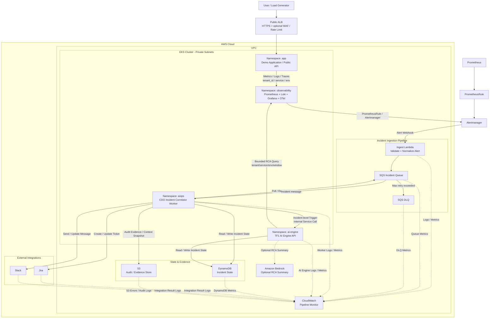
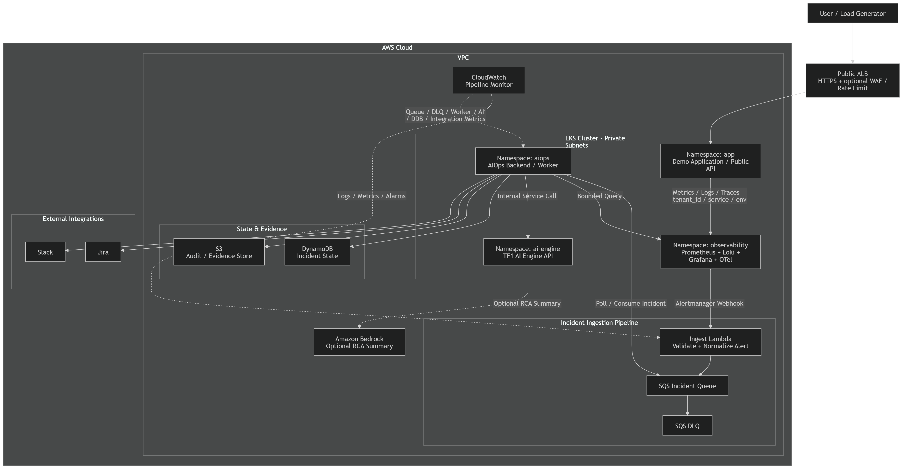

# Security Design - TF1 Triage Hub · CDO-05

**Owner:** DevOps/CDO-05  
**Team liên quan:** AIOps/AI AIO-01  
**Architecture angle:** EKS-native / K8s-heavy, dùng Lambda + SQS để tăng độ tin cậy cho luồng alert  
**Scope:** Security ở mức DevOps/infrastructure: network, IAM, Kubernetes RBAC, secrets, encryption, audit, rate limit, tenant isolation, storage boundary, cost-aware controls.  
**Ngoài phạm vi:** Full enterprise security audit, SIEM implementation, auto-remediation security, app-level authorization chi tiết.

---

## 0. Tóm tắt security

TF1 Triage Hub xử lý alert/incident cho hệ thống SaaS B2B multi-tenant. Rủi ro chính không chỉ là "service bị hack", mà còn gồm:

- tenant A nhìn thấy dữ liệu của tenant B;
- alert critical bị mất trong pipeline;
- retry tạo trùng Jira ticket hoặc Slack message;
- secret của Jira/Slack/Bedrock bị lộ;
- raw logs/metrics bị gửi quá rộng vào AI;
- public endpoint bị spam làm tăng cost hoặc tạo incident giả;
- EKS/Kubernetes bị cấp quyền quá rộng.

Security model của CDO-05:

```text
Private-by-default infrastructure
+ namespace/RBAC/NetworkPolicy isolation
+ IRSA least privilege
+ bounded observability query
+ SQS/DLQ durable alert flow
+ DynamoDB idempotency state
+ S3 audit evidence
+ CloudWatch pipeline monitoring
+ human-in-the-loop, no auto-remediation
```

Production baseline cần đạt:

| Layer | Prod best practice |
|---|---|
| Public edge | HTTPS bắt buộc, AWS WAF rate-based rule, AWS Shield Standard, ALB access logs. |
| EKS | Private nodes, private cluster endpoint nếu vận hành được, RBAC least privilege, audit logs enabled. |
| Kubernetes workload | Pod Security `restricted`, non-root, read-only filesystem, no privileged/hostPath, ResourceQuota/LimitRange. |
| AWS access | IRSA hoặc EKS Pod Identity cho từng service account; không dùng static AWS keys trong pod. |
| Observability access | AI Engine chỉ read-only bounded query; production nên đi qua query gateway. |
| Secrets | Secrets Manager + External Secrets; không commit secret vào Git/Helm values/image/log. |
| Storage | Encryption at rest, tenant-scoped key/prefix, lifecycle/TTL, S3 Block Public Access. |
| Workflow | SQS/DLQ + DynamoDB conditional writes/idempotency để không mất alert và không tạo duplicate Jira/Slack. |
| AI/Bedrock | Redaction, context size limit, model allowlist, budget cap, không auto-remediation. |
| Supply chain | Image scan, immutable tags, GitOps RBAC, approval gate cho prod, audit trail. |

---

## 1. Chia role và ranh giới tin cậy

### 1.1 Trách nhiệm của từng team

| Area | CDO-05 chịu trách nhiệm | AIO-01 chịu trách nhiệm |
|---|---|---|
| Runtime platform | EKS cluster, namespace, ingress, service discovery, autoscaling | Behavior của AI app/container |
| Observability platform | Prometheus/Loki/Grafana/OTel stack, CloudWatch pipeline monitor | RCA interpretation, anomaly logic |
| Alert reliability | Ingest Lambda, SQS Incident Queue, SQS DLQ, CDO Incident Correlator Worker, retry visibility | AI/RCA processing logic sau khi nhận incident trigger |
| State/audit storage | DynamoDB table, S3 audit bucket, retention/encryption | Quyết định field RCA/evidence nào cần ghi |
| Security guardrails | IAM, IRSA, RBAC, NetworkPolicy, secrets, rate limit | Payload validation bên trong AI/AIOps app |
| Integrations | Bảo vệ Jira/Slack tokens và gửi/update workflow | Sinh nội dung Jira/Slack payload |

Boundary chính:

```text
CDO owns platform, networking, IAM, observability access, alert reliability, state store, secrets, monitoring.
AIOps owns RCA logic, prompts/model behavior, confidence, evidence reasoning, and payload generation.
```

Điểm cần chốt theo `02_infra_design`: **CDO Incident Correlator Worker không làm RCA**. Worker này chỉ consume SQS, deduplicate/correlate alert, update DynamoDB, kiểm tra idempotency, quyết định có nên gọi AI Engine hay không, rồi gửi incident-level trigger. AI Engine/AIOps mới là bên query context và phân tích RCA.

### 1.2 Vùng tin cậy trong runtime

| Trust zone | Component | Security rule |
|---|---|---|
| Public/demo edge | ALB cho Demo Application/Public API | Chỉ public khi cần demo; nếu public phải có HTTPS, auth, rate limit/WAF. |
| EKS namespace `app` | Demo app / public API | Được emit metrics/logs; không được truy cập trực tiếp AI namespace hoặc incident state. |
| EKS namespace `aiops` | CDO Incident Correlator Worker / AIOps integration worker | Được poll SQS, correlate incident, gọi AI Engine, update DynamoDB/S3/Jira/Slack theo least privilege. |
| EKS namespace `ai-engine` | TF1 AI Engine API | Chỉ internal service, không public trực tiếp. |
| EKS namespace `observability` | Prometheus, Loki, Grafana, OpenTelemetry | Query phải scope theo tenant/service/env/window. |
| AWS managed services | Lambda, SQS, DLQ, DynamoDB, S3, CloudWatch, Bedrock optional | Access qua IAM/IRSA/service role được scope chặt. |

---

## 2. Bảo mật network

### 2.1 Sơ đồ network





### 2.2 Quy tắc ranh giới network

- EKS nodes/pods nên chạy trong private subnets nếu có thể.
- Production: EKS node groups đặt trong private subnets; public subnet chỉ chứa ALB/NAT nếu thật sự cần.
- Production: EKS API endpoint ưu tiên private endpoint hoặc public endpoint giới hạn CIDR/VPN/bastion; không mở `0.0.0.0/0` cho admin access.
- Public ALB chỉ dùng để expose Demo App/Public API, không expose AI Engine trực tiếp.
- Public ALB bắt buộc có ACM TLS certificate, TLS policy hiện đại, access logs, security group chỉ mở port 443.
- Nếu endpoint public thật: bật AWS WAF rate-based rule, request size limit, managed rule group cơ bản và AWS Shield Standard.
- AI Engine API chỉ expose bằng internal Kubernetes Service.
- CDO Correlator Worker gọi AI Engine qua internal service DNS, không đi public internet.
- Query observability nên ở trong cluster/VPC.
- Lambda chỉ nhận alert, validate/normalize và push vào SQS. Lambda không gọi AI, Bedrock, Jira, Slack trực tiếp.
- Nên dùng VPC endpoints cho S3, DynamoDB, SQS, CloudWatch Logs, Secrets Manager, ECR và Bedrock nếu bật.
- NAT Gateway chỉ là fallback. Ưu tiên VPC endpoints để giảm public egress và tối ưu cost.
- Egress từ namespace nhạy cảm nên allowlist theo destination/port thay vì mở toàn bộ internet.

### 2.3 Kiểm soát ingress và egress

| Flow | Có cho phép? | Control |
|---|---|---|
| User -> Public ALB -> Demo App | Có, nếu demo cần | HTTPS, optional WAF/rate limit, ALB access logs. |
| Internet -> AI Engine | Không | AI Engine không có public ingress. |
| App -> Observability | Có | Chỉ metrics/logs/traces có metadata. |
| Alertmanager -> Ingest Lambda | Có | Validate payload, ký webhook nếu có thể. |
| Lambda -> SQS | Có | Lambda role chỉ có `sqs:SendMessage` vào incident queue. |
| CDO Correlator Worker -> SQS | Có | IRSA role chỉ receive/delete/change visibility trên incident queue. |
| CDO Correlator Worker -> Observability | Hạn chế | Chỉ query metadata tối thiểu nếu thật sự cần; không cấp observability admin. |
| CDO Correlator Worker -> AI Engine | Có | Internal service + auth header/service token; chỉ gửi incident-level trigger. |
| AI Engine -> Observability | Có | Read-only bounded query theo `tenant_id/service/env/window`; production nên qua query gateway. |
| CDO Correlator Worker -> Jira/Slack | Có nếu CDO owns integration | Secret riêng, retry và idempotency. |
| Bedrock -> Observability | Không | LLM không được query Prometheus/Loki/CloudWatch trực tiếp. |

### 2.4 Production network hardening

| Control | Recommendation |
|---|---|
| ALB | TLS 1.2+, ACM certificate, access logs, WAF nếu public, không route tới AI Engine. |
| Security Groups | Chỉ mở inbound cần thiết; outbound không nên `0.0.0.0/0` nếu đã có VPC endpoints. |
| EKS API | Private endpoint hoặc CIDR allowlist; bật control plane logs. |
| VPC endpoints | S3, DynamoDB, SQS, ECR, CloudWatch Logs, Secrets Manager, STS, Bedrock nếu dùng. |
| NAT | Tránh dùng NAT cho toàn bộ egress nếu chỉ cần gọi AWS services; giúp giảm cost và giảm attack surface. |
| Service-to-service | Internal DNS + auth token/JWT tối thiểu; mTLS/service mesh nếu production cần identity mạnh. |
| Observability UI | Grafana/Prometheus/Alertmanager không public unauthenticated; dùng SSO/RBAC hoặc VPN/internal access. |

---

## 3. Bảo mật storage và dữ liệu

### 3.1 Ranh giới storage

| Data type | Storage | Security rule |
|---|---|---|
| Metrics | Prometheus / Prometheus-compatible backend | Retention bounded; label bằng `tenant_id`, `service`, `env`. |
| Logs | Loki và/hoặc CloudWatch Logs | Redact secrets/PII; demo retention 7-14 ngày nếu không có yêu cầu dài hơn. |
| Traces | OpenTelemetry backend nếu bật | Không chứa token hoặc full request body. |
| Alert event | SQS Incident Queue | Durable event lifecycle; không dump raw metric/log vào SQS. |
| Failed alert event | SQS DLQ | Dùng debug/replay; alarm khi DLQ > 0. |
| Incident state | DynamoDB | Idempotency + workflow state; key có tenant/incident scope. |
| Audit evidence | S3 | Alert payload, context snapshot, AI request/response, Jira/Slack payload. |
| Integration secrets | Secrets Manager / External Secrets | Không nằm trong Git, image, logs hoặc screenshots. |
| Optional AI model call | Bedrock | Chỉ nhận bounded context, không có quyền query observability unbounded. |

### 3.2 Security design cho DynamoDB

DynamoDB không phải nơi lưu raw observability data. DynamoDB chỉ lưu workflow state và idempotency.

Key model đề xuất:

```text
PK = tenant_id#incident_id
SK = state#<timestamp> or workflow#current
GSI1PK = idempotency_key
```

Các field bắt buộc:

```text
tenant_id
incident_id
idempotency_key
service
env
status
current_step
jira_ticket_id
slack_message_ts
retry_count
last_error
created_at
updated_at
ttl
```

Security controls:

- Bật encryption at rest.
- Dùng TTL để xóa incident state cũ và kiểm soát cost.
- IAM/IRSA chỉ nên cho các action cần thiết: `GetItem`, `PutItem`, `UpdateItem`, `Query`.
- Không cấp broad `dynamodb:*`.
- Dùng conditional writes để tránh duplicate Jira/Slack side effects.

### 3.3 Bảo mật S3 Audit Store

Object prefix đề xuất:

```text
s3://tf1-audit/{tenant_id}/{service}/{incident_id}/alert.json
s3://tf1-audit/{tenant_id}/{service}/{incident_id}/context.json
s3://tf1-audit/{tenant_id}/{service}/{incident_id}/ai-request.json
s3://tf1-audit/{tenant_id}/{service}/{incident_id}/ai-response.json
s3://tf1-audit/{tenant_id}/{service}/{incident_id}/jira-payload.json
s3://tf1-audit/{tenant_id}/{service}/{incident_id}/slack-payload.json
```

Security controls:

- Bật S3 Block Public Access.
- Baseline dùng SSE-S3; dùng SSE-KMS nếu compliance/mentor yêu cầu.
- Bucket policy deny non-TLS access.
- Có thể restrict access qua VPC endpoint.
- Lifecycle policy sau 30-90 ngày để giảm cost.
- Không lưu toàn bộ raw logs vĩnh viễn; chỉ lưu bounded snapshots hoặc summary.

### 3.4 Bounded observability access cho AI Engine

Theo `02_infra_design`, AI Engine có thể cần query Prometheus/Loki để dựng context RCA. Quyền này phải là **read-only và bounded**, không phải quyền đọc toàn bộ monitoring stack.

Access scope bắt buộc:

```text
tenant_id
service hoặc service_group
env
time_window
read-only permission
internal network path
```

MVP có thể enforce bằng:

- service token/JWT riêng cho AI Engine;
- NetworkPolicy chỉ cho AI Engine gọi endpoint observability cần thiết;
- query convention bắt buộc có `tenant_id`, `service`, `env`, `time_window`;
- audit log cho mỗi query: ai query, tenant nào, window nào, result count bao nhiêu.

Production best practice:

- Dùng **query gateway/API** ở giữa AI Engine và Prometheus/Loki để validate query trước khi chạy.
- Không expose Prometheus/Loki/Grafana admin API ra public.
- Không cho AI Engine quyền admin trong namespace `observability`.
- Không dựa hoàn toàn vào label `tenant_id` như một security boundary cứng; labels phù hợp cho MVP/demo, còn production nên có query gateway hoặc backend hỗ trợ multi-tenancy mạnh hơn.

### 3.5 Xử lý dữ liệu cho Bedrock / AI

- Bedrock là optional cho summary/synthesis, không phải bắt buộc cho detection.
- Bedrock không được nhận unlimited raw logs.
- Input vào Bedrock phải là bounded context package:

```text
tenant_id
service
env
time_window
alert summary
metric summary
log excerpts
recent deploy metadata
ownership/runbook reference
```

- Redact secrets, tokens, webhook URLs, email/phone nếu xuất hiện.
- Chỉ lưu model request/response vào S3 khi đã redact và thật sự cần audit.
- Không cho AI/Bedrock thực hiện hành động trực tiếp như scale service, restart pod, close incident, create Jira/Slack bằng quyền riêng.
- Model response chỉ là recommendation/payload; CDO workflow vẫn kiểm tra idempotency và human-in-the-loop.
- Production: dùng model allowlist, max token/context size, timeout, retry budget, budget alarm và deny prompt yêu cầu tiết lộ secret/system prompt.
- Production: audit AI request/response bằng correlation_id/incident_id nhưng không log raw secret hoặc PII.

---

## 4. Encryption và key management

Mục tiêu của phần này là chỉ rõ dữ liệu ở đâu thì được mã hóa ở đó, tránh nói chung chung "có encryption".

### 4.1 Encryption at rest

| Data | Storage | Encryption baseline | Production best practice |
|---|---|---|---|
| Metrics | Prometheus backend / PVC / EBS / managed backend | EBS encryption hoặc backend encryption | KMS CMK nếu backend hỗ trợ và compliance yêu cầu. |
| Logs | Loki / CloudWatch Logs | CloudWatch/Loki backend encryption | Retention + redaction + KMS CMK cho log group nhạy cảm. |
| Alert event | SQS Incident Queue | SSE-SQS | KMS CMK nếu alert payload chứa sensitive context. |
| Failed alert | SQS DLQ | SSE-SQS | DLQ access hạn chế hơn main queue, vì DLQ dùng debug/replay. |
| Incident state | DynamoDB | AWS-managed encryption | PITR enabled, TTL, KMS CMK nếu cần audit/compliance. |
| Audit evidence | S3 | SSE-S3 baseline | SSE-KMS + Object Lock nếu cần chống sửa/xóa evidence. |
| Secrets | Secrets Manager / K8s Secret | Secrets Manager encryption | External Secrets + KMS CMK + rotation policy. |
| Container images | ECR | ECR default encryption | ECR scan + immutable tags + lifecycle policy. |

### 4.2 Encryption in transit

- Public ALB phải dùng HTTPS/TLS 1.2+ nếu expose internet.
- Internal service call giữa CDO Correlator Worker và AI Engine tối thiểu dùng internal service + auth token/JWT.
- Production best practice: mTLS/service mesh nếu cần service-to-service identity mạnh hơn.
- AWS service calls đi qua HTTPS; ưu tiên VPC endpoints cho SQS, DynamoDB, S3, Secrets Manager, CloudWatch, ECR, Bedrock.
- Không gửi token/secrets qua query string.

### 4.3 Key management

- Pack #1 có thể dùng AWS-managed keys để giảm complexity.
- Production hoặc compliance-sensitive path nên dùng KMS CMK cho S3 audit bucket, CloudWatch log group nhạy cảm, SQS queue nếu alert payload nhạy cảm.
- Key policy chỉ cấp cho deploy role, worker IRSA role, read-only reviewer role khi thật sự cần.
- Không để human user dùng key admin hằng ngày; dùng break-glass role nếu cần.
- KMS key rotation bật theo policy nếu dùng CMK.

---

## 5. Rate limit và chống abuse

### 5.1 Rate limit đặt ở đâu?

| Layer | Control | Lý do |
|---|---|---|
| Public ALB / Ingress | WAF rate-based rule hoặc ingress throttling pattern | Chống public spam và cost attack. |
| Ingest Lambda | Payload size check, schema validation, per-source allowlist | Chặn alert malformed/flood. |
| SQS | Queue depth alarms, DLQ alarms, visibility timeout | Detect backlog và retry loop. |
| CDO Correlator Worker | Max concurrency, per-tenant quota, backoff | Không để noisy tenant làm nghẽn tenant khác. |
| AI Engine API | Request size limit, timeout, auth, per-tenant token bucket nếu kịp | Chống request đắt/large payload. |
| Bedrock | Daily budget/call cap, `AI_MODE=rules` fallback | Tránh LLM cost spike. |

### 5.2 Limit đề xuất cho demo

| Item | Demo target |
|---|---:|
| Alert payload size | <= 256 KB |
| AI context package | <= 1 MB |
| Max log excerpts per incident | 50 lines |
| Worker concurrency | 2-5 concurrent messages |
| SQS max receive count | 3-5 before DLQ |
| Lambda timeout | 5-10 seconds |
| AI Engine timeout | 5-15 seconds |
| Bedrock mode | Off by default, chỉ bật nếu demo thật |

Cost/security line:

```text
Rate limit vừa là security control vừa là cost control.
Nó ngăn alert spam biến thành compute/log/SQS/DynamoDB/Bedrock cost không giới hạn.
```

---

## 6. Kiểm soát truy cập

### 6.1 AWS IAM roles

| Role | Dùng bởi | Quyền được cấp | Tránh cấp |
|---|---|---|---|
| `tf1-ingest-lambda-role` | Ingest Lambda | `sqs:SendMessage`, CloudWatch Logs write, read webhook signing secret | `sqs:*`, DynamoDB write, Jira/Slack secret access |
| `tf1-correlator-worker-irsa-role` | K8s service account `aiops/correlator-worker` | SQS receive/delete/change visibility, DynamoDB read/write scoped table, S3 put/get scoped prefix, Secrets read scoped ARNs | `AdministratorAccess`, broad `s3:*`, broad `dynamodb:*`, observability admin |
| `tf1-ai-engine-irsa-role` | K8s service account `ai-engine/api` | Optional Bedrock invoke, Secrets read scoped token, CloudWatch logs | Observability admin, Jira/Slack tokens nếu không cần |
| `tf1-observability-irsa-role` | OTel/Prom/Loki components | Permission riêng cho observability backend | Incident state mutation |
| `tf1-deploy-role` | CI/CD / GitOps | ECR push, EKS deploy, Helm/Argo sync, Terraform apply scoped resources | Long-lived static key, broad IAM admin |
| `tf1-readonly-review-role` | Mentor/reviewer | Read-only EKS/CloudWatch/S3 evidence | Mutating actions |

### 6.2 Quy tắc IRSA

Dùng IRSA cho pod cần gọi AWS services:

- `correlator-worker-sa` có scoped SQS/DynamoDB/S3/Secrets permissions.
- `ai-engine-sa` có optional Bedrock + secret read only.
- `observability-sa` có permissions riêng cho observability.

Rules:

- Không mount AWS static credentials vào pod.
- Hạn chế node IAM role; pod không nên dựa vào node role.
- Tránh `hostNetwork: true` nếu không bắt buộc.
- Set `automountServiceAccountToken: false` mặc định; chỉ enable cho pod cần Kubernetes API.
- Production: prefer IRSA hoặc EKS Pod Identity theo từng service account, không dùng chung một role cho nhiều namespace khác trust zone.
- IAM policy nên scope theo ARN cụ thể: queue ARN, table ARN, bucket prefix, secret ARN.
- Dùng permission boundary/SCP nếu account dùng chung với team khác.
- Bật CloudTrail để audit `AssumeRoleWithWebIdentity`, IAM changes, S3/DynamoDB/SQS config changes.

### 6.3 Kubernetes RBAC

| Role | Namespace | Verbs | Resources | Notes |
|---|---|---|---|---|
| `app-viewer` | `app` | `get`, `list`, `watch` | pods, services, configmaps, events | Cho debug/review. |
| `app-deployer` | `app` | `get`, `list`, `watch`, `create`, `update`, `patch` | deployments, services, configmaps, ingresses | Không đọc secrets mặc định. |
| `correlator-worker` | `aiops` | `get`, `list`, `watch` | pods, services, endpoints | Worker không cần cluster-admin. |
| `ai-engine-deployer` | `ai-engine` | deploy/update AI service | deployments, services, configmaps | Không access secret namespace `observability`. |
| `observability-admin` | `observability` | manage monitoring stack | servicemonitors, prometheusrules, configmaps | Chỉ trong namespace observability. |
| `readonly-reviewer` | selected namespaces | `get`, `list`, `watch` | non-secret resources | Tránh `get/list secrets`. |

RBAC hard rules:

- Ưu tiên `RoleBinding` thay vì `ClusterRoleBinding`.
- Tránh `cluster-admin`, wildcard `*`, và `system:masters`.
- Không cấp `get/list/watch secrets` nếu không bắt buộc.
- Không cấp rộng `pods/exec`, `pods/portforward`, `nodes/proxy`, `escalate`, `bind`, `impersonate`.
- Tách namespace theo trust boundary: `app`, `aiops`, `ai-engine`, `observability`.
- Production: user access đi qua SSO/IAM Identity Center hoặc OIDC; không share kubeconfig cá nhân.
- Break-glass admin phải có owner, expiry, MFA và audit log.
- Argo CD/deploy role chỉ được sync namespace/resource được phép, không mặc định cluster-wide admin.

---

## 7. Quản lý secrets

### 7.1 Danh sách secrets

| Secret | Storage | Accessed by | Rotation |
|---|---|---|---|
| `WEBHOOK_SIGNING_KEY` | Secrets Manager -> External Secrets -> K8s Secret hoặc Lambda env secret | Ingest Lambda / Alertmanager adapter | Manual cho capstone |
| `SERVICE_AUTH_TOKEN` | Secrets Manager / External Secrets | CDO Correlator Worker + AI Engine | Manual cho capstone |
| `JIRA_API_TOKEN` | Secrets Manager | CDO Correlator Worker / integration layer | Manual, rotate sau demo nếu dùng token thật |
| `SLACK_WEBHOOK_URL` | Secrets Manager | CDO Correlator Worker / integration layer | Manual, rotate sau demo nếu dùng webhook thật |
| `BEDROCK_MODEL_ID` | ConfigMap/env var | AI Engine | Không phải secret |
| `GRAFANA_ADMIN_PASSWORD` | Secrets Manager / K8s Secret | Observability admin only | Manual |

### 7.2 Cách inject secrets

Preferred pattern:

```text
AWS Secrets Manager
-> External Secrets Operator
-> Kubernetes Secret trong target namespace
-> Pod env var hoặc mounted file
```

Fallback cho capstone:

```text
Secrets Manager
-> CI/CD hoặc Helm values secret reference
-> Kubernetes Secret
```

Anti-leak controls:

- Không commit secret vào Git.
- Không bake secret vào Docker image.
- Không commit secret trong `values.yaml`.
- Không chụp screenshot `kubectl get secret -o yaml`.
- Redact `Authorization`, Slack webhook URLs, Jira token, Bedrock credentials.
- Chạy secret scan đơn giản trên evidence trước khi nộp final.

---

## 8. Tenant isolation

### 8.1 Tenant model

CDO-05 dùng pooled EKS platform với tenant-aware metadata, không tạo một cluster riêng cho từng tenant.

Minimum tenant context:

```json
{
  "tenant_id": "tenant-a",
  "service": "checkout",
  "env": "prod",
  "alert_fingerprint": "abc123",
  "window": "5m"
}
```

### 8.2 Các control isolation

| Layer | Control |
|---|---|
| Kubernetes metadata | Workload/log/metric phải có `tenant_id`, `service`, `env`, `version`. |
| Namespace pattern | Demo: chia theo function (`app`, `aiops`, `ai-engine`, `observability`). Production mạnh hơn: namespace theo tenant/env hoặc tenant service group. |
| Observability query | Bắt buộc có `tenant_id + service + env + time_window`; production nên enforce bằng query gateway, không chỉ convention. |
| CDO Correlator Worker | Reject nếu thiếu `tenant_id`, `service`, `env`, `window`; không gọi AI nếu tenant context không hợp lệ. |
| AI Engine API | Header/body tenant validation nếu API nhận tenant headers. |
| DynamoDB | Partition key có tenant/incident; GSI theo idempotency key. |
| S3 | Prefix bắt đầu bằng `tenant_id/service/incident_id`. |
| Rate limit | Per-tenant quota/backoff để hạn chế noisy neighbor. |
| Evidence | Cần test tenant mismatch và cross-tenant query. |

Production note:

- Label `tenant_id` giúp query đúng scope nhưng không đủ mạnh nếu đứng một mình.
- Query gateway hoặc backend có multi-tenancy native nên enforce tenant scope trước khi query Prometheus/Loki.
- IAM/S3 policy có thể dùng prefix condition để giảm rủi ro đọc nhầm tenant.
- DynamoDB access nên đi qua service layer/worker; không cấp direct table access cho client hoặc AI prompt runtime.

### 8.3 Giảm noisy neighbor

- Per-tenant alert quota.
- Per-tenant worker concurrency limit nếu implement kịp.
- SQS queue age/backlog alarm.
- DynamoDB throttling alarm.
- Limit log snippets và context size.
- Không cho một tenant trigger unlimited Bedrock calls.

---

## 9. Kubernetes NetworkPolicy và Pod Security

### 9.1 NetworkPolicy

Baseline bắt buộc:

```text
default deny ingress per namespace
default deny egress where feasible
explicit allow app -> observability
explicit allow aiops -> ai-engine
explicit allow aiops -> AWS endpoints / SQS / DynamoDB / S3
explicit allow observability scrape targets
```

Intent:

| Source | Destination | Port | Reason |
|---|---|---:|---|
| `app` pods | `observability` collectors | 4317/4318 hoặc scrape port | Export metrics/traces/logs. |
| `aiops` worker | `ai-engine` service | 8080 | Internal AI triage API. |
| `aiops` worker | AWS endpoints | 443 | SQS, DynamoDB, S3, Secrets. |
| `observability` Prometheus | `app` pods | metrics port | Scrape metrics. |
| public ingress | `ai-engine` | none | Không cho phép. |

Lưu ý quan trọng: Kubernetes NetworkPolicy chỉ có hiệu lực nếu CNI/network plugin enforce policy. Nếu chỉ dùng AWS VPC CNI mặc định, cần confirm có bật NetworkPolicy support hoặc dùng Calico/Cilium.

### 9.2 Pod Security

Baseline cho app, aiops, ai-engine:

```yaml
securityContext:
  runAsNonRoot: true
  allowPrivilegeEscalation: false
  readOnlyRootFilesystem: true
  capabilities:
    drop: ["ALL"]
seccompProfile:
  type: RuntimeDefault
```

Namespace policy:

- Dùng Pod Security Admission `baseline` tối thiểu.
- Target `restricted` cho `aiops` và `ai-engine` nếu image hỗ trợ.
- Production target: `restricted` cho app/aiops/ai-engine; chỉ observability add-ons nào cần quyền đặc biệt mới có exception có lý do.
- Không dùng privileged pods trừ cluster add-ons bắt buộc.
- Không dùng hostPath volume cho app/aiops/ai-engine.
- Không dùng `hostNetwork: true` nếu không có lý do rõ.
- Default `automountServiceAccountToken: false`; chỉ bật cho pod cần Kubernetes API.
- Đặt `resources.requests/limits` cho mọi workload để tránh noisy neighbor và tránh pod ăn hết node.

### 9.3 ResourceQuota, LimitRange và autoscaling guardrails

Production nên có quota/limit ở từng namespace để một workload hoặc tenant không làm nghẽn toàn cluster.

| Control | Recommendation |
|---|---|
| `ResourceQuota` | Giới hạn tổng CPU/memory/pod count theo namespace. |
| `LimitRange` | Đặt default request/limit cho pod/container nếu developer quên khai báo. |
| HPA | Scale app/worker theo CPU/memory hoặc custom metrics. |
| KEDA | Có thể scale CDO Correlator Worker theo SQS queue depth nếu implement kịp. |
| PodDisruptionBudget | Giữ tối thiểu replicas cho worker/AI/observability khi node drain. |
| PriorityClass | Không để workload demo chiếm tài nguyên của observability/incident pipeline. |

### 9.4 Bảo mật image và supply chain

- Dùng ECR immutable tags hoặc Git SHA tags; tránh mutable `latest`.
- Scan image bằng Trivy hoặc ECR scan.
- Fail hoặc document exception nếu có HIGH/CRITICAL CVEs.
- Dùng minimal base image.
- Không bake `.env` hoặc credentials vào image layers.
- Production: ký image bằng Cosign hoặc cơ chế tương đương nếu có thời gian.
- Admission policy nên block image không rõ registry, `latest` tag, privileged pod, hostPath, hostNetwork.
- GitOps/Argo CD nên dùng RBAC theo project/namespace; repo credentials lưu bằng secret manager, không hardcode token.
- Production deployment cần approval gate hoặc manual sync cho environment nhạy cảm; mọi rollout/rollback phải có audit trail.

---

## 10. Bảo mật và độ tin cậy của alert

### 10.1 Vì sao SQS liên quan đến security?

SQS không dùng để lưu raw metrics/logs. SQS bảo vệ vòng đời của alert event:

```text
Alertmanager -> Ingest Lambda -> SQS Incident Queue -> CDO Correlator Worker -> AI Engine -> Jira/Slack
```

Giá trị security:

- alert không bị mất âm thầm khi worker down;
- retry được kiểm soát bằng visibility timeout;
- DLQ giữ failed alerts để debug/replay;
- queue metrics giúp phát hiện backlog hoặc spam/attack pattern;
- DynamoDB idempotency ngăn duplicate Jira/Slack side effects.

### 10.2 Bảo vệ Alertmanager webhook

Production không nên để Ingest Lambda nhận webhook không xác thực.

| Control | Recommendation |
|---|---|
| Webhook auth | Dùng HMAC signature hoặc shared secret header giữa Alertmanager và Ingest Lambda. |
| Replay protection | Payload có timestamp/nonce; Lambda reject request quá cũ hoặc duplicate nonce. |
| Schema validation | Reject nếu thiếu `tenant_id`, `service`, `env`, `severity`, `alert_fingerprint`, `starts_at`. |
| Payload limit | Reject payload quá lớn; không nhận raw log blob trong webhook. |
| Source control | Nếu có thể, restrict source bằng network path/VPC/internal endpoint; public endpoint thì phải có WAF/rate limit. |
| Error handling | Trả lỗi rõ cho invalid payload nhưng không log raw secret/header. |

### 10.3 Các control cho SQS

| Control | Recommendation |
|---|---|
| Queue type | Standard queue đủ dùng nếu không cần strict ordering. |
| Visibility timeout | Dài hơn max worker processing time. |
| Max receive count | 3-5 trước khi vào DLQ. |
| DLQ alarm | `ApproximateNumberOfMessagesVisible > 0`. |
| Queue age alarm | `ApproximateAgeOfOldestMessage` vượt SLO. |
| IAM | Lambda chỉ send; worker chỉ receive/delete/change visibility. |
| Encryption | Bật SSE-SQS; KMS CMK optional. |

### 10.4 Control idempotency bằng DynamoDB

Dùng `idempotency_key` để tránh duplicate side effects:

```text
tenant_id#service#alert_name#alert_fingerprint#window_start
```

Worker flow:

```text
1. Receive SQS message.
2. Check DynamoDB by idempotency_key.
3. Nếu Jira đã tạo, reuse jira_ticket_id.
4. Retry đúng bước fail, ví dụ Slack.
5. Chỉ delete SQS message sau khi state đã update an toàn.
```

### 10.5 AI call gating

CDO Correlator không gọi AI cho mọi alert. Đây là control quan trọng để tránh alert storm biến thành cost spike hoặc spam RCA.

Gọi AI khi:

- incident mới được tạo;
- severity tăng;
- xuất hiện alert type quan trọng mới trong cùng incident;
- incident kéo dài vượt threshold;
- RCA trước đó có confidence thấp;
- human yêu cầu re-analysis.

Không gọi AI khi:

- alert là duplicate;
- message chỉ là SQS retry;
- chỉ `alert_count` hoặc `last_seen_at` thay đổi;
- alert đã thuộc incident hiện có và không có tín hiệu mới quan trọng.

Prod best practice:

- log reason vì sao gọi hoặc skip AI;
- đặt per-tenant AI call quota;
- đặt Bedrock budget/call cap nếu bật model thật;
- timeout và circuit breaker cho AI Engine;
- fallback sang rules/template summary khi AI Engine/Bedrock lỗi.

---

## 11. Audit logging và monitoring

### 11.1 Cần log gì?

| Event | Field bắt buộc |
|---|---|
| Ingest Lambda received alert | `tenant_id`, `service`, `env`, `alert_fingerprint`, `message_id`, validation status |
| SQS enqueue/dequeue | queue name, message age, receive count |
| AI Engine bounded query | `tenant_id`, `service`, `env`, `window`, query source, result count |
| CDO Correlator -> AI Engine call | `tenant_id`, `correlation_id`, `incident_id`, gating_reason, latency, status |
| AI Engine RCA result | `tenant_id`, `correlation_id`, `incident_id`, confidence, evidence_count, status |
| DynamoDB state update | incident_id, idempotency_key, old/new status |
| Jira/Slack side effect | idempotency_key, target, result id, retry count |
| Tenant mismatch | header/body tenant values hoặc hash, status 400 |
| Security rejection | missing auth, invalid token, oversized payload, invalid schema |

### 11.2 CloudWatch Pipeline Monitor

Cần monitor:

- Lambda errors, duration, throttles.
- SQS queue depth, in-flight messages, oldest message age.
- SQS DLQ message count.
- CDO Correlator Worker errors, processing latency, throughput, AI call skip/call count.
- AI Engine timeout/error rate/latency.
- DynamoDB throttles/errors/successful request latency.
- Jira/Slack integration failures.
- CloudWatch log groups:
  - `/aws/lambda/*`
  - `/aws/eks/aiops/*`
  - `/aws/sqs/*`
  - `/aws/dynamodb/*`
  - `/ai-engine/*`
  - `/integrations/*`

Security monitoring signals cho production:

- IAM policy/role thay đổi bất thường.
- Security group mở inbound rộng hơn dự kiến.
- S3 Block Public Access bị tắt hoặc bucket policy cho public principal.
- Secrets Manager secret bị đọc quá nhiều lần hoặc bởi role không mong đợi.
- EKS event có `pods/exec`, `pods/portforward`, `get secrets`, `clusterrolebinding` bất thường.
- WAF blocked request hoặc ALB 4xx/5xx tăng bất thường.
- AI Engine/Bedrock call tăng đột biến theo tenant.

### 11.3 CloudTrail và EKS audit logs

Ngoài application logs, production nên bật detective controls ở hạ tầng:

| Audit source | Dùng để phát hiện | Recommendation |
|---|---|---|
| CloudTrail management events | Terraform apply, IAM changes, S3/DynamoDB/SQS config changes | Bật account-level CloudTrail; giữ ít nhất 90 ngày cho demo/audit. |
| EKS control plane audit logs | Kubernetes API calls, RBAC denied/allowed events, suspicious mutation | Bật `api`, `audit`, `authenticator` logs nếu budget cho phép. |
| ALB access logs | Public request pattern, burst/spam, 4xx/5xx | Bật nếu public ALB dùng thật. |
| S3 data events | Audit evidence read/write/delete | Bật cho audit bucket nếu cần forensic mạnh hơn; cân nhắc cost. |
| GuardDuty / Security Hub | Threat detection managed service | Production best practice; Pack #1 chỉ cần mention nếu chưa bật. |

### 11.4 Retention cho evidence

| Evidence | Storage | Retention |
|---|---|---:|
| App/worker/AI logs | CloudWatch Logs / Loki | 7-14 ngày demo |
| Alert payload + RCA context snapshot | S3 | 30-90 ngày |
| DynamoDB incident state | DynamoDB TTL | 30-90 ngày |
| CI/CD deploy logs | GitHub Actions / S3 export | Đến final defense |
| Security test outputs | repo `evidence/` hoặc S3 | Đến final defense |

---

## 12. Security tối ưu cost

| Control | Giá trị security | Cost position |
|---|---|---|
| Namespace + RBAC | Giảm quyền quá rộng trong cluster | Không có direct cost. |
| NetworkPolicy | Chặn lateral movement | Không có direct AWS cost, nhưng cần CNI support. |
| IRSA | AWS access scoped theo pod/service account | Không có direct cost. |
| Secrets Manager | Tránh secret leak | Có cost nhỏ theo secret/tháng, đáng dùng cho Jira/Slack thật. |
| SQS + DLQ | Durable alert lifecycle | Rẻ với alert volume nhỏ, giá trị reliability cao. |
| DynamoDB on-demand + TTL | Idempotency và workflow state | Rẻ ở capstone; TTL kiểm soát storage. |
| S3 lifecycle | Audit evidence | Rẻ; lifecycle tránh phình dài hạn. |
| WAF | Bảo vệ public ingress | Chỉ dùng nếu public endpoint tồn tại; không cần cho internal-only path. |
| VPC endpoints | Private AWS API access | Có cost endpoint, nhưng có thể giảm NAT cost và giảm public egress. |
| CloudWatch retention | Detect pipeline issues | Giữ retention ngắn cho demo để kiểm soát log cost. |

Cost defense:

```text
Không bật mọi security service có thể.
ưu tiên controls giảm rủi ro lớn nhất của architecture:
tenant leak, alert loss, duplicate side effects, secret leak,
public abuse, và uncontrolled cost.
```

---

## 13. Ma trận security theo component trong image

Mục này map trực tiếp theo architecture image để khi bị hỏi "phần này secure thế nào?", mình trả lời được ngay.

| Component trong image | Rủi ro chính | Security control cần có | Best practice production |
|---|---|---|---|
| User / Load Generator | Spam request, DDoS nhỏ, fake traffic | HTTPS, WAF/rate limit nếu public, ALB access logs | AWS WAF rate-based rules, AWS Shield Standard, request size limit, bot/rate dashboard. |
| Public ALB | Public attack surface, TLS yếu, open ingress | TLS 1.2+, security group allow đúng port, access logs | ACM certificate, modern TLS policy, WAF nếu public, không route trực tiếp tới AI Engine. |
| Demo App / Public API namespace `app` | App bị compromise rồi lateral movement | Namespace isolation, NetworkPolicy, Pod Security, resource quota | `restricted` Pod Security, no privileged pod, read-only filesystem, non-root, separate service account. |
| Prometheus / PrometheusRule / Alertmanager | Alert spoofing, query quá rộng, dashboard leak | Alert webhook signing, Grafana auth, bounded labels, no public unauthenticated Grafana | Grafana SSO/RBAC, Alertmanager receiver auth, Prometheus admin API không public, retention/quota rõ. |
| OpenTelemetry / Loki | Log chứa token/PII, log volume cost spike | Redaction, sampling, retention, label limit | Drop sensitive headers, cardinality control, tenant/service/env labels chuẩn, lifecycle retention. |
| Ingest Lambda | Malformed alert, webhook giả, payload lớn | Validate schema, verify signing key nếu có, payload size limit | Lambda reserved concurrency, timeout thấp, DLQ/failure alarm, chỉ `sqs:SendMessage`. |
| SQS Incident Queue | Poison message, backlog, duplicate delivery | Visibility timeout, max receive count, queue age alarm, SSE-SQS | Separate DLQ, redrive policy, message schema version, no raw logs in message. |
| SQS DLQ | DLQ bị quên, chứa sensitive alert data | DLQ alarm, restricted read access, replay runbook | Manual approval before redrive, retention policy, DLQ inspection logs. |
| CDO Incident Correlator Worker namespace `aiops` | Worker có quyền quá rộng, duplicate Jira/Slack, gọi AI quá nhiều | IRSA least privilege, idempotency check, NetworkPolicy, AI call gating | Per-tenant worker quota, retry with backoff, no cluster-admin, no direct broad observability admin, KEDA/HPA guardrails. |
| TF1 AI Engine API namespace `ai-engine` | Public abuse, prompt/log injection, oversized context, cross-tenant query | Internal service only, auth header, request size limit, bounded context | mTLS/service mesh hoặc JWT service-to-service, query gateway cho Prometheus/Loki, no auto-remediation, model guardrails. |
| Amazon Bedrock optional | LLM cost spike, sensitive data sent to model | `AI_MODE=rules` fallback, redact before call, budget/call cap | Model allowlist, prompt logging policy, no direct access to observability backend. |
| DynamoDB Incident State | Cross-tenant state leak, duplicate side effects | Tenant-scoped keys, conditional writes, TTL, encryption | PITR enabled, backup policy, IAM condition on table/index, idempotency key uniqueness. |
| S3 Audit / Evidence Store | Public bucket, leaked payload, long retention cost | Block Public Access, SSE-S3/SSE-KMS, tenant prefix, lifecycle | Bucket policy deny non-TLS, Object Lock if required, VPC endpoint restriction, access logging. |
| Jira / Slack integrations | Token leak, duplicate notification, fake ticket | Secrets Manager, idempotency, scoped integration token | Rotate tokens, least-privilege app permissions, outbound allowlist/proxy, audit every side effect. |
| CloudWatch Pipeline Monitor | Missing alarms, logs leak secrets, high log cost | Log retention, metric alarms, redaction, dashboard | Alarm on Lambda errors, SQS age, DLQ > 0, worker error, AI timeout, DynamoDB throttles, integration failures. |
| EKS cluster/control plane | Cluster takeover, broad kubeconfig access | Private endpoint if possible, RBAC least privilege, audit logs | EKS control plane logs enabled, regular version patching, managed node groups/Karpenter hardened, no `system:masters` except break-glass. |
| EKS nodes | Container escape, node role credential abuse | IMDS restriction, no privileged workloads, patching | IMDSv2, restrict pod access to node metadata, node security groups, managed node updates. |

Production rule of thumb:

```text
Public edge: protect with TLS + WAF/rate limit.
Cluster: protect with RBAC + NetworkPolicy + Pod Security.
AWS access: protect with IRSA + least privilege.
Data: protect with tenant-scoped keys/prefixes + encryption + retention.
Workflow: protect with SQS/DLQ + DynamoDB idempotency.
Cost: protect with quota, retention, max concurrency, and Bedrock cap.
```

---

## 14. Security tests và evidence

| Test | Method | Expected |
|---|---|---|
| Tenant mismatch | Gửi request/header tenant A nhưng body tenant B | HTTP 400 hoặc bị worker/API reject |
| Missing auth | Gọi AI Engine/internal API không token | HTTP 401/403 |
| Cross-tenant query | Query tenant A window và kiểm tra output | Không có tenant B data |
| SQS retry | Làm worker fail một lần | Message quay lại sau visibility timeout |
| DLQ path | Force worker fail nhiều lần | Message vào DLQ, alarm visible |
| Idempotency | Retry cùng alert sau khi Jira đã tạo | Reuse Jira ticket cũ, không tạo duplicate |
| Secret leak scan | Search evidence/logs theo token/webhook patterns | Không có raw secret |
| Network isolation | Thử gọi public trực tiếp AI Engine | Không reachable |
| Rate limit | Burst alert events | Queue/backoff/limit hoạt động, không trigger unlimited Bedrock |
| Pod security | Inspect deployment manifests | non-root, no privileged, no hostPath |
| Webhook signing | Gửi Alertmanager webhook thiếu/sai HMAC | Ingest Lambda reject 401/403, không enqueue SQS |
| Replay protection | Gửi lại cùng webhook với timestamp/nonce cũ | Lambda reject hoặc deduplicate, không tạo incident mới |
| Query gateway / bounded query | AI Engine query thiếu tenant/window hoặc query tenant khác | Query bị reject/audit; không trả cross-tenant data |
| Admission policy | Apply pod privileged/hostPath/latest tag | Bị reject hoặc ghi exception rõ nếu MVP chưa bật admission |
| WAF / ALB protection | Burst public API requests nếu ALB public | WAF/rate limit log visible; app không bị overload |

Evidence commands cần chuẩn bị:

```powershell
kubectl get ns
kubectl get networkpolicy -A
kubectl get role,rolebinding -A
kubectl get sa -A
kubectl describe ingress -A
kubectl get resourcequota,limitrange -A
kubectl get ns --show-labels
aws sqs get-queue-attributes --attribute-names All
aws dynamodb describe-table --table-name <incident-state-table>
aws s3api get-public-access-block --bucket <audit-bucket>
```

---

## 15. Compliance touchpoints

Capstone không phải compliance audit đầy đủ. Mục này chỉ map control ở mức platform để mentor/client thấy team có security thinking đúng hướng.

| Concern / Standard | Control trong design |
|---|---|
| SOC2 logical access | IAM least privilege, IRSA, RBAC theo namespace, no `cluster-admin` mặc định. |
| SOC2 monitoring | CloudWatch pipeline monitor, SQS/DLQ alarms, EKS/CloudTrail audit logs. |
| SOC2 change management | GitOps/CI-CD, immutable image tags, Terraform/Helm history, audit logs. |
| GDPR-style tenant data protection | Tenant-scoped metadata, bounded query, S3 prefix theo tenant, retention/TTL. |
| Data retention | CloudWatch/Loki retention 7-14 ngày demo; S3/DynamoDB 30-90 ngày tùy evidence. |
| PCI-DSS | Out of scope; không đưa card data vào telemetry hoặc AI context. |

---

## 16. Câu hỏi còn mở

| ID | Question | Owner | Target |
|---|---|---|---|
| SQ-01 | Public API/ALB có cần public internet thật không, hay chỉ demo internal/VPN? | CDO-05 | Before infra final |
| SQ-02 | CNI có enforce NetworkPolicy không? AWS VPC CNI native policy, Calico, hay Cilium? | CDO-05 | Before security evidence |
| SQ-03 | Final auth giữa CDO Correlator Worker và AI Engine là bearer token, mTLS, hay service-to-service JWT? | CDO-05 + AIO-01 | Before integration |
| SQ-04 | Jira/Slack là live integration hay mock payload? | CDO-05 + AIO-01 | Before demo |
| SQ-05 | Bedrock có bật thật không? Nếu bật, model/cost cap là gì? | AIO-01 + CDO-05 | Before cost final |
| SQ-06 | Audit evidence có cần Object Lock/KMS CMK không, hay SSE-S3 đủ cho capstone? | CDO-05 | Before final docs |
| SQ-07 | Namespace model cuối cùng là by function hay by tenant/env? | CDO-05 | Before multi-tenant evidence |

---

## 17. Câu chốt để defend

```text
EKS được chọn vì TF1 cần runtime metadata, observability, alerting và GitOps context gần với microservice workload.
```

```text
SQS không phải raw log store. SQS bảo vệ critical alert event khỏi mất mát và cung cấp retry/DLQ/replay visibility.
```

```text
DynamoDB không lưu toàn bộ logs. DynamoDB lưu incident workflow state và idempotency để retry không tạo trùng Jira/Slack.
```

```text
S3 lưu audit evidence và context snapshot. Prometheus/Loki/CloudWatch vẫn là nguồn lưu raw metrics/logs.
```

```text
Tenant isolation được enforce bằng metadata, bounded query, namespace/RBAC/NetworkPolicy, DynamoDB keys, S3 prefixes và security tests.
```

```text
Security và cost đi chung với nhau: không raw log dump vô hạn, không Bedrock call vô hạn, không NAT mặc định nếu không cần, log retention ngắn, rate limit ở alert/API/worker layers.
```

---

## 18. Nguồn tham khảo

- AWS EKS security best practices: https://docs.aws.amazon.com/eks/latest/best-practices/security.html
- AWS EKS IRSA: https://docs.aws.amazon.com/eks/latest/userguide/iam-roles-for-service-accounts.html
- Kubernetes RBAC good practices: https://kubernetes.io/docs/concepts/security/rbac-good-practices/
- Kubernetes NetworkPolicy: https://kubernetes.io/docs/concepts/services-networking/network-policies/
- AWS Secrets Manager best practices: https://docs.aws.amazon.com/secretsmanager/latest/userguide/best-practices.html
- Amazon S3 Block Public Access: https://docs.aws.amazon.com/AmazonS3/latest/userguide/access-control-block-public-access.html
- AWS SQS dead-letter queues: https://docs.aws.amazon.com/AWSSimpleQueueService/latest/SQSDeveloperGuide/sqs-dead-letter-queues.html

---

## 19. Related documents

- [`02_infra_design (1).md`](<02_infra_design (1).md>) - source of truth cho architecture diagram, component table, scaling và failure modes.
- [`04_deployment_design.md`](04_deployment_design.md) - CI/CD security gates, GitOps, rollback, deployment permissions.
- [`08_adrs.md`](08_adrs.md) - các decision quan trọng như EKS, SQS/DLQ, DynamoDB idempotency, S3 audit.
- [`05_cost_analysis.md`](05_cost_analysis.md) - cost impact của WAF, VPC endpoints, CloudWatch retention, Bedrock cap.
- [`07_test_eval_report.md`](07_test_eval_report.md) - nơi ghi evidence thật cho tenant isolation, auth, DLQ, idempotency và secret scan.
