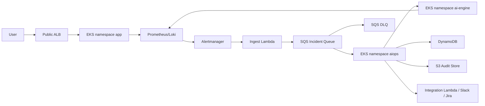

# Security Design - Task Force 1 · CDO-05

<!-- Doc owner: CDO-05
     Status: Draft (W11 T4) -> Final (W11 T6 Pack #1) -> Refined (W12 T4 Pack #2)
     Word target: 1200-2000 words
     Scope: DevOps-level security for TF1 Triage Hub: IAM, secrets, network, audit, tenant isolation.
     Out of scope: full enterprise SIEM, app-level business authorization, auto-remediation security. -->

TF1 Triage Hub nhận alert từ observability stack, đưa alert qua Ingest Lambda -> SQS/DLQ -> CDO Correlator Worker, sau đó gọi AI Engine để RCA và tạo Slack/Jira payload. CDO-05 bảo vệ platform, alert reliability, state/audit store, tenant boundary và integration plumbing. AIO-01 chịu trách nhiệm RCA logic, confidence scoring và nội dung payload.

Nguyên tắc security chính:

```text
private-by-default
+ least privilege IAM/IRSA
+ bounded observability access
+ tenant-scoped state/evidence
+ SQS/DLQ reliability
+ DynamoDB idempotency
+ S3 audit trail
+ human-in-the-loop, no auto-remediation
```

---

## 1. IAM model

CDO-05 dùng IAM least privilege cho AWS resources và IRSA/EKS Pod Identity cho workload trong EKS. Không mount static AWS keys vào pod, không để application dựa vào node role để truy cập SQS/DynamoDB/S3/Secrets Manager.

| Role                              | Used by                             | Allow                                                                                                                | Avoid                                                                        |
| --------------------------------- | ----------------------------------- | -------------------------------------------------------------------------------------------------------------------- | ---------------------------------------------------------------------------- |
| `tf1-ingest-lambda-role`          | Ingest Lambda                       | `sqs:SendMessage` vào incident queue, CloudWatch Logs write, read webhook signing secret                             | `sqs:*`, DynamoDB write, Jira/Slack secret access                            |
| `tf1-correlator-worker-irsa-role` | K8s SA `aiops/correlator-worker`    | SQS receive/delete/change visibility, DynamoDB read/write scoped table, S3 put/get audit bucket, read scoped secrets | `AdministratorAccess`, broad `s3:*`, broad `dynamodb:*`, observability admin |
| `tf1-ai-engine-irsa-role`         | K8s SA `ai-engine/ai-engine-api`    | Read bounded evidence, optional `bedrock:InvokeModel`, read service auth secret                                      | Jira/Slack tokens, cluster-admin, direct broad log access                    |
| `tf1-observability-irsa-role`     | Prometheus/Loki/OTel add-ons        | Minimal backend/log permissions if needed                                                                            | Incident state mutation                                                      |
| `tf1-deploy-role`                 | GitHub Actions / ArgoCD / Terraform | ECR push, EKS deploy, Helm/Argo sync, Terraform apply scoped resources                                               | Long-lived static keys, broad IAM admin                                      |
| `tf1-readonly-review-role`        | Mentor/reviewer                     | Read-only CloudWatch/EKS/S3 evidence                                                                                 | Mutating actions                                                             |

Kubernetes RBAC rules: ưu tiên `RoleBinding`; tránh `cluster-admin`, wildcard `*`, `system:masters`; không cấp `get/list/watch secrets` nếu không bắt buộc; hạn chế `pods/exec`, `pods/portforward`, `nodes/proxy`, `escalate`, `bind`, `impersonate`; tách namespace `app`, `aiops`, `ai-engine`, `observability`; break-glass admin phải có owner, expiry, MFA và audit log.

Tenant isolation không dùng per-tenant IAM role riêng trong MVP vì CDO-05 chọn pooled EKS platform. Thay vào đó, tenant boundary được enforce bằng metadata, bounded query, DynamoDB keys, S3 prefix, NetworkPolicy và service-layer validation. Production có thể nâng cấp thêm permission boundary/SCP hoặc per-tenant role nếu tenant được tách theo account/namespace riêng.

---

## 2. Secrets management

Secrets nằm trong AWS Secrets Manager; Kubernetes workload lấy secret qua External Secrets Operator hoặc cơ chế tương đương. Terraform chỉ tạo secret placeholder nếu cần, không hardcode giá trị thật trong state.

| Secret                   | Storage                                           | Accessed by                                | Rotation                              |
| ------------------------ | ------------------------------------------------- | ------------------------------------------ | ------------------------------------- |
| `WEBHOOK_SIGNING_KEY`    | Secrets Manager                                   | Ingest Lambda / Alertmanager adapter       | Manual cho capstone                   |
| `SERVICE_AUTH_TOKEN`     | Secrets Manager -> External Secrets -> K8s Secret | CDO Worker + AI Engine                     | Manual cho capstone                   |
| `JIRA_API_TOKEN`         | Secrets Manager                                   | Integration Lambda / CDO integration layer | Rotate sau demo nếu dùng token thật   |
| `SLACK_WEBHOOK_URL`      | Secrets Manager                                   | Integration Lambda / CDO integration layer | Rotate sau demo nếu dùng webhook thật |
| `GRAFANA_ADMIN_PASSWORD` | Secrets Manager / K8s Secret                      | Observability admin                        | Manual                                |
| `BEDROCK_MODEL_ID`       | ConfigMap/env var                                 | AI Engine                                  | Không phải secret                     |

Inject pattern:

```text
AWS Secrets Manager
-> External Secrets Operator
-> Kubernetes Secret trong target namespace
-> Pod env var hoặc mounted file
```

Anti-leak controls: không commit `.env`, token, webhook URL, kubeconfig; không bake secret vào Docker image hoặc Helm values plaintext; CI chạy Gitleaks/Trivy secret scan; redact `Authorization`, Slack webhook, Jira token, Bedrock credentials; không chụp screenshot secret YAML.

---

## 3. Network policy

### 3.1 VPC topology



Caption: ALB chỉ expose Demo App/Public API. AI Engine không public; CDO Worker gọi AI Engine qua internal Kubernetes Service. Metrics/logs nằm trong Prometheus/Loki/CloudWatch, không dump raw vào SQS.

### 3.2 Network controls

| Area               | Control                                                                                                             |
| ------------------ | ------------------------------------------------------------------------------------------------------------------- |
| Public edge        | ALB dùng HTTPS/TLS 1.2+, security group chỉ mở 443; nếu public thật thì bật WAF rate-based rule và ALB access logs. |
| EKS placement      | EKS nodes chạy private subnets; public subnet chỉ dành cho ALB/NAT nếu cần.                                         |
| EKS API            | Prod dùng private endpoint hoặc public endpoint giới hạn CIDR/VPN/bastion; tránh admin access `0.0.0.0/0`.          |
| AI Engine          | Internal service only; không route public ingress tới `ai-engine`.                                                  |
| AWS service access | Ưu tiên VPC endpoints cho S3, DynamoDB, SQS, CloudWatch Logs, ECR, Secrets Manager, STS, Bedrock nếu bật.           |
| NAT Gateway        | Không bật mặc định cho mọi egress; chỉ dùng khi pod cần gọi public Slack/Jira trực tiếp.                            |
| Observability UI   | Prometheus, Loki, Grafana, Alertmanager không public unauthenticated; dùng SSO/RBAC/VPN/internal access.            |

Kubernetes NetworkPolicy baseline: default deny ingress theo namespace nếu CNI hỗ trợ; allow `app -> observability`, `aiops -> ai-engine`, `ai-engine -> observability`, `aiops -> AWS endpoints`; deny public ingress tới `ai-engine`.

Nếu dùng AWS VPC CNI, team cần xác nhận NetworkPolicy enforcement đã bật hoặc dùng Calico/Cilium. Nếu chưa enforce được, ghi rõ gap trong `07_test_eval_report.md`.

---

## 4. Audit trail

Audit trail phải trả lời được: alert nào vào hệ thống, ai/worker xử lý, AI dùng evidence nào, Jira/Slack payload nào được tạo, và retry có duplicate hay không.

### 4.1 Audit format

```json
{
  "timestamp": "2026-06-25T10:00:00Z",
  "tenant_id": "tenant-a",
  "service": "checkout",
  "env": "prod",
  "incident_id": "inc-001",
  "correlation_id": "corr-001",
  "idempotency_key": "tenant-a#checkout#HighLatency#abc#2026-06-25T10:00",
  "event_type": "ai_engine_called",
  "actor": "correlator-worker",
  "result": "success",
  "artifact_uri": "s3://tf1-audit/tenant-a/checkout/inc-001/ai-response.json"
}
```

### 4.2 Storage and retention

| Evidence                                 | Storage                  | Retention         |
| ---------------------------------------- | ------------------------ | ----------------- |
| App/worker/AI logs                       | CloudWatch Logs / Loki   | 7-14 ngày demo    |
| Alert payload + context snapshot         | S3 audit bucket          | 30-90 ngày        |
| AI request/response + Jira/Slack payload | S3 audit bucket          | 30-90 ngày        |
| Incident state/idempotency               | DynamoDB TTL + PITR      | 30-90 ngày        |
| Security test outputs                    | repo `evidence/` hoặc S3 | Đến final defense |

S3 audit bucket bật Block Public Access, deny non-TLS access, SSE-S3 hoặc SSE-KMS. Object Lock 90 ngày là production target nếu client yêu cầu immutable audit trail.

### 4.3 Query interface

MVP query bằng S3 prefix + DynamoDB incident state:

```text
s3://tf1-audit/{tenant_id}/{service}/{incident_id}/...
```

Production có thể thêm Athena/Glue table hoặc internal audit API để reviewer query theo `tenant_id`, `incident_id`, `correlation_id`, `ticket_id`.

---

## 5. Compliance touch

Capstone không phải compliance audit đầy đủ. Mục này chỉ map control ở mức platform để reviewer thấy design có security reasoning đúng.

| Area                              | Control touched                                                                                                   |
| --------------------------------- | ----------------------------------------------------------------------------------------------------------------- |
| SOC2 logical access               | IAM least privilege, IRSA, RBAC, no default cluster-admin.                                                        |
| SOC2 monitoring                   | CloudWatch alarms, SQS/DLQ visibility, EKS audit logs, CloudTrail for IAM/S3/DynamoDB/SQS changes.                |
| SOC2 change management            | Terraform plan/apply, GitOps/ArgoCD, immutable image tags, CI approval gate.                                      |
| GDPR-style tenant data protection | Tenant-scoped metadata/query/state/prefix, bounded observability access, retention/TTL.                           |
| Data deletion                     | Delete S3 tenant prefix, expire DynamoDB items by TTL, delete/expire related logs according to retention.         |
| Data residency                    | Region phải chốt giữa infra/deployment/cost docs; nếu demo region khác target client region thì ghi rõ deviation. |

---

## 6. Threat model (STRIDE)

| Threat                 | Component                     | Mitigation                                                                                 |
| ---------------------- | ----------------------------- | ------------------------------------------------------------------------------------------ |
| Spoofing               | Alertmanager -> Ingest Lambda | HMAC/shared secret, timestamp/replay check, schema validation.                             |
| Spoofing               | Worker -> AI Engine           | Internal service only + service auth token/JWT; no public AI endpoint.                     |
| Tampering              | S3 audit evidence             | Block Public Access, deny non-TLS, SSE-KMS/Object Lock target, append-only convention.     |
| Repudiation            | Jira/Slack side effects       | Log idempotency key, actor, request/response artifact URI, ticket/message id.              |
| Information disclosure | Observability query           | Bounded query by `tenant_id + service + env + time_window`; production query gateway.      |
| Information disclosure | Secrets                       | Secrets Manager, External Secrets, CI secret scan, log redaction.                          |
| Denial of service      | Alert storm / public edge     | Alertmanager grouping, SQS buffer, DLQ, WAF/rate limit if public, worker concurrency cap.  |
| Elevation of privilege | EKS workload                  | IRSA per service account, RBAC least privilege, Pod Security, no cluster-admin by default. |

---

## 7. Incident response runbook

| Phase       | Action                                                                                                                                                     |
| ----------- | ---------------------------------------------------------------------------------------------------------------------------------------------------------- |
| Detection   | CloudWatch/Grafana alarms for Lambda errors, SQS age/backlog, DLQ > 0, worker errors, AI timeout, DynamoDB throttles, S3 errors, suspicious secret access. |
| Containment | Disable public route/WAF rule if abused, pause worker if duplicate side effects occur, rotate leaked secret, restrict IAM role if over-permissioned.       |
| Eradication | Fix schema/worker/integration bug, patch IAM/NetworkPolicy, rebuild image if secret or CVE leaked into image.                                              |
| Recovery    | Redrive DLQ after fix, resume worker, verify DynamoDB idempotency prevents duplicate Jira/Slack, replay safe evidence bundle if needed.                    |
| Post-mortem | Record incident timeline, root cause, failed control, evidence URI, action items, and doc updates in `07_test_eval_report.md` / ADR if design changed.     |

---

## 8. Security evidence checklist

| Test               | Expected evidence                                                 |
| ------------------ | ----------------------------------------------------------------- |
| Tenant mismatch    | Header tenant A + body tenant B bị reject 400/403.                |
| Cross-tenant query | Query tenant A không trả data tenant B.                           |
| Webhook signing    | Alert thiếu/sai HMAC không enqueue SQS.                           |
| SQS retry/DLQ      | Worker fail nhiều lần -> message vào DLQ, alarm visible.          |
| Idempotency        | Retry cùng alert không tạo duplicate Jira/Slack.                  |
| Secret leak scan   | Gitleaks/Trivy output không có raw token/webhook.                 |
| Network isolation  | AI Engine không reachable từ public path.                         |
| S3 public access   | `aws s3api get-public-access-block` shows public access disabled. |

Commands cần chuẩn bị cho Pack #2:

```bash
kubectl get networkpolicy -A
kubectl auth can-i get secrets --as <reviewer>
aws sqs get-queue-attributes --queue-url <queue-url> --attribute-names All
aws s3api get-public-access-block --bucket <audit-bucket>
```

---

## 9. Open questions

| ID    | Question                                                                     | Owner           | Deadline                 |
| ----- | ---------------------------------------------------------------------------- | --------------- | ------------------------ |
| SQ-01 | Public ALB có cần internet thật không, hay demo internal/VPN là đủ?          | CDO-05          | Before infra final       |
| SQ-02 | NetworkPolicy enforce bằng AWS VPC CNI native policy, Calico hay Cilium?     | CDO-05          | Before security evidence |
| SQ-03 | Jira/Slack là live integration hay chỉ payload/mock trong demo?              | CDO-05 + AIO-01 | Before E2E demo          |
| SQ-04 | Bedrock có bật thật không? Nếu bật, model/cost cap là gì?                    | AIO-01 + CDO-05 | Before cost final        |
| SQ-05 | Audit evidence có cần Object Lock/KMS CMK không, hay SSE-S3 đủ cho capstone? | CDO-05          | Before final docs        |
| SQ-06 | Namespace model cuối cùng là by function hay by tenant/env?                  | CDO-05          | Before multi-tenant test |
| SQ-07 | Region cuối cùng theo deployment/cost/client expectation là gì?              | CDO-05          | Before infra final       |

---

## Related documents

- [`01_requirements_analysis.md`](01_requirements_analysis.md) - NFRs driving security: tenant isolation, auditability, no auto-remediation.
- [`02_infra_design.md`](02_infra_design.md) - architecture, component choices, scaling/failure modes.
- [`04_deployment_design.md`](04_deployment_design.md) - Terraform, GitOps, CI/CD secret scanning, rollout gates.
- [`05_cost_analysis.md`](05_cost_analysis.md) - cost impact of WAF, endpoints, retention, Bedrock cap.
- [`07_test_eval_report.md`](07_test_eval_report.md) - final evidence for tenant isolation, auth, DLQ, idempotency, secret scan.
- [`08_adrs.md`](08_adrs.md) - ADRs for EKS, SQS/DLQ, DynamoDB idempotency, S3 audit.
