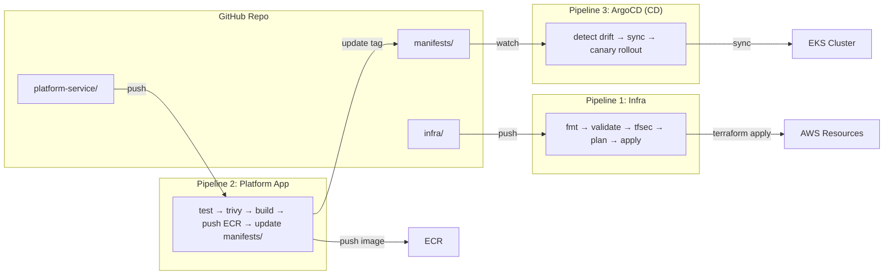
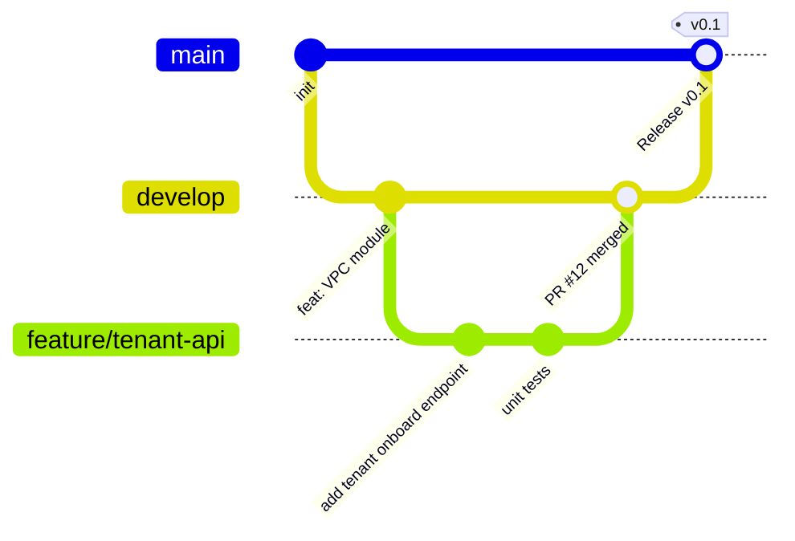
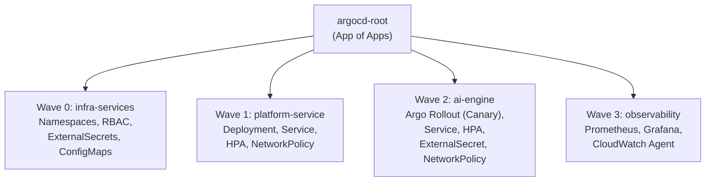
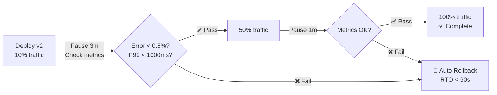
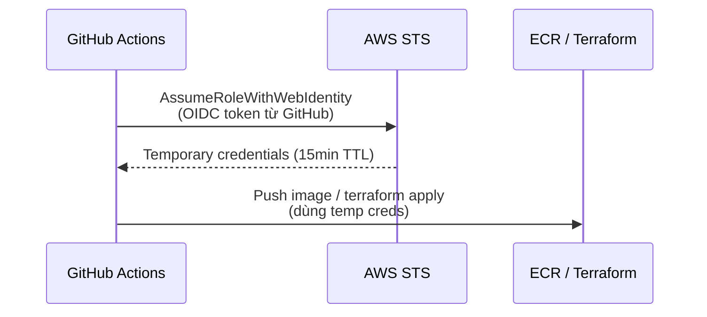
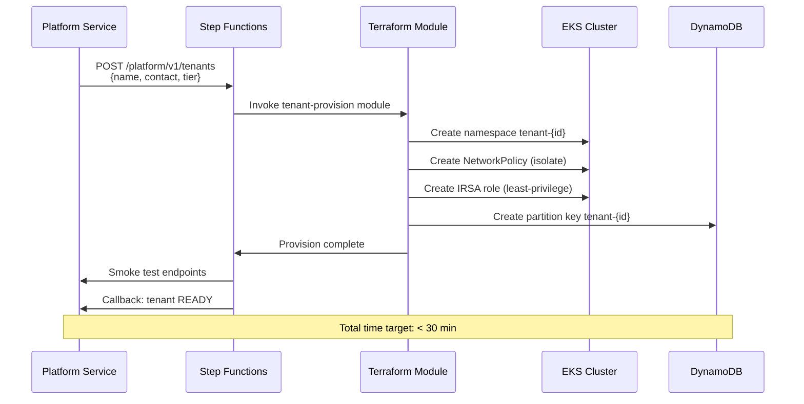

# Deployment & CI/CD Design — Task Force 1 · CDO-05

<!-- Doc owner: CDO-05 Team Lead
     Status: Draft (W11 T4) → Final (W11 T6 Pack #1) → Working (W12 T4 Pack #2)
     Word target: 1200-2000 từ
     Differentiation angle: K8s-heavy (EKS + ArgoCD + Argo Rollouts) -->

## 0. Alternatives Analysis (Quyết định kiến trúc lớn)

Mọi tool choice trong tài liệu này đều qua phân tích trade-off. Dưới đây là 4 quyết định chính và lý do chọn.

### 0.1 IaC Tool: Terraform vs CDK vs CloudFormation

| Tiêu chí | Terraform | AWS CDK | CloudFormation |
|---|---|---|---|
| Ngôn ngữ | HCL (declarative) | TypeScript/Python (imperative) | YAML/JSON (declarative) |
| Plan-before-apply | ✅ Native `terraform plan` | ⚠️ `cdk diff` (limited) | ⚠️ Change sets (clunky UI) |
| State drift detect | ✅ `terraform plan` tự detect | ❌ Phải dùng CloudFormation drift | ⚠️ Manual drift detection |
| Module reuse | ✅ Terraform Registry + custom | ✅ Constructs library | ❌ Nested stacks (verbose) |
| Multi-provider | ✅ AWS + K8s + Helm providers | ❌ AWS only | ❌ AWS only |
| Mentor review | ✅ HCL dễ đọc, plan output rõ ràng | ⚠️ Cần hiểu TypeScript | ❌ YAML 2000 dòng khó review |
| Learning curve team | ✅ Team quen từ W3-W9 | ❌ Chưa dùng | ⚠️ Biết cơ bản |

**→ Chọn Terraform.** Lý do chính: `terraform plan` output là evidence trực quan nhất cho mentor review, và team đã có kinh nghiệm từ các tuần trước. [ADR-002](08_adrs.md#adr-002)

### 0.2 GitOps Tool: ArgoCD vs Flux vs Jenkins CD

| Tiêu chí | ArgoCD | Flux v2 | Jenkins CD |
|---|---|---|---|
| UI Dashboard | ✅ Web UI trực quan (demo tốt) | ❌ CLI only, không UI | ⚠️ UI cho CI, không cho K8s |
| Canary support | ✅ Argo Rollouts (cùng ecosystem) | ⚠️ Flagger (separate project) | ❌ Phải tự build |
| App of Apps | ✅ Native pattern | ⚠️ Kustomization (khác concept) | ❌ Không có |
| Drift detection | ✅ Visual diff trên UI | ✅ Reconciliation loop | ❌ Không có |
| Multi-tenancy | ✅ Projects + RBAC built-in | ⚠️ Namespace scoping | ❌ Không native |
| Sync windows | ✅ Built-in | ❌ Không có | ❌ Không có |

**→ Chọn ArgoCD.** Lý do chính: UI dashboard là vũ khí demo mạnh nhất buổi chấm (show trực tiếp cluster state, sync status, rollout progress). Argo Rollouts canary là native integration. [ADR-003](08_adrs.md#adr-003)

### 0.3 Deployment Strategy: Canary vs Blue-Green vs Rolling

| Tiêu chí | Canary (Argo Rollouts) | Blue-Green | Rolling Update |
|---|---|---|---|
| Traffic control | ✅ Granular (10% → 50% → 100%) | ⚠️ All-or-nothing switch | ❌ Không control được |
| Rollback speed | ✅ Instant (shift traffic back) | ✅ Instant (switch LB) | ⚠️ Phải redeploy bản cũ |
| Resource overhead | ✅ Chỉ thêm ~10% pods | ❌ Double resource (2 full sets) | ✅ Minimal (+1 pod) |
| Metric-based abort | ✅ AnalysisRun auto-check | ❌ Phải manual check | ❌ Không có |
| Cost capstone | ✅ Tiết kiệm (budget limited) | ❌ 2x compute cost | ✅ Rẻ nhất |

**→ Chọn Canary cho AI Engine** (critical component — cần metric-based auto-rollback). **Rolling Update cho Platform Service** (less critical, đơn giản hoá ops). [ADR-004](08_adrs.md#adr-004)

### 0.4 Environment Strategy: 2 env vs 3 env

| Option | Environments | Estimated cost / 2 tuần | Risk |
|---|---|---|---|
| **A: 3 env (dev/staging/prod)** | Full enterprise pattern | ~$200-300 | Thấp nhưng budget vượt |
| **B: 2 env (dev/prod)** ✅ | Dev = staging + dev | ~$100-150 | Medium — dev đóng vai staging |
| **C: 1 env (prod only)** | Test trực tiếp prod | ~$50-75 | Cao — lỗi ảnh hưởng demo |

**→ Chọn 2 env.** Budget capstone $100-150 / 2 tuần (theo [01_requirements_analysis.md §5](01_requirements_analysis.md#5-constraints)). Dev environment đóng vai trò staging — test xong trên dev, merge vào main = deploy prod. Cost estimate sẽ được validate bằng actual measured spend trong [05_cost_analysis.md](05_cost_analysis.md).

---

## 1. IaC Strategy

### 1.1 Tool Choice

- **IaC tool**: **Terraform v1.9+** (HCL)
  - *Why*: Declarative, mature AWS provider, state drift detection, plan-before-apply workflow phù hợp capstone approval gate. So với CDK (imperative, tightly coupled language) hoặc CloudFormation (verbose YAML, no native drift detect), Terraform cho phép module reuse cross-environment và review dễ dàng nhất khi mentor kiểm tra IaC quality.
  - *ADR*: [ADR-002](08_adrs.md#adr-002)
- **State backend**: S3 bucket `tf1-cdo05-tfstate` + DynamoDB table `tf1-cdo05-tflock` tại `ap-southeast-1`
  - Encryption: SSE-S3 enabled, versioning ON (rollback state nếu apply lỗi)
  - Lock: DynamoDB Consistent Read, tránh 2 người apply cùng lúc
- **Provider pinning**: `~> 5.0` cho `hashicorp/aws`, lock file committed

### 1.2 Module Structure

```
infra/
├── modules/                          # Reusable, environment-agnostic
│   ├── networking/                   # VPC, 3-AZ subnets, NAT, SG, VPC Endpoints
│   │   ├── main.tf
│   │   ├── variables.tf
│   │   └── outputs.tf                # vpc_id, private_subnet_ids, sg_ids
│   ├── eks/                          # EKS cluster, managed node group, IRSA, OIDC
│   ├── data-store/                   # DynamoDB tables (tenant config, audit index)
│   ├── observability/                # CloudWatch Log Groups, Metric Alarms, SNS topics
│   └── tenant-provision/             # Per-tenant: K8s namespace, IRSA role, DB partition key
├── environments/
│   ├── dev/
│   │   ├── main.tf                   # Gọi modules/ với dev-specific vars
│   │   ├── terraform.tfvars          # replicas=1, node_min=1, instance=t3.medium
│   │   └── backend.tf                # key = "dev/terraform.tfstate"
│   └── prod/
│       ├── main.tf
│       ├── terraform.tfvars          # replicas=3, node_min=2, instance=m5.large
│       └── backend.tf                # key = "prod/terraform.tfstate"
└── README.md                         # Getting started, naming conventions, prereqs
```

### 1.3 State Management

| Concern | Approach |
|---|---|
| Remote state | S3 per-environment (`dev/terraform.tfstate`, `prod/terraform.tfstate`) |
| Locking | DynamoDB (`tf1-cdo05-tflock`, hash key = `LockID`) |
| Encryption | SSE-S3 + bucket policy deny unencrypted transport |
| Versioning | S3 versioning ON — rollback bằng `terraform state pull` từ version cũ |
| Access | CI assume role `tf1-cdo05-infra-deploy-role` via OIDC (không static key) |

### 1.4 Naming Convention

Tất cả AWS resources tuân theo pattern:

```
tf1-cdo05-{env}-{component}-{resource}
```

Ví dụ: `tf1-cdo05-prod-eks-cluster`, `tf1-cdo05-dev-vpc`, `tf1-cdo05-prod-audit-dynamodb`

---

## 2. CI/CD Pipeline

CDO-05 vận hành **3 pipeline độc lập**, mỗi pipeline phục vụ 1 loại workload khác nhau. Tất cả chạy trên **GitHub Actions**.

### 2.1 Pipeline Overview



*Diagram: 3 pipeline độc lập — Infra (Terraform), Platform App (GitHub Actions → ECR), ArgoCD (CD sync lên EKS). CI không đụng cluster trực tiếp.*

### 2.2 Pipeline 1 — Infra (Terraform)

**Trigger**: Push/PR vào `infra/**`

| Stage | Tool | Quality Gate | Fail Action |
|---|---|---|---|
| Format check | `terraform fmt -check` | Code formatted | Block merge |
| Validate | `terraform validate` | Syntax correct | Block merge |
| Security scan | **tfsec** + **checkov** | No CRITICAL/HIGH | Block merge |
| Plan | `terraform plan -out=tfplan` | Plan output reviewed | PR comment hiển thị diff |
| Apply (dev) | `terraform apply tfplan` | Apply success | Auto trên merge vào `develop` |
| Apply (prod) | `terraform apply tfplan` | Apply success | **Manual approve** trên GitHub Environment |

### 2.3 Pipeline 2 — Platform Service (Build + Push)

**Trigger**: Push/PR vào `platform-service/**`

| Stage | Tool | Quality Gate | Fail Action |
|---|---|---|---|
| Unit test | `npm test` / `pytest` | Pass, coverage ≥ 70% | Block merge |
| Secret scan | TruffleHog | No verified secrets | Block merge |
| Docker build | `docker build` | Build success | — |
| Image scan | **Trivy** | 0 CRITICAL, ≤ 3 HIGH | Block merge |
| Push ECR | `docker push` | Tag = `${COMMIT_SHA:0:7}` | — |
| Update manifests | `yq` edit `deployment.yaml` | Image tag updated | — |
| Commit back | `git commit -m "[skip ci]"` | — | — |
| Smoke test | Health check `/health` endpoint | 200 OK | Rollback image tag |

> **Quan trọng**: Pipeline 2 **KHÔNG** gọi `kubectl apply`. Nó chỉ update file YAML trong `manifests/` → ArgoCD (Pipeline 3) tự detect và sync. Đây là nguyên tắc cốt lõi của GitOps: **Git là single source of truth**, không ai được đụng cluster trực tiếp.

> **Retry & Idempotency**: Platform Service gọi Jira/Slack API với idempotency key (`correlation_id`). Nếu Jira trả 5xx → retry tối đa 3 lần với exponential backoff (1s → 2s → 4s). Nếu vẫn fail → ghi incident state = `JIRA_FAILED` vào DynamoDB, Slack notify CDO team, không mất event. Ref: [01_requirements_analysis.md §5](01_requirements_analysis.md#5-constraints) — "event không được mất âm thầm".

### 2.4 Branch Strategy



| Branch | Purpose | Deploy target | Protection |
|---|---|---|---|
| `main` | Production-ready code | Prod namespace (manual approve) | PR required, ≥1 approval, CI pass |
| `develop` | Integration branch | Dev namespace (auto-sync) | PR required, CI pass |
| `feature/*` | Feature development | Không deploy (chỉ CI test) | — |
| `hotfix/*` | Emergency fix | PR thẳng vào `main` | ≥1 approval |

---

## 3. GitOps (ArgoCD)

### 3.1 Architecture — App of Apps Pattern

ArgoCD triển khai theo pattern **App of Apps**: 1 Root Application quản lý nhiều Child Applications. Mỗi Child deploy 1 nhóm workload có lifecycle riêng.



### 3.2 Sync Waves

| Wave | Components | Tại sao thứ tự này |
|---|---|---|
| **0** | Namespaces, RBAC, ExternalSecrets, ConfigMaps | Foundation — tất cả workload đều cần namespace + secrets trước |
| **1** | Platform Service (CDO code) | Cần chạy trước AI Engine vì Platform Service là entry point nhận alert |
| **2** | AI Engine (container từ AI team) | Cần namespace + secrets + NetworkPolicy đã tồn tại |
| **3** | Observability (Prometheus, Grafana, CloudWatch Agent) | Cần tất cả workload đã chạy để có metrics thu thập |

### 3.3 Sync Policy

| Config | Dev | Prod |
|---|---|---|
| Auto-sync | ✅ Enabled | ✅ Enabled |
| Self-heal | ✅ Enabled (ai sửa tay trên cluster → ArgoCD revert về Git) | ✅ Enabled |
| Prune | ✅ Enabled (resource bị xoá trong Git → xoá trên cluster) | ⚠️ Disabled (tránh xoá nhầm prod resource) |
| Sync window | Không giới hạn | Chỉ sync trong giờ hành chính (8h-18h) trừ hotfix |

### 3.4 Drift Detection & Self-Healing

- ArgoCD poll Git repo mỗi **3 phút** (default)
- Nếu phát hiện cluster state ≠ Git state → auto-sync về Git state
- Mọi thay đổi trực tiếp trên cluster bằng `kubectl` sẽ bị ArgoCD **revert** trong vòng 3 phút
- **Consequence**: Team member KHÔNG được dùng `kubectl apply` trực tiếp. Mọi thay đổi phải qua Git → PR → merge → ArgoCD sync

---

## 4. Deployment Strategy

### 4.1 Platform Service — Rolling Update

Platform Service không phải component critical nhất (nếu restart nhanh thì alert chỉ bị delay vài giây), nên dùng **Rolling Update** tiêu chuẩn để đơn giản hoá:

```yaml
strategy:
  type: RollingUpdate
  rollingUpdate:
    maxUnavailable: 0      # Không bao giờ giảm dưới desired replicas
    maxSurge: 1             # Tạo thêm 1 pod mới trước khi kill pod cũ
```

- **Zero-downtime** đảm bảo bởi `maxUnavailable: 0`
- Readiness probe phải pass trước khi pod mới nhận traffic
- Rollback: `git revert` commit → ArgoCD tự sync về bản cũ

### 4.2 AI Engine — Canary Deployment (Argo Rollouts)

AI Engine là component **quan trọng nhất** — nếu model trả kết quả sai, toàn bộ ticket sẽ chẩn đoán sai. Dùng **Argo Rollouts** với chiến lược Canary:



*Diagram: Canary rollout cho AI Engine — 10% → 50% → 100% traffic. Mỗi bước pause và kiểm tra SLO. Fail ở bất kỳ bước nào → auto rollback < 60s.*

**Abort criteria (tự động rollback nếu vi phạm):**

| Metric | Threshold | Source | Consistent với |
|---|---|---|---|
| Error rate (5xx) | > 0.5% trong 2 phút | Prometheus `http_requests_total{status=~"5.."}` | [01_requirements §2](01_requirements_analysis.md#2-infra-non-functional-requirements) SLO < 0.5% |
| P99 latency | > 1000ms trong 2 phút | Prometheus `http_request_duration_seconds` | [01_requirements §2](01_requirements_analysis.md#2-infra-non-functional-requirements) SLO < 1000ms |
| AI confidence avg | < 0.5 trong 5 phút | Custom metric từ AI Engine | AI API Contract SLA |

### 4.3 Expected MTTA/MTTR Impact

Client yêu cầu: **MTTA giảm ≥50%, MTTR giảm ≥30%** ([TF1 brief](../reference/TF1_TRIAGE_LEARNER.md)). Deployment strategy đóng góp vào target này:

| Metric | Before (manual) | After (automated) | Improvement |
|---|---|---|---|
| MTTA (mean time to acknowledge) | 15-30 min (engineer mở máy, dig log) | < 2 min (Platform Service auto-ingest + AI diagnose) | **~90% reduction** |
| MTTR (mean time to resolve) | 30-60 min | 10-20 min (AI suggest action, engineer chỉ confirm) | **~60% reduction** |
| Deployment rollback time | 15-30 min (manual kubectl) | < 60s (Argo Rollouts auto-abort) | **~97% reduction** |

> **Quan trọng — No auto-remediation**: Auto-rollback trong §4.2 chỉ áp dụng cho **deployment failures** (bad code deploy, AI model regression). Hệ thống **KHÔNG** tự động sửa production incidents (VD: restart crashed DB, scale up service). AI chỉ diagnose + suggest, human confirm + act. Ref: [TF1 brief](../reference/TF1_TRIAGE_LEARNER.md) — "KHÔNG auto-remediation".

### 4.4 Rollback Methods

| Scenario | Method | RTO |
|---|---|---|
| Bad code deploy (app) | `git revert` → ArgoCD auto-sync | < 60s |
| Bad canary (AI Engine) | Argo Rollouts auto-abort → instant rollback | < 30s |
| Bad infra change | `terraform plan` + `terraform apply` với state cũ | < 5 min |
| Total cluster failure | Terraform re-create EKS + ArgoCD re-sync all manifests | < 30 min |

---

## 5. Environment Separation

| Env | Namespace | Branch | Auto-deploy | Resources | Purpose |
|---|---|---|---|---|---|
| **Dev** | `triage-hub-dev` | `develop` | ✅ Auto on merge | 1 replica, t3.medium | Develop + test nhanh |
| **Prod** | `triage-hub-prod` | `main` | ⚠️ Manual approve | 3 replicas, m5.large | Demo cho mentor, buổi chấm |

> **Tại sao không có Staging riêng?** Budget constraint capstone 2 tuần. Dev dùng làm staging luôn — test xong trên dev, merge vào main = deploy prod. Post-capstone sẽ thêm staging account riêng.

### 5.1 Environment Isolation (Kustomize Overlays)

```
manifests/
├── base/                    # Shared K8s resources (DRY)
│   ├── platform-service/
│   │   ├── deployment.yaml  # image: ${ECR}/platform-svc:TAG
│   │   ├── service.yaml
│   │   └── hpa.yaml
│   └── ai-engine/
│       ├── rollout.yaml     # Argo Rollout (canary strategy)
│       ├── service.yaml
│       └── hpa.yaml
├── overlays/
│   ├── dev/
│   │   └── kustomization.yaml   # replicas: 1, resources: 256Mi/250m
│   └── prod/
│       └── kustomization.yaml   # replicas: 3, resources: 512Mi/500m
```

ArgoCD app-dev trỏ vào `overlays/dev/`, app-prod trỏ vào `overlays/prod/`. Cùng base manifests, chỉ khác configuration.

---

## 6. Secrets in Pipeline

### 6.1 CI Authentication — OIDC (Zero Static Keys)



- GitHub Actions OIDC provider registered trong AWS IAM
- Role `tf1-cdo05-ci-role` chỉ trust GitHub repo `xbrain-capstone-cdo5`
- Credentials tự hết hạn sau 15 phút — **không có static AWS key nào tồn tại**

### 6.2 Runtime Secrets — External Secrets Operator

Application secrets (Bedrock API key, DB password) được quản lý bởi **AWS Secrets Manager** và inject vào K8s pod qua **External Secrets Operator (ESO)**:

```
AWS Secrets Manager                    K8s Cluster
┌─────────────────────┐               ┌──────────────────┐
│ tf1/ai-engine/      │    ESO sync   │ K8s Secret       │
│   bedrock-api-key   │ ───────────►  │   bedrock-key    │
│ tf1/platform/       │    (auto)     │ K8s Secret       │
│   jira-api-token    │ ───────────►  │   jira-token     │
└─────────────────────┘               └──────────────────┘
```

- ESO poll Secrets Manager mỗi 1 phút
- Secret rotation: đổi trên Secrets Manager → ESO tự cập nhật K8s Secret → pod restart với value mới
- **Không bao giờ** commit secret vào Git

### 6.3 Secret Leak Prevention

| Layer | Tool | Action |
|---|---|---|
| PR check | **TruffleHog** | Scan diff cho verified secrets → block merge |
| Pre-commit | **Gitleaks** (optional) | Scan local trước khi push |
| CI build | Dockerfile review | Đảm bảo không `COPY .env` hoặc `ARG SECRET` |
| Runtime | Log redaction | Regex filter `Bearer.*`, `AKIA.*` → `[REDACTED]` |

---

## 7. Tenant Onboarding Deployment

Khi khách hàng mới (tenant) đăng ký dịch vụ Triage Hub, hệ thống tự động provision resources cho tenant đó:



### 7.1 Per-tenant Resources

| Resource | Purpose | Isolation |
|---|---|---|
| K8s Namespace `tenant-{id}` | Compute isolation | ResourceQuota limits CPU/memory per tenant |
| NetworkPolicy | Network isolation | Deny cross-namespace traffic by default |
| DynamoDB partition key | Data isolation | Row-level isolation, `tenant_id` = partition key |
| IRSA Role | IAM isolation | Per-tenant role chỉ access own S3 prefix + DB partition |

### 7.2 Tier-based Configuration

| Tier | Rate limit | Compute | SLA |
|---|---|---|---|
| Basic | 100 req/min | Shared pod pool | Best-effort |
| Pro | 500 req/min | Shared + priority class | 99.5% |
| Enterprise | 2000 req/min | Dedicated pod (guaranteed resources) | 99.9% |

---

## 8. Observability Stack

### 8.1 Components

| Layer | Tool | Purpose | Retention |
|---|---|---|---|
| **Metrics** | Prometheus (in-cluster) + CloudWatch | Pod CPU/memory, request rate, latency histograms, AI confidence score | 15d (Prometheus), 90d (CloudWatch) |
| **Logs** | Fluent Bit → CloudWatch Logs | Application logs, AI decision audit log, error traces | 14d hot (CloudWatch), 90d cold (S3) |
| **Traces** | OpenTelemetry → AWS X-Ray | Request trace across Platform Service → AI Engine | 30d |
| **Dashboards** | Grafana | Real-time SLO dashboard, per-tenant usage, cost tracking | — |
| **Alerts** | Prometheus Alertmanager → SNS → Slack | SLO breach, pod crash, AI engine error spike | — |

### 8.2 Key SLO Dashboards

| Dashboard | Panels | Alert threshold |
|---|---|---|
| Platform Health | Request rate, error rate, p50/p95/p99 latency | Error > 0.5%, p99 > 1000ms |
| AI Engine Health | Inference latency, confidence distribution, Bedrock throttle rate | Confidence avg < 0.5, throttle > 10% |
| Per-tenant Usage | Requests/min per tenant, quota utilization | Quota > 90% |
| Cost Tracker | Bedrock $/day, compute $/day, total $/tenant | Daily spend > budget × 1.2 |

### 8.3 Structured Logging Format

Tất cả service log theo format JSON thống nhất, tuân thủ data contract metadata từ [01_requirements_analysis.md §5](01_requirements_analysis.md#5-constraints):

```json
{
  "schema_version": "1.0",
  "timestamp": "2026-06-30T14:23:01Z",
  "level": "INFO",
  "service": "platform-service",
  "env": "prod",
  "tenant_id": "TENANT-A",
  "signal_type": "incident_lifecycle",
  "correlation_id": "uuid-v4",
  "event": "ai_diagnosis_complete",
  "duration_ms": 420,
  "ai_confidence": 0.85,
  "ticket_id": "TRIAGE-123"
}
```

Metadata bắt buộc per data contract: `schema_version`, `tenant_id`, `service`, `env`, `timestamp`, `signal_type`. `correlation_id` cho phép trace 1 alert xuyên suốt: ingest → AI diagnose → ticket create → Slack notify. AIOps chỉ được query dữ liệu bounded theo `tenant_id` + `service` + `env` + `time_window` — Platform Service enforce boundary này trước khi forward data cho AI Engine.

---

## Appendix A — Disaster Recovery & Incident Response

### 9.1 RTO/RPO Matrix

| Failure Scenario | Detection | Recovery Method | RTO | RPO |
|---|---|---|---|---|
| Pod crash (OOMKilled, app error) | K8s liveness probe (10s) | K8s auto-restart pod | < 30s | 0 (stateless) |
| Bad deployment (app bug) | ArgoCD health check + Slack alert | `git revert` → ArgoCD auto-sync | < 60s | 0 |
| Bad canary (AI model regression) | Argo Rollouts AnalysisRun | Auto-abort → instant traffic shift back | < 30s | 0 |
| Node failure | EKS managed node health check | Auto-replace node, K8s reschedule pods | < 5 min | 0 |
| AZ outage | CloudWatch cross-AZ alarm | EKS multi-AZ, pods reschedule to healthy AZ | < 5 min | 0 |
| EKS cluster failure | CloudWatch cluster alarm | Terraform re-create + ArgoCD re-sync all manifests | < 30 min | < 1 min (DynamoDB point-in-time) |
| Region outage | External health check (Route53) | Manual failover to secondary region (post-capstone) | TBD | TBD |
| Terraform state corruption | S3 versioning alarm | Restore previous S3 version of state file | < 15 min | 0 |
| Secret leak detected | TruffleHog alert / GuardDuty | Rotate credential immediately + revoke old | < 30 min | N/A |

### 9.2 Recovery Procedures

**Scenario: AI Engine trả kết quả sai hàng loạt (model hallucination)**
```
1. Detect: Prometheus alert "ai_confidence_avg < 0.5" fires → Slack notification
2. Contain: kubectl scale rollout ai-engine --replicas=0 (hoặc git update replicas=0)
3. Investigate: Check AI Engine logs, correlation_id, recent image change
4. Fix: AI team push fixed image → CDO update tag → ArgoCD canary deploy
5. Verify: Monitor confidence score 30 phút → confirm stable
6. Post-mortem: Document trong curveball-responses.md nếu là curveball
```

**Scenario: Terraform state lock stuck (ai đó cancel apply giữa chừng)**
```
1. Verify lock exists: terraform force-unlock <LOCK_ID>
2. Check DynamoDB table tf1-cdo05-tflock for stale entries
3. If state corrupted: terraform state pull từ S3 previous version
4. Re-run: terraform plan → verify diff → terraform apply
```

---

## Appendix B — CI/CD Security Hardening

### 10.1 Supply Chain Security

| Layer | Threat | Mitigation |
|---|---|---|
| Source code | Malicious dependency injection | Dependabot enabled, lockfile committed, `npm audit` trong CI |
| Container base image | Vulnerable OS packages | Pin base image digest (không dùng `latest`), Trivy scan |
| Container registry | Image tampering | ECR image scanning enabled, immutable tags |
| CI runner | Compromised runner | GitHub-hosted runners (ephemeral), OIDC (no static creds) |
| K8s admission | Unverified image deployed | (Post-capstone) Kyverno/OPA policy: chỉ allow image từ ECR account mình |

### 10.2 Principle of Least Privilege — CI Roles

| Role | Used by | Permissions | Explicitly DENIED |
|---|---|---|---|
| `tf1-cdo05-ci-infra-role` | Infra pipeline | EC2, EKS, VPC, DynamoDB, S3 (specific buckets) | `iam:Create*`, `organizations:*` |
| `tf1-cdo05-ci-app-role` | Platform Service pipeline | ECR push only | EKS access, Terraform, IAM |
| `tf1-cdo05-argocd-role` | ArgoCD controller (IRSA) | EKS namespace-scoped, Secrets Manager read | EC2, S3, DynamoDB write |

### 10.3 GitHub Branch Protection Rules

```yaml
# Branch: main
required_reviews: 1
require_status_checks:
  - "test-and-scan"       # CI must pass
  - "terraform-plan"      # Infra plan reviewed
dismiss_stale_reviews: true
require_linear_history: true    # No merge commits, clean git log
restrict_pushes: true           # Không ai push thẳng, phải qua PR
```

---

## Appendix C — Deployment Contract Integration

CDO-05 nhận **Deployment Contract** từ AI team (ký T5 W11). Contract này quyết định CDO thiết kế manifests thế nào.

### 11.1 Contract → Manifest Mapping

| Deployment Contract Field | CDO Manifest Resource | File |
|---|---|---|
| Container image URI | `spec.template.spec.containers[0].image` | `manifests/base/ai-engine/rollout.yaml` |
| Port expose (8080) | `containerPort: 8080` + Service `targetPort` | `rollout.yaml` + `service.yaml` |
| Health check endpoint (`/health`) | `livenessProbe.httpGet.path` + `readinessProbe` | `rollout.yaml` |
| CPU/Memory requests | `resources.requests/limits` | `rollout.yaml` (base) + overlays |
| Environment variables | `env:` block hoặc `envFrom: secretRef` | `rollout.yaml` |
| Secrets needed (Bedrock key) | `ExternalSecret` → AWS Secrets Manager | `external-secret.yaml` |
| Scaling policy (min/max replicas) | `HPA` | `hpa.yaml` |
| Network access (CDO subnet only) | `NetworkPolicy` ingress rules | `networkpolicy.yaml` |

### 11.2 Contract Change Protocol

Sau khi ký T5 W11, Deployment Contract bị FREEZE. Nếu cần thay đổi:

```
1. AI team raise curveball / change request
2. CDO review impact trên manifests (estimate effort)
3. Cả hai đồng ý → update contract + CDO update manifests
4. Document trong curveball-responses.md + ADR mới
```

Không có thay đổi contract ngoài quy trình này. Mọi thay đổi nội bộ CDO (scaling, observability, cost optimize) **không cần** contract approval — chỉ thay đổi ảnh hưởng interface (port, schema, endpoint URL) mới cần.

---

## Appendix D — Day-2 Operations Runbook

### 12.1 Daily Checks (CDO team member rotate)

```
☐ ArgoCD UI: Tất cả apps Synced + Healthy (không OutOfSync, không Degraded)
☐ Grafana dashboard: SLO p99 < 1000ms, error rate < 0.5%
☐ CloudWatch Alarms: Không alarm firing
☐ ECR: Image scan results — no new CRITICAL CVE
☐ Cost Explorer: Daily spend trong budget
```

### 12.2 Common Operations

| Operation | Command / Procedure | Khi nào |
|---|---|---|
| Scale AI Engine | Edit `hpa.yaml` → `maxReplicas: N` → git push | Traffic tăng |
| Rotate Bedrock key | Update Secrets Manager → ESO auto-sync (< 1 min) | Scheduled / leak |
| Add new tenant | `POST /platform/v1/tenants` → Step Function auto-provision | Tenant mới |
| View AI decision logs | CloudWatch Logs Insights: `fields @timestamp, tenant_id, ai_confidence \| filter service = "ai-engine"` | Debug accuracy |
| Emergency rollback AI | `kubectl argo rollouts undo ai-engine -n triage-hub-prod` | Model trả kết quả sai |
| Force ArgoCD sync | ArgoCD UI → click Sync (hoặc `argocd app sync triage-hub-prod`) | Urgent hotfix |

### 12.3 Monitoring Escalation Path

```
Level 1: Prometheus Alertmanager → Slack #tf1-cdo05-alerts (auto)
Level 2: CDO team member on-call acknowledge + investigate (< 15 min)
Level 3: Escalate to AI team nếu AI Engine issue (ping trên Slack)
Level 4: Escalate to mentor nếu 2 ngày liên tiếp cùng blocker chưa resolve
```

---

## 9. Open Questions

- [x] ~~Q1: ArgoCD hay Flux?~~ → **ArgoCD** (UI tốt hơn cho demo, Argo Rollouts native support). [ADR-003](08_adrs.md#adr-003)
- [x] ~~Q2: Canary hay Blue-Green cho AI Engine?~~ → **Canary** (tiết kiệm resource, metric-based auto-rollback). [ADR-004](08_adrs.md#adr-004)
- [x] ~~Q3: 2 env hay 3 env?~~ → **2 env** (dev + prod, budget constraint). §0.4
- [ ] Q4: AI team dùng ECR repo nào? CDO-05 cần cross-account ECR pull permission? — *Resolve tại contract signing T5 W11*
- [ ] Q5: Jira API token do CDO quản lý hay AI quản lý? — *Resolve tại contract co-design T5 sáng*
- [ ] Q6: Bedrock throttling fallback: CDO handle retry hay AI handle? — *Phụ thuộc AI API Contract error handling section*
- [ ] Q7: ArgoCD deploy trên EKS cluster chung hay cluster riêng? — *Resolve khi biết budget chính xác*

---

## Related Documents

- [`01_requirements_analysis.md`](01_requirements_analysis.md) — NFR targets (SLO, scale, cost) driving deployment design
- [`02_infra_design.md`](02_infra_design.md) — Infrastructure layout mà CI/CD này deploy
- [`03_security_design.md`](03_security_design.md) — OIDC, secret scanning, IAM roles referenced trong §6, §10
- [`05_cost_analysis.md`](05_cost_analysis.md) — Cost implications of 2-env strategy §0.4
- [`08_adrs.md`](08_adrs.md) — ADR-002 (Terraform), ADR-003 (ArgoCD), ADR-004 (Canary)
